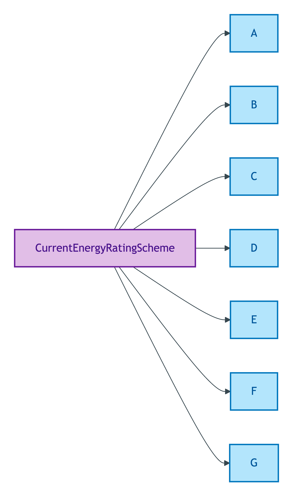
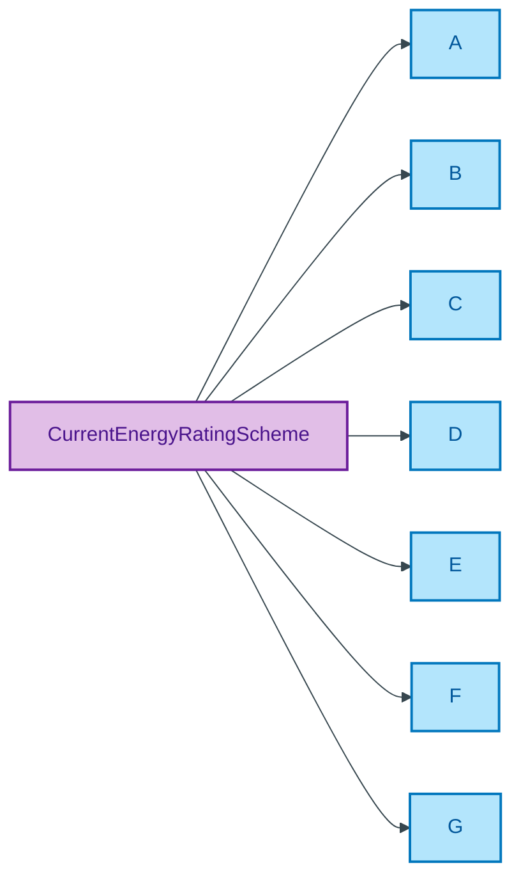

# CurrentEnergyRatingScheme

## Summary

EPC current energy rating banding (A–G) published by DESNZ (Department for Energy Security and Net Zero) for residential properties in England & Wales. [UFO Quale-in-Region / DOLCE Quality-Region]. Verbatim source: DESNZ Energy Performance Certificate guidance. Steward: Baker (regulator-cited per ODR-0011 §4a; DESNZ-governed).
[Concept tier — Property →](../../../concept/property/property.md)

## Members

| Notation | Label | Definition | Source |
|---|---|---|---|
| `A` | A | EPC current energy rating band A as defined by DESNZ | [gov.uk EPC guidance](https://www.gov.uk/government/publications/guide-to-energy-performance-certificates-for-the-construction-sale-and-let-of-dwellings) |
| `B` | B | EPC current energy rating band B as defined by DESNZ | [gov.uk EPC guidance](https://www.gov.uk/government/publications/guide-to-energy-performance-certificates-for-the-construction-sale-and-let-of-dwellings) |
| `C` | C | EPC current energy rating band C as defined by DESNZ | [gov.uk EPC guidance](https://www.gov.uk/government/publications/guide-to-energy-performance-certificates-for-the-construction-sale-and-let-of-dwellings) |
| `D` | D | EPC current energy rating band D as defined by DESNZ | [gov.uk EPC guidance](https://www.gov.uk/government/publications/guide-to-energy-performance-certificates-for-the-construction-sale-and-let-of-dwellings) |
| `E` | E | EPC current energy rating band E as defined by DESNZ | [gov.uk EPC guidance](https://www.gov.uk/government/publications/guide-to-energy-performance-certificates-for-the-construction-sale-and-let-of-dwellings) |
| `F` | F | EPC current energy rating band F as defined by DESNZ | [gov.uk EPC guidance](https://www.gov.uk/government/publications/guide-to-energy-performance-certificates-for-the-construction-sale-and-let-of-dwellings) |
| `G` | G | EPC current energy rating band G as defined by DESNZ | [gov.uk EPC guidance](https://www.gov.uk/government/publications/guide-to-energy-performance-certificates-for-the-construction-sale-and-let-of-dwellings) |

## Cardinality discipline

Bound by [`Property.currentEnergyRating`](../property.md#attributes) (`0..1`, optional). Closed scheme — DESNZ-governed; members track upstream regulator changes only.

## Concept hierarchy

Mermaid Source

## Source ODR + ADR

- [ODR-0011 — Enumeration vocabularies](../../../ontology/odr/ODR-0011-enumeration-vocabularies.md), §4a regulator-citation discipline
- [ADR-0010 — SKOS vocabulary emission](../../../adr/ADR-0010-skos-vocabulary-emission.md) — implementation
