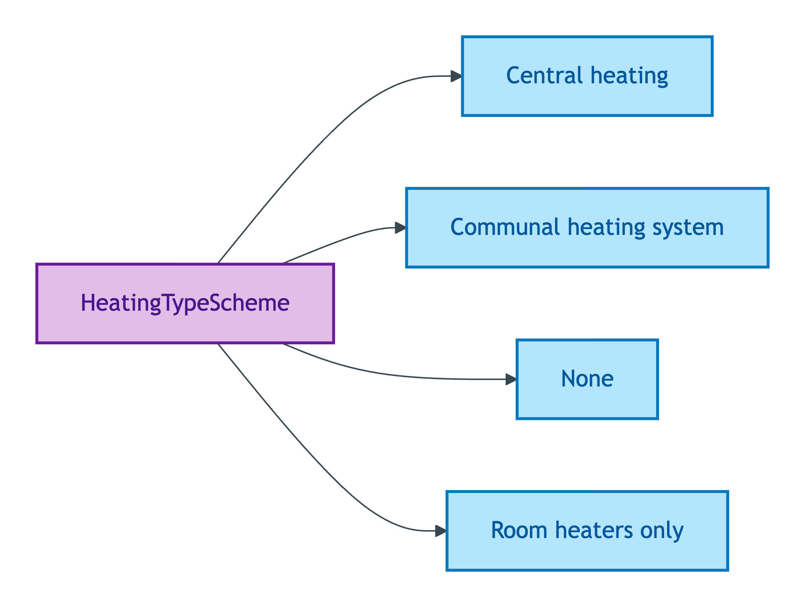
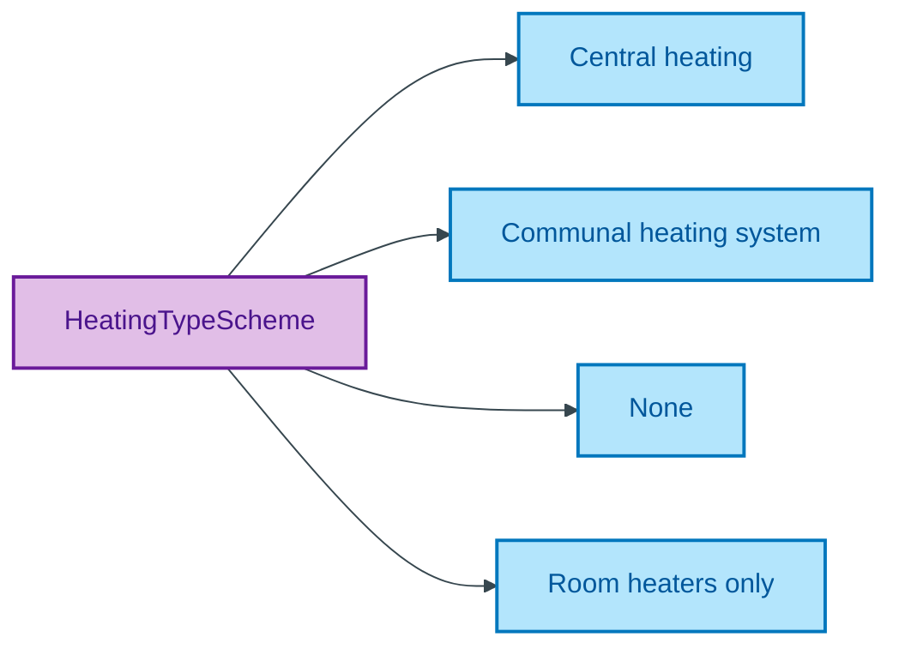

# HeatingTypeScheme

## Summary

Classification of a Property's overall heating-system arrangement (central, communal, room-only, or none). [UFO Quale-in-Region / DOLCE Quality-Region]. Steward: Allemang (property-qualities sub-module steward per S008 Q2).
[Concept tier — Property →](../../../concept/property/property.md)

## Members

| Notation | Label | Definition | Source |
|---|---|---|---|
| `Central heating` | Central heating | Whole-property heating distributed from a single central source | OPDA data dictionary |
| `Communal heating system` | Communal heating system | Heating shared between multiple dwellings (e.g. district heating) | OPDA data dictionary |
| `None` | None | No installed heating system | OPDA data dictionary |
| `Room heaters only` | Room heaters only | Heating provided by per-room appliances rather than a central system | OPDA data dictionary |

## Cardinality discipline

Bound by [`Property.heatingType`](../property.md#attributes) (`0..1`, optional). Closed scheme — overlays may subset but may NOT extend.

## Concept hierarchy

Mermaid Source

## Source ODR + ADR

- [ODR-0011 — Enumeration vocabularies](/modelling/odr/odr-0011), §8a UFO meta-category
- [ADR-0010 — SKOS vocabulary emission](/modelling/adr/adr-0010) — implementation
