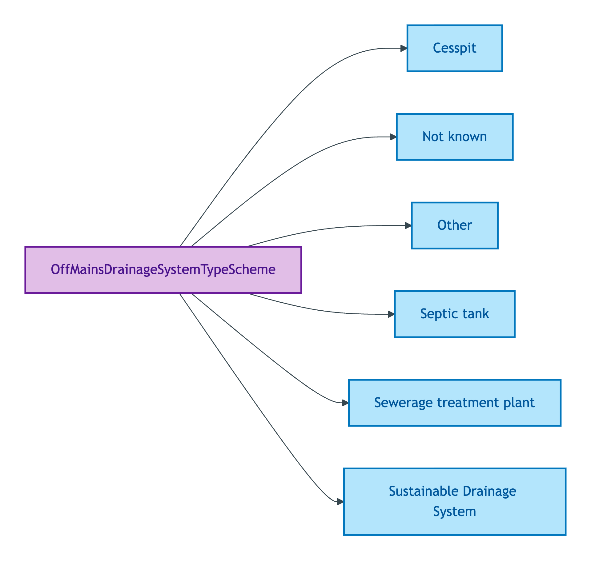
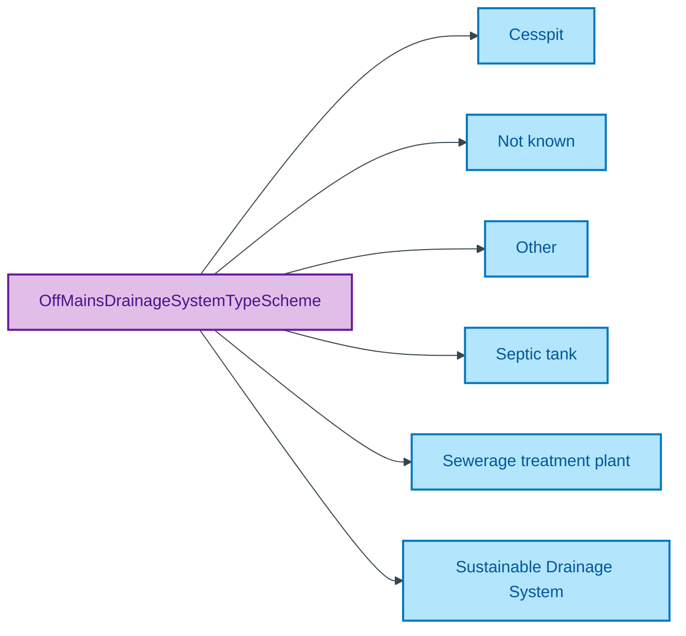

# OffMainsDrainageSystemTypeScheme

## Summary

Classification of a Property's off-mains drainage system (SuDS / Septic tank / Cesspit / Sewerage treatment plant / Other / Not known). [UFO Quale-in-Region / DOLCE Quality-Region]. Applies only when the Property is not connected to the mains sewerage system. Steward: Allemang (property-qualities sub-module steward per S008 Q2).
[Concept tier — Property →](../../../concept/property/property.md)

## Members

| Notation | Label | Definition | Source |
|---|---|---|---|
| `Cesspit` | Cesspit | On-site cesspit (sealed underground container) collecting foul sewerage for periodic removal | OPDA data dictionary |
| `Not known` | Not known | Off-mains drainage system type is not known to the Seller | OPDA data dictionary |
| `Other` | Other | Drainage type falling outside the standard off-mains categories | OPDA data dictionary |
| `Septic tank` | Septic tank | On-site septic-tank treatment for foul sewerage | OPDA data dictionary |
| `Sewerage treatment plant` | Sewerage treatment plant | On-site sewerage treatment plant treating foul sewerage before discharge | OPDA data dictionary |
| `Sustainable Drainage System` | Sustainable Drainage System | Drainage routed to a SuDS designed to manage surface water close to source | OPDA data dictionary |

## Cardinality discipline

Bound by [`Property.offMainsDrainageSystemType`](../property.md#attributes) (`0..1`, optional; conditional on not-connected-to-mains). Closed scheme — overlays may subset but may NOT extend.

## Concept hierarchy

Mermaid Source

## Source ODR + ADR

- [ODR-0011 — Enumeration vocabularies](/modelling/odr/odr-0011), §8a UFO meta-category
- [ADR-0010 — SKOS vocabulary emission](/modelling/adr/adr-0010) — implementation
