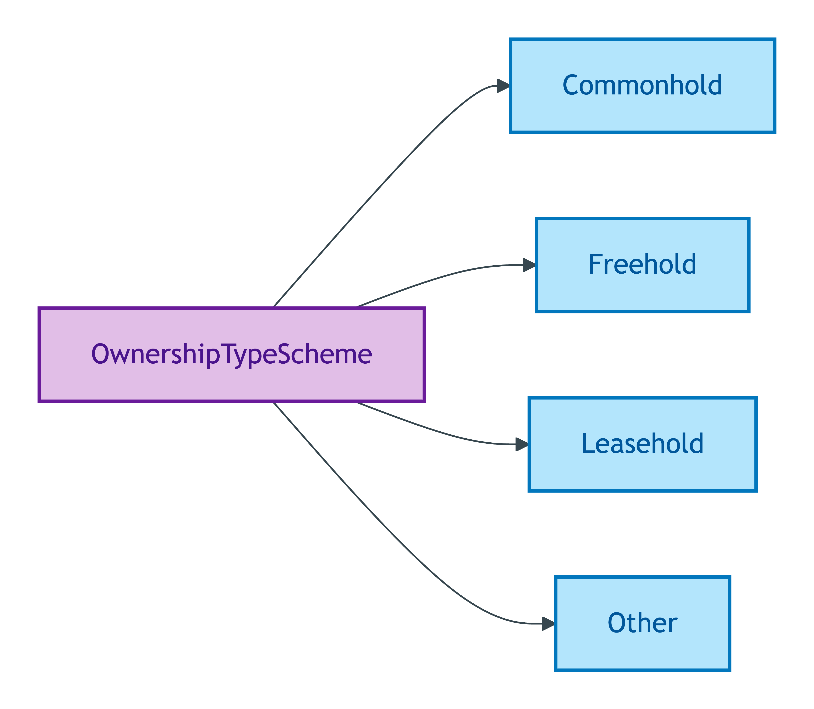
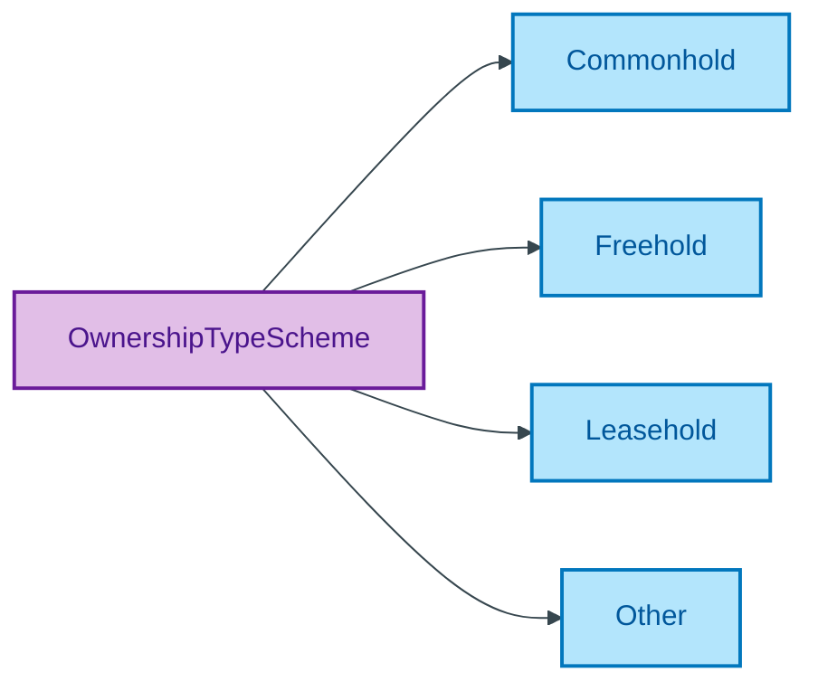

# OwnershipTypeScheme

## Summary

Classification of a legal estate's ownership structure (Freehold, Leasehold, Commonhold, Other). [UFO Quale-in-Region / DOLCE Quality-Region]. NTS2 four-value canonical set used as authority. Steward: Kendall (LegalEstate steward per S008 Q2).
[Concept tier — LegalEstate →](../../../concept/property/legal-estate.md)

## Members

| Notation | Label | Definition | Source |
|---|---|---|---|
| `Commonhold` | Commonhold | Freehold ownership of a unit within a commonhold development, with shared ownership of common parts | OPDA data dictionary |
| `Freehold` | Freehold | Outright ownership of the property and the land it sits on | OPDA data dictionary |
| `Leasehold` | Leasehold | Ownership of the property for a fixed period under a lease from the freeholder | OPDA data dictionary |
| `Other` | Other | Ownership type falling outside the standard categories | OPDA data dictionary |

## Cardinality discipline

Bound by [`LegalEstate.ownershipType`](../legal-estate.md#attributes) (`0..1`, optional). Distinct from `TenureKindScheme` (which is a Substance Kind label binding via `skos:exactMatch` to OWL sub-classes) — this scheme is a Quale-in-Region classifier. Closed scheme.

## Concept hierarchy

Mermaid Source

## Source ODR + ADR

- [ODR-0011 — Enumeration vocabularies](/modelling/odr/odr-0011), §8a UFO meta-category
- [ADR-0010 — SKOS vocabulary emission](/modelling/adr/adr-0010) — implementation
