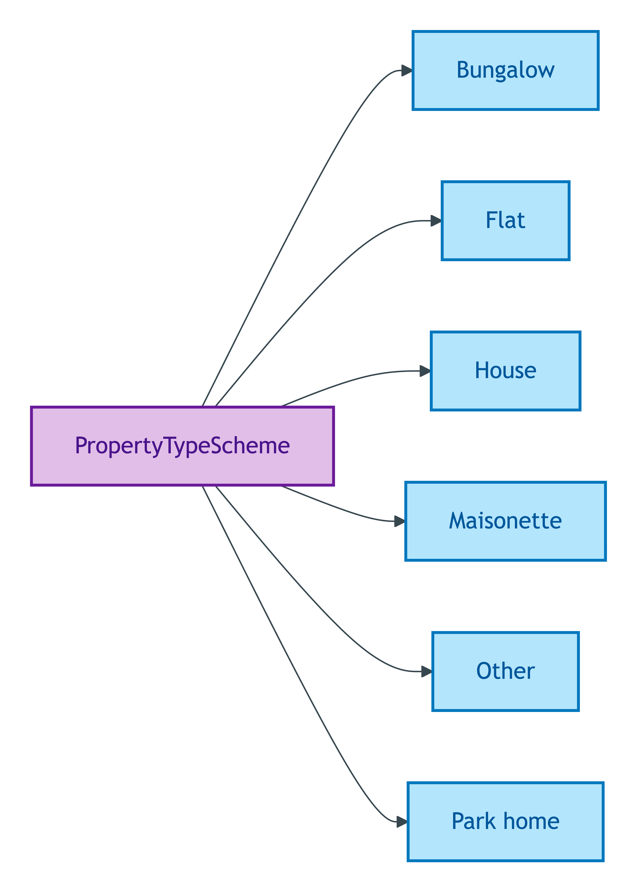
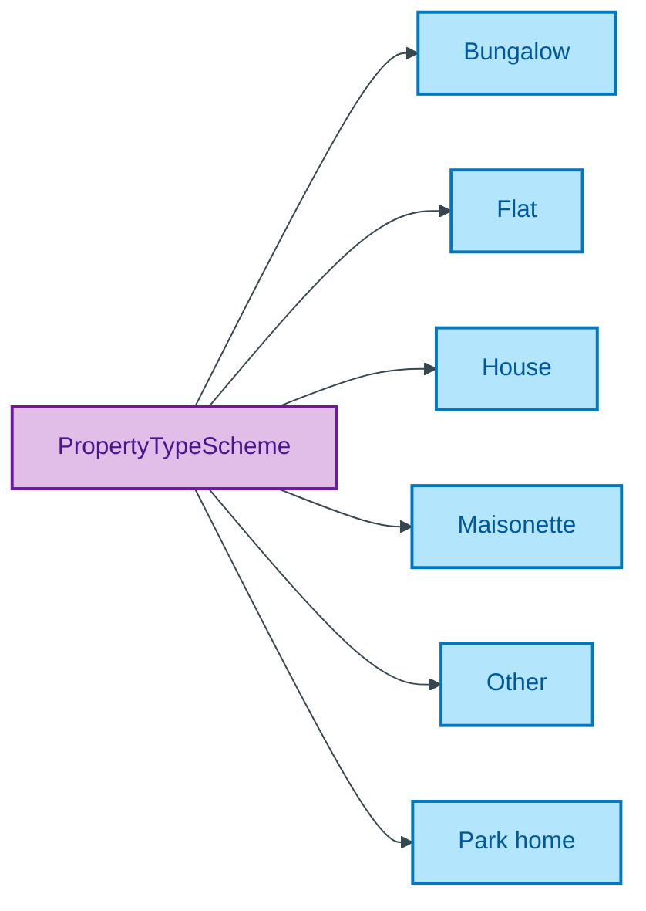

# PropertyTypeScheme

## Summary

Substance Kind labels for the physical-form kind of a Property (House / Bungalow / Park home / Flat / Maisonette / Other). Distinct from `BuiltFormScheme` which carries the structural Quale (Detached / Semi-detached / Terrace). [UFO Substance Kind label]. Members may bind to OWL sub-classes of `Property` via `skos:exactMatch` when conditional Building/Room class promotions trigger. Steward: Allemang (property-qualities sub-module steward per S008 Q2).
[Concept tier — Property →](../../../concept/property/property.md)

## Members

| Notation | Label | Definition | Source |
|---|---|---|---|
| `Bungalow` | Bungalow | A single-storey detached dwelling | OPDA data dictionary |
| `Flat` | Flat | A self-contained dwelling forming part of a larger building | OPDA data dictionary |
| `House` | House | A self-contained dwelling occupying a complete structure | OPDA data dictionary |
| `Maisonette` | Maisonette | A self-contained dwelling within a larger building, typically with its own external entrance | OPDA data dictionary |
| `Other` | Other | Property type falling outside the standard categories | OPDA data dictionary |
| `Park home` | Park home | A detached single-storey dwelling sited within a residential park | OPDA data dictionary |

## Cardinality discipline

Bound by [`Property.propertyType`](../property.md#attributes) (`0..1`, optional). Members are Substance Kind labels — when a member binds to a forthcoming OWL sub-class (e.g. `opda:Flat`, `opda:House`), `skos:exactMatch` is the only admissible binding mechanism per ODR-0005 Anti-pattern §5 (NEVER `owl:sameAs`). Closed scheme.

## Concept hierarchy

Mermaid Source

## Source ODR + ADR

- [ODR-0011 — Enumeration vocabularies](/modelling/odr/odr-0011), §8a UFO meta-category
- [ADR-0010 — SKOS vocabulary emission](/modelling/adr/adr-0010) — implementation
