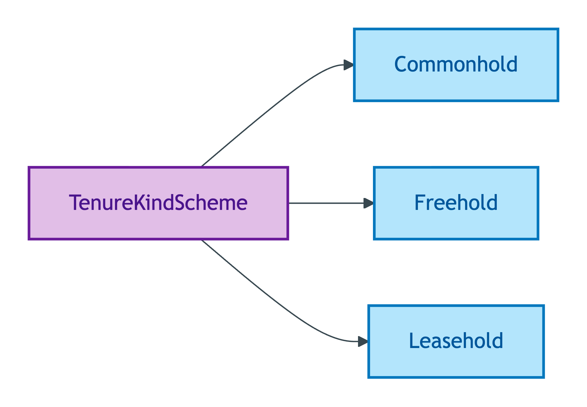
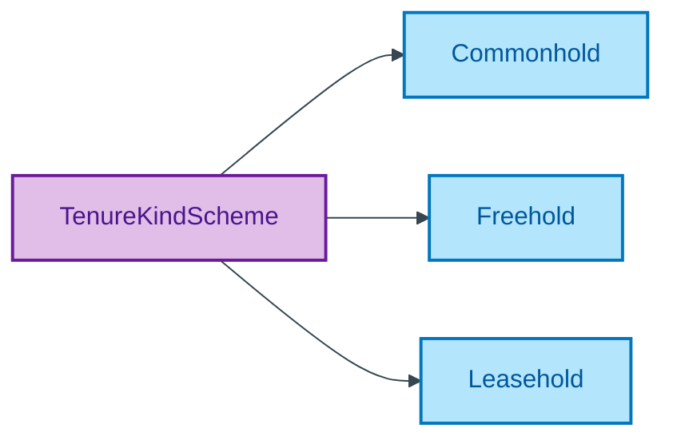

# TenureKindScheme

## Summary

Substance Kind labels for tenure (Freehold, Leasehold, Commonhold). Each member binds to its corresponding OWL sub-class via `skos:exactMatch` per ODR-0011 §8a Substance Kind label cross-scheme consistency check (NEVER `owl:sameAs` per ODR-0005 Anti-pattern §5). [UFO Substance Kind label]. Steward: Kendall (LegalEstate steward per S008 Q2).
[Concept tier — LegalEstate →](../../../concept/property/legal-estate.md)

## Members

| Notation | Label | Definition | Source |
|---|---|---|---|
| `Commonhold` | Commonhold | Substance Kind: commonhold tenure | OPDA data dictionary |
| `Freehold` | Freehold | Substance Kind: freehold tenure | OPDA data dictionary |
| `Leasehold` | Leasehold | Substance Kind: leasehold tenure | OPDA data dictionary |

## Cardinality discipline

Bound by [`LegalEstate.tenureKind`](../legal-estate.md#attributes) (`0..1`, identity-bearing surface). Members bind to OWL sub-classes via `skos:exactMatch`; binding mechanism is the only admissible cross-scheme alignment per ODR-0005 Anti-pattern §5. Closed scheme — new tenure Kinds require Council ratification.

## Concept hierarchy

Mermaid Source

## Source ODR + ADR

- [ODR-0011 — Enumeration vocabularies](../../../ontology/odr/ODR-0011-enumeration-vocabularies.md), §8a UFO meta-category
- [ODR-0005 — Property + LegalEstate + RegisteredTitle](../../../ontology/odr/ODR-0005-property-legal-estate-registered-title.md), Anti-pattern §5
- [ADR-0010 — SKOS vocabulary emission](../../../adr/ADR-0010-skos-vocabulary-emission.md) — implementation
