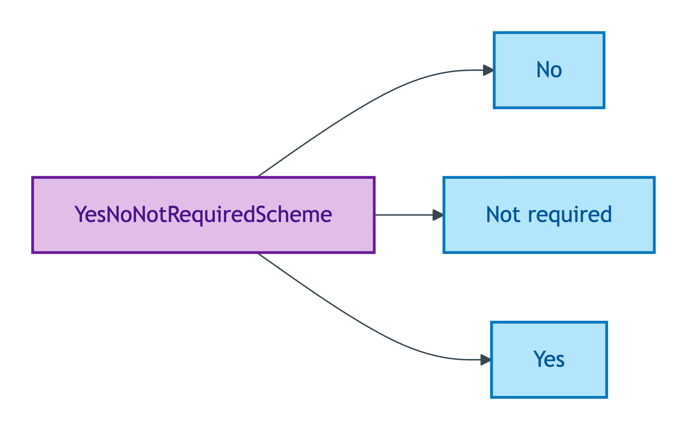
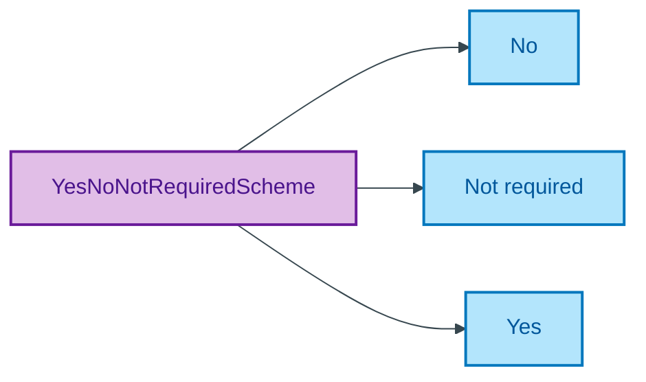

# YesNoNotRequiredScheme

## Summary

Mode label register for BASPI5 questions admitting not-required as a third option (Yes / No / Not required). [UFO Quale-in-Region]. Mode register for BASPI5 form questions where the question itself becomes not-required in some discriminator branches. Steward: Allemang (property-qualities sub-module steward per S008 Q2).
[Concept tier — Property module →](../../../concept/property/README.md)

## Members

| Notation | Label | Definition | Source |
|---|---|---|---|
| `No` | No | Negative answer | [ODR-0011 §1a](../../../ontology/odr/ODR-0011-enumeration-vocabularies.md) |
| `Not required` | Not required | Answer is not required in this context | [ODR-0011 §1a](../../../ontology/odr/ODR-0011-enumeration-vocabularies.md) |
| `Yes` | Yes | Affirmative answer | [ODR-0011 §1a](../../../ontology/odr/ODR-0011-enumeration-vocabularies.md) |

## Cardinality discipline

Bound by BASPI5 questions where the question becomes not-required in some discriminator branches. No core-tier attribute binds this scheme directly; binding lives in BASPI5 and equivalent overlay profiles. Closed scheme — strict three-member.

## Concept hierarchy

Mermaid Source

## Source ODR + ADR

- [ODR-0011 — Enumeration vocabularies](../../../ontology/odr/ODR-0011-enumeration-vocabularies.md), §1a scheme-steward
- [ADR-0010 — SKOS vocabulary emission](../../../adr/ADR-0010-skos-vocabulary-emission.md) — implementation
