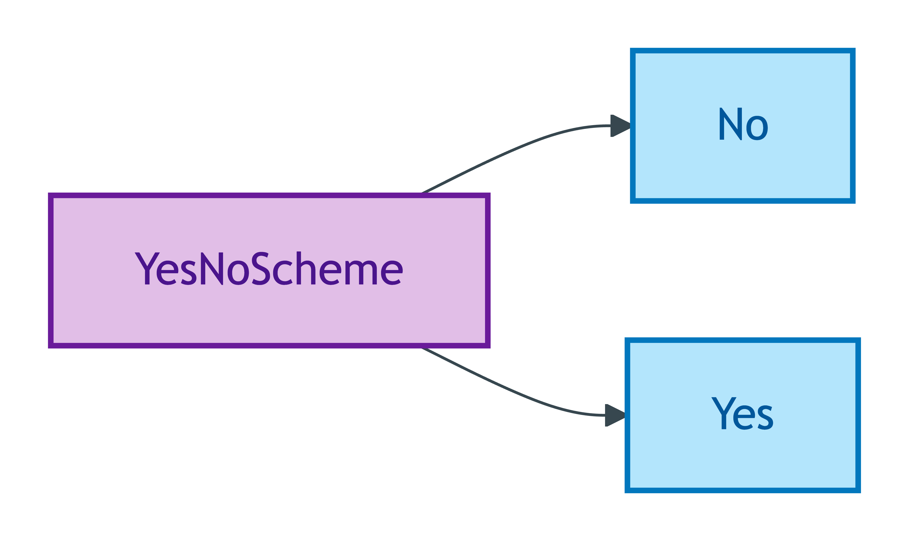
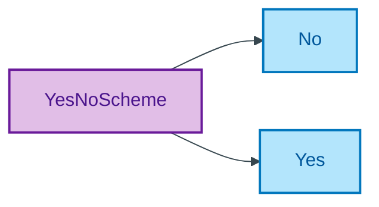

# YesNoScheme

## Summary

Binary register for affirmative/negative answers to BASPI5 discriminator questions (Yes / No). [UFO Quale-in-Region / DOLCE Quality-Region]. Used by ~276 BASPI5 discriminator questions across the Property, LegalEstate, and Agent modules; emitted as a shared scheme per ODR-0011 §1a one-scheme-per-enum discipline. Steward: Allemang (property-qualities sub-module steward per S008 Q2).
[Concept tier — Property module →](../../../concept/property/README.md)

## Members

| Notation | Label | Definition | Source |
|---|---|---|---|
| `No` | No | Negative answer to a binary BASPI5 question | [ODR-0011 §1a](../../../ontology/odr/ODR-0011-enumeration-vocabularies.md) |
| `Yes` | Yes | Affirmative answer to a binary BASPI5 question | [ODR-0011 §1a](../../../ontology/odr/ODR-0011-enumeration-vocabularies.md) |

## Cardinality discipline

Bound by many Yes/No-bearing attributes across multiple modules:

- Property: `areBoundariesUniform`, `hasBeenFlooded`, `hasSmartHomeSystems`, `hasSprayFoamInstalled`, `hasValidGuaranteesOrWarranties`, `isInsured`, `isLocatedOverCommercialPremises`, `isSupplyMetered`, `riskIndicator`, `soldWithVacantPossession`
- LegalEstate: `isGroundRentPayable`, `isSharedOwnership`, `sellerContributesToServiceCharge`
- Agent (Seller): `hasOthersAged17OrOver`

All bindings are `0..1` (optional). Closed scheme — strict two-member binary; questions admitting a third option use [`YesNoNotApplicableScheme`](./yes-no-not-applicable-scheme.md), [`YesNoNotKnownScheme`](./yes-no-not-known-scheme.md), or [`YesNoNotRequiredScheme`](./yes-no-not-required-scheme.md).

## Concept hierarchy

Mermaid Source

## Source ODR + ADR

- [ODR-0011 — Enumeration vocabularies](../../../ontology/odr/ODR-0011-enumeration-vocabularies.md), §1a scheme-steward / one-scheme-per-enum discipline
- [ADR-0010 — SKOS vocabulary emission](../../../adr/ADR-0010-skos-vocabulary-emission.md) — implementation
