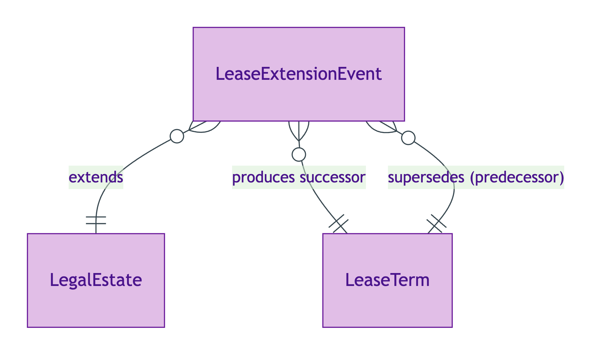
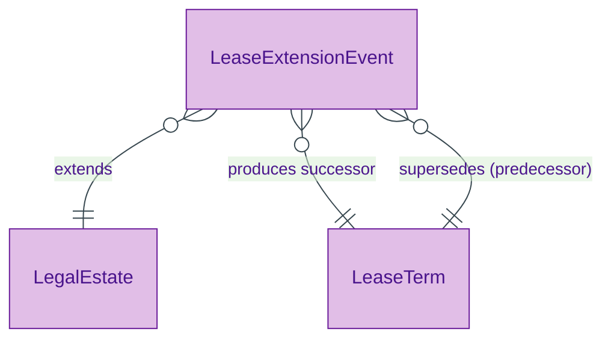

# Lease Extension Event

## Summary

Reified PROV-O activity recording a statutory lease extension (LRHUDA 1993 in England & Wales). Mutates the LeaseTerm of an existing leasehold [LegalEstate](./legal-estate.md) — LegalEstate identity PERSISTS through extension per ODR-0005 §3b Rule 1; the rights-bundle is modified, not dissolved. Updates the RegisteredTitle's registry record. [Event particular; UFO Event particular / DOLCE Accomplishment]. The same node may co-type as [Transaction](../transaction/transaction.md) (S007 Q1 Transaction-as-Relator) — the dual typing reflects the property-lifecycle vs relator perspectives on the same event.
[Concept tier →](../../concept/property/lease-extension-event.md)

## Attributes

This entity declares no module-local datatype properties. Timestamps live on the inherited `prov:Activity` predicates (`prov:atTime` for instant culmination; `prov:startedAtTime` / `prov:endedAtTime` if the registration spans an interval).

## Relationships

This entity declares no module-local object properties. The extension event references the LegalEstate it extends and the predecessor / successor LeaseTerm pair via PROV-O predicates (`prov:wasGeneratedBy`, `prov:wasDerivedFrom`).

## Identity key

Identity key = `(LegalEstate, prov-timestamp)` tuple. The reified event has its own URI; identity is established by the (estate-affected, culmination-timestamp) pair.

## Constraints

No SHACL Violation/Warning shapes emitted on LeaseExtensionEvent at this tier. PROV-O lifecycle constraints (a `prov:Activity` requires either `prov:atTime` or both `prov:startedAtTime` + `prov:endedAtTime`) are inherited from the upstream W3C PROV-O recommendation.

## Derived attributes

None on the event itself — the LeaseTerm succession status (whether a given LeaseTerm has a predecessor) is materialised on the LeaseTerm via the `hasLeaseTermSuccessionStatus` rule.

## ER diagram

Mermaid Source

## Source ODR + ADR

- [ODR-0005 — Property + LegalEstate + RegisteredTitle](../../../ontology/odr/ODR-0005-property-legal-estate-registered-title.md), §3b Rule 1 (LegalEstate identity persistence through extension)
- [ADR-0011 — Module TBox emission](../../../adr/ADR-0011-module-tbox-emission.md) — implementation
