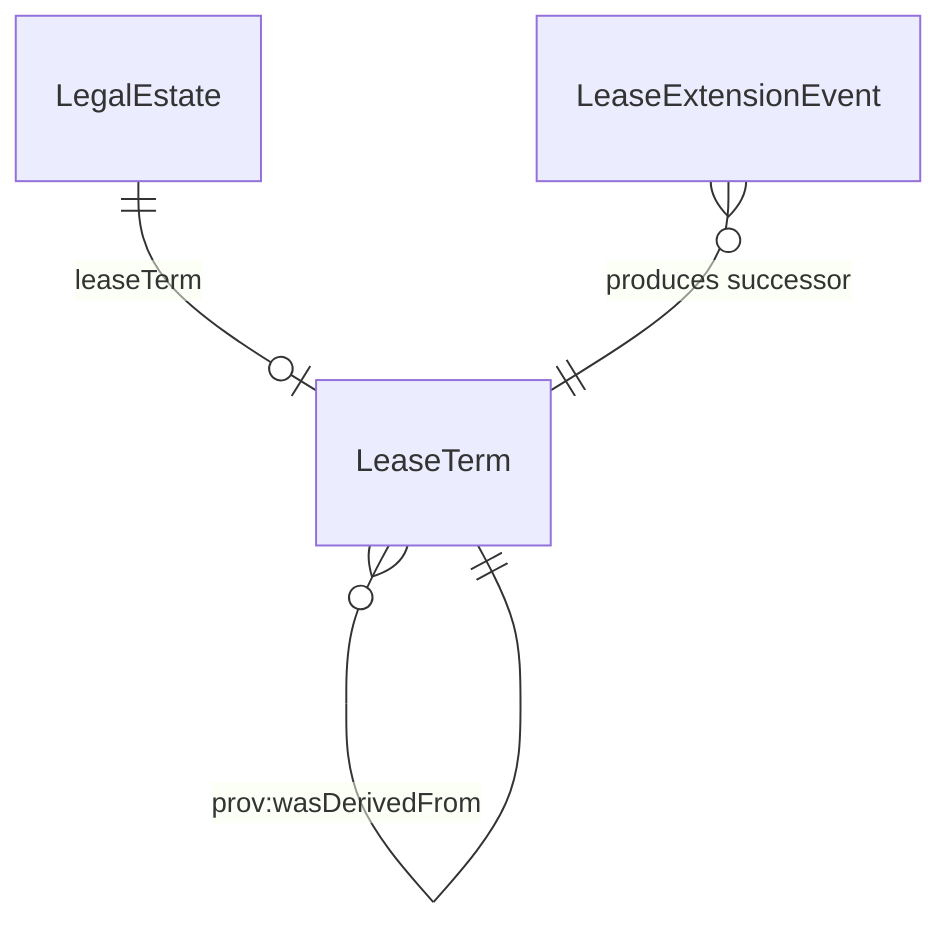

# Lease Term

## Summary

OWL-Time `ProperInterval` representing a leasehold term. Carries `time:hasBeginning` + `time:hasDurationDescription` (or `time:hasEnd`) per S007 Q5. [Information particular; UFO Information particular bounding a leasehold tenure perdurant]. Belongs to a leasehold [LegalEstate](./legal-estate.md). Modified by [LeaseExtensionEvent](./lease-extension-event.md) on statutory extension — extension produces a successor LeaseTerm with a `prov:wasDerivedFrom` chain.
[Concept tier →](../../concept/property/lease-term.md)

## Attributes

This entity declares no module-local datatype properties beyond those inherited from `time:ProperInterval` (`time:hasBeginning`, `time:hasEnd`, `time:hasDurationDescription`). These OWL-Time predicates are platform-agnostic and not re-emitted at the Logical tier.

## Relationships

This entity declares no module-local object properties. Inbound predicates: `LegalEstate.leaseTerm`; `LeaseExtensionEvent` produces a successor via PROV-O.

## Identity key

Identity key = `(LegalEstate, time:hasBeginning, time:hasEnd)` or `(LegalEstate, time:hasBeginning, time:hasDurationDescription)`. A LeaseTerm is parasitic on its parent LegalEstate; on lease extension a successor LeaseTerm is minted via `prov:wasDerivedFrom`. Cross-reference: Concept-tier [LeaseTerm narrative](../../concept/property/lease-term.md).

## Constraints

No SHACL Violation/Warning shapes emitted on LeaseTerm at this tier — the OWL-Time interval shape constraints are inherited from the upstream W3C Time Ontology recommendation.

## Derived attributes

| Attribute | Derived from | Rule summary | Severity |
|---|---|---|---|
| `hasLeaseTermSuccessionStatus` | `prov:wasDerivedFrom` chain to predecessor LeaseTerm | `extended-from-predecessor` when a prior LeaseTerm is named via prov; `primary-term` otherwise | `Info` |

## ER diagram

## Source ODR + ADR

- [ODR-0007 — Transaction lifecycle](../../../ontology/odr/ODR-0007-transaction-lifecycle.md), §Q5 LeaseTerm
- [ADR-0011 — Module TBox emission](../../../adr/ADR-0011-module-tbox-emission.md) — implementation
- [ADR-0012 — SHACL + DPV annotation emission](../../../adr/ADR-0012-shacl-and-dpv-annotation-emission.md) — derived-attribute rule
