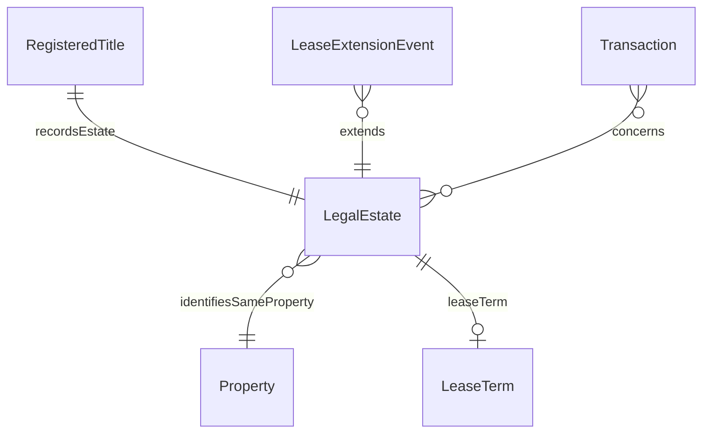

# Legal Estate

## Summary

Legal rights-bundle vested in a Property. [Substance Kind; UFO Substance Kind / DOLCE NonPhysicalEndurant — Searle 1995 legal-institutional object]. Identity criterion is rights-bundle persistence: same individual through grant, transfer, registration, and discharge events; distinguishable from coexisting RegisteredTitle and physical Property by extent of property rights. Hard cases per ODR-0005 §3b: tenure change, lease grant, lease termination, commonhold conversion, first-registration of pre-existing common-law estate.
[Concept tier →](../../concept/property/legal-estate.md)

## Attributes

| Attribute | Type | Cardinality | Required | Identity-bearing | Description |
|---|---|---|---|---|---|
| `tenureKind` | `EnumScheme:TenureKindScheme` | `0..1` | N | Y | Tenure classification (Freehold / Leasehold / Commonhold) — surface IC element |
| `ownershipType` | `EnumScheme:OwnershipTypeScheme` | `0..1` | N | N | Ownership structure (Freehold / Leasehold / Commonhold / Other) |
| `isGroundRentPayable` | `EnumScheme:YesNoScheme` | `0..1` | N | N | Yes/No: is ground rent payable on the Leasehold? |
| `isSharedOwnership` | `EnumScheme:YesNoScheme` | `0..1` | N | N | Yes/No: is this a shared-ownership lease? Applies to Leasehold ownership |
| `sellerContributesToServiceCharge` | `EnumScheme:YesNoScheme` | `0..1` | N | N | Yes/No: does the Seller contribute to a service charge? Applies to Leasehold / Managed Freehold / Commonhold |

## Relationships

| Predicate | Target entity | Cardinality | Inverse | Description |
|---|---|---|---|---|
| `leaseTerm` | `LeaseTerm` | `0..1` | — | LegalEstate → LeaseTerm join (Leasehold tenure only). The LeaseTerm bounds the leasehold tenure as an OWL-Time ProperInterval |

Inbound predicates: `RegisteredTitle.recordsEstate`; `LeaseExtensionEvent` mutates the LeaseTerm via PROV-O derivation; `Transaction.concerns` references the LegalEstate.

## Identity key

Identity key = rights-bundle persistence (the typed surface is `tenureKind` + the full rights-bundle IC enforced via the registered-title binding through `RegisteredTitle.recordsEstate`). Identity persists through grant / transfer / registration / discharge — these are mutations of the rights-bundle rather than identity-collapsing events. Cross-reference: Concept-tier [LegalEstate IC narrative](../../concept/property/legal-estate.md#identity-criterion).

## Constraints

- `tenureKind` MUST be a single `string` value when present (`Violation`, `LegalEstateIdentityKeyShape`)
- LegalEstate identity persists through `LeaseExtensionEvent` per ODR-0005 §3b Rule 1: the rights-bundle is modified, not dissolved

## Derived attributes

None at this tier — the LeaseTerm succession status is materialised on `LeaseTerm`, not on the parent LegalEstate.

## ER diagram

## Source ODR + ADR

- [ODR-0005 — Property + LegalEstate + RegisteredTitle](../../../ontology/odr/ODR-0005-property-legal-estate-registered-title.md), §3b LegalEstate IC
- [ADR-0011 — Module TBox emission](../../../adr/ADR-0011-module-tbox-emission.md) — implementation
- [ADR-0012 — SHACL + DPV annotation emission](../../../adr/ADR-0012-shacl-and-dpv-annotation-emission.md) — shapes
