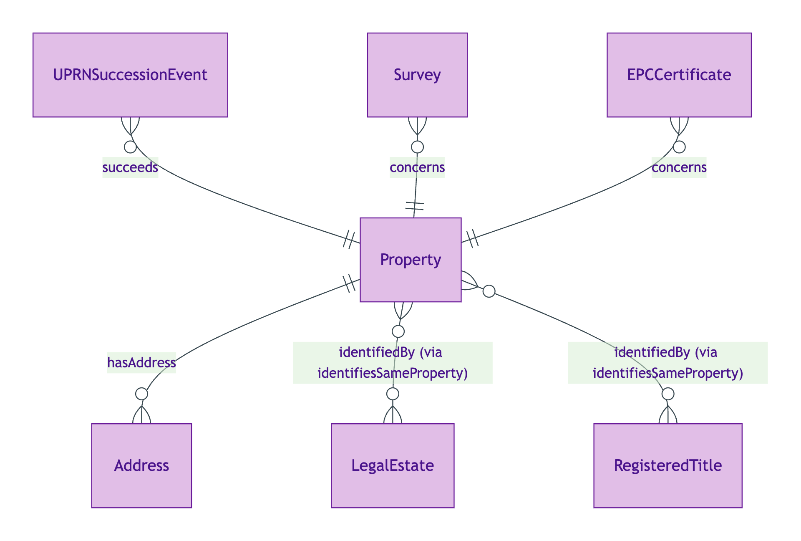
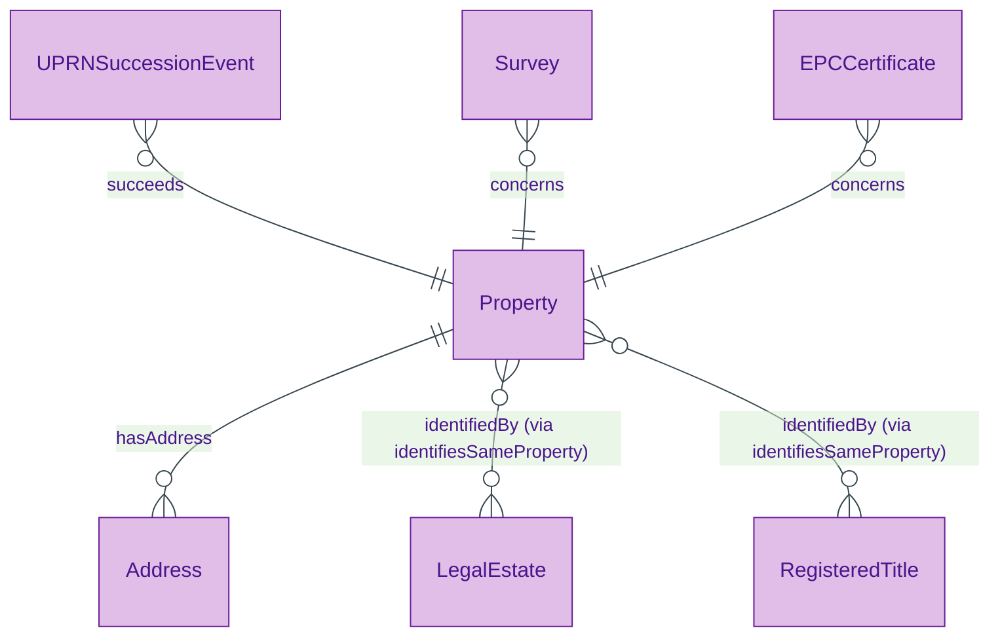
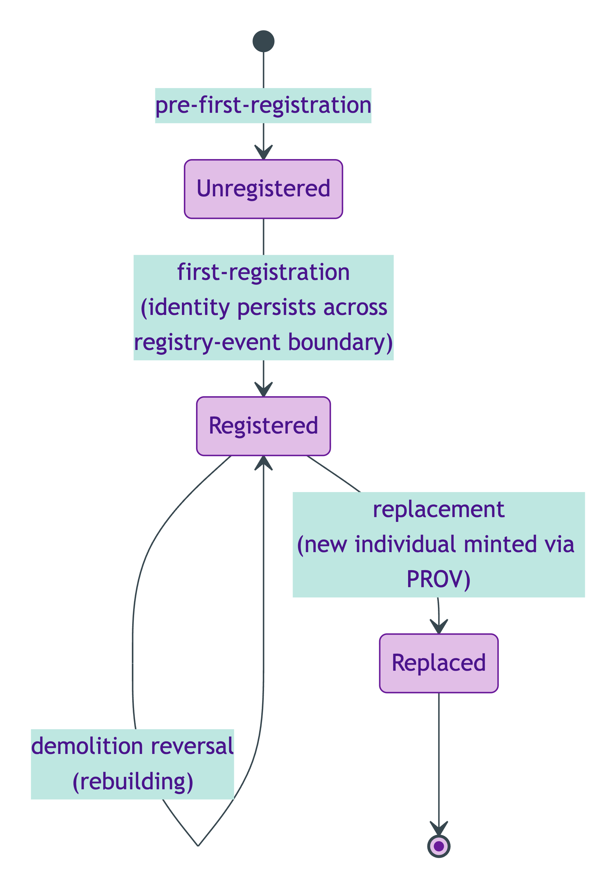
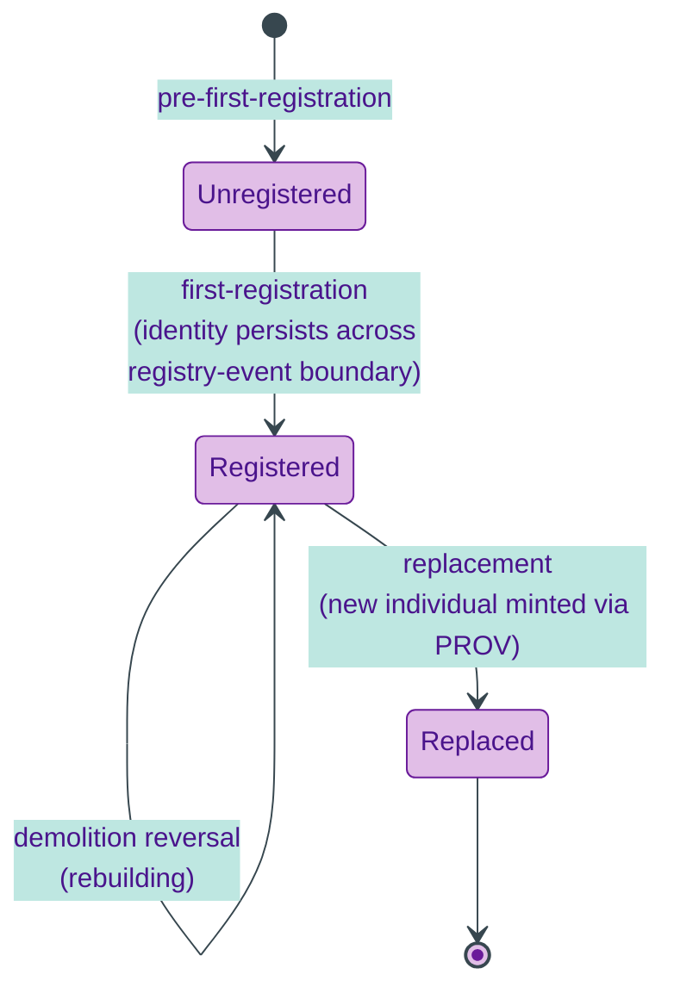

# Property

## Summary

Physical property — the spatial-material object that sits at the centre of OPDA's data model. [Substance Kind; UFO Substance Kind / DOLCE Endurant + PhysicalObject]. Identity criterion is spatial-material continuity with a Kendall + Davis legal-record-discontinuity-override hybrid: same individual through demolition reversal, subdivision-merger continuity, and replacement, with first-registration / unregistered-pre-registration cases preserving identity across the registry-event boundary.
[Concept tier →](../../concept/property/property.md)

## Attributes

| Attribute | Type | Cardinality | Required | Identity-bearing | Description |
|---|---|---|---|---|---|
| `hasUPRN` | `string` | `0..1` | N | N | Unique Property Reference Number — OS AddressBase identifier. Contingent administrative identifier under PROV-O succession; NOT a load-bearing IC |
| `propertyType` | `EnumScheme:PropertyTypeScheme` | `0..1` | N | N | Physical-form Kind classification (House / Bungalow / Flat / Maisonette / Park home / Other) |
| `builtForm` | `EnumScheme:BuiltFormScheme` | `0..1` | N | N | Structural built-form classification (Detached / Semi-detached / Mid-terrace / End-terrace / Other) |
| `areBoundariesUniform` | `EnumScheme:YesNoScheme` | `0..1` | N | N | Yes/No: do the Property's legal and physical boundaries match? |
| `centralHeatingFuelType` | `EnumScheme:CentralHeatingFuelTypeScheme` | `0..1` | N | N | Fuel classification for central heating (Mains gas / Electricity / Oil / LPG / Biomass / Other) |
| `currentEnergyRating` | `EnumScheme:CurrentEnergyRatingScheme` | `0..1` | N | N | EPC current energy rating band (A–G) |
| `hasBeenFlooded` | `EnumScheme:YesNoScheme` | `0..1` | N | N | Yes/No: has the Property been flooded? |
| `hasSmartHomeSystems` | `EnumScheme:YesNoScheme` | `0..1` | N | N | Yes/No: does the Property have smart-home systems installed? |
| `hasSprayFoamInstalled` | `EnumScheme:YesNoScheme` | `0..1` | N | N | Yes/No: has spray-foam insulation been installed? Relevant for mortgage eligibility |
| `hasValidGuaranteesOrWarranties` | `EnumScheme:YesNoScheme` | `0..1` | N | N | Yes/No: does the Property carry valid guarantees, warranties, or indemnity insurances? |
| `heatingType` | `EnumScheme:HeatingTypeScheme` | `0..1` | N | N | Heating-system arrangement (Central / Communal / Room heaters only / None) |
| `isInsured` | `EnumScheme:YesNoScheme` | `0..1` | N | N | Yes/No: is the Property currently insured? |
| `isLocatedOverCommercialPremises` | `EnumScheme:YesNoScheme` | `0..1` | N | N | Yes/No: is the Property located over commercial premises? Applies to Flats / Maisonettes |
| `isSupplyMetered` | `EnumScheme:YesNoScheme` | `0..1` | N | N | Yes/No: is the Property's utility supply (electricity / water / gas) metered? |
| `offMainsDrainageSystemType` | `EnumScheme:OffMainsDrainageSystemTypeScheme` | `0..1` | N | N | Off-mains drainage classification when not connected to mains sewerage |
| `riskIndicator` | `EnumScheme:YesNoScheme` | `0..*` | N | N | Yes/No-bearing risk indicators (flood / radon / coal-mining etc.) |
| `soldWithVacantPossession` | `EnumScheme:YesNoScheme` | `0..1` | N | N | Yes/No: is the Property sold with vacant possession? |

## Relationships

| Predicate | Target entity | Cardinality | Inverse | Description |
|---|---|---|---|---|
| `hasAddress` | `Address` | `0..*` | — | Property → Address join. Multiple Addresses differing on `addressVariant` are admissible |
| `identifiesSameProperty` | `Property` | `0..*` | — | Co-reference predicate from any identity-bearing surface (RegisteredTitle, LegalEstate, Address) to the physical Property. NEVER use `owl:sameAs` per ODR-0005 Rule 5 |

## Identity key

Identity key = spatial-material continuity (cf. Kendall S005 Q4 + Davis legal-record-discontinuity-override hybrid per ODR-0005 §2a). `hasUPRN` is a contingent administrative surface; succession across UPRN re-numbering is tracked by [UPRNSuccessionEvent](./uprn-succession-event.md) via PROV-O. Cross-reference: Concept-tier [Property IC narrative](../../concept/property/property.md#identity-criterion).

## Constraints

- `hasUPRN` MUST be a single `string` value when present; absence is admissible (`Violation`, `PropertyIdentityKeyShape`)
- Property co-reference MUST use `identifiesSameProperty` (IRI-valued); `owl:sameAs` is forbidden per ODR-0005 Rule 5 (`Violation`, `PropertyICBreachShape`)

## Derived attributes

| Attribute | Derived from | Rule summary | Severity |
|---|---|---|---|
| `hasUPRNSuccessionStatus` | `hasUPRN` + `prov:wasDerivedFrom` chain | `succession-tracked` when prov-predecessor carries a different UPRN; `primary-uprn` otherwise | `Info` |

## ER diagram

Mermaid Source

## Lifecycle state-transition diagram

Property identity persists through hard-case lifecycle events per ODR-0005 §2a (Kendall + Davis hybrid). The Kendall-side IC anchors spatial-material continuity; the Davis-side override admits legal-record-discontinuity through UPRN re-numbering and first-registration boundaries.

Mermaid Source

## Source ODR + ADR

- [ODR-0005 — Property + LegalEstate + RegisteredTitle](../../../ontology/odr/ODR-0005-property-legal-estate-registered-title.md), §2a Property IC; §6a UPRN succession
- [ODR-0008 — Descriptive attributes](../../../ontology/odr/ODR-0008-descriptive-attributes.md), §Q5a BASPI5 Yes/No discriminators
- [ADR-0011 — Module TBox emission](../../../adr/ADR-0011-module-tbox-emission.md) — implementation
- [ADR-0012 — SHACL + DPV annotation emission](../../../adr/ADR-0012-shacl-and-dpv-annotation-emission.md) — shapes
