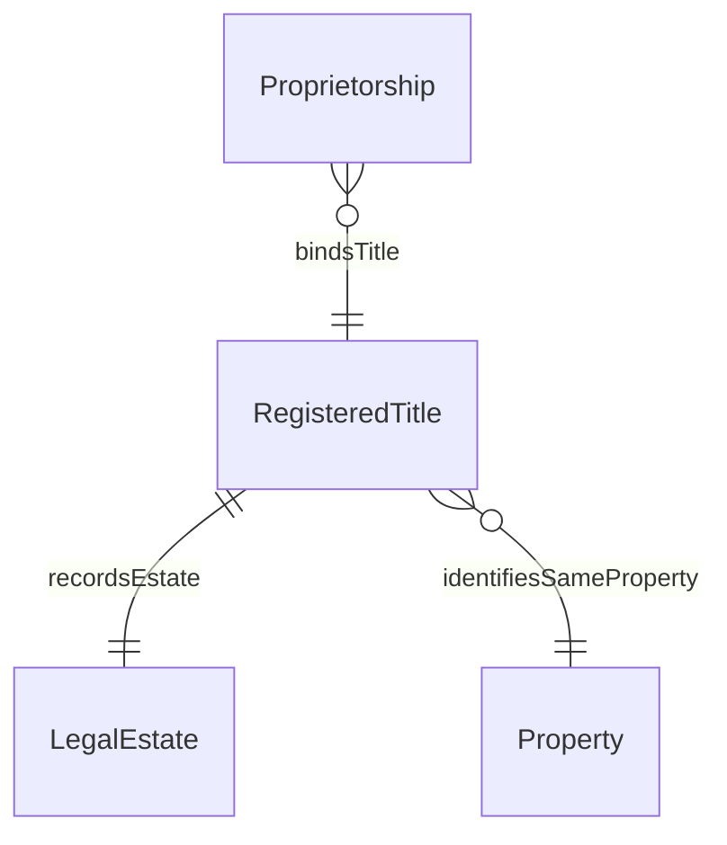

# Registered Title

## Summary

HM Land Registry title-register record. [Substance Kind (informational); UFO Substance Kind / DOLCE NonPhysicalEndurant — HMLR record-entity]. Identity criterion is title-number lineage + registry-event history: every lifecycle event is captured as a reified `prov:Activity` with explicit `prov:wasDerivedFrom` / `prov:wasInvalidatedBy` triples. Hard cases per ODR-0005 §3c: first registration (title opening), title closure, title merger, transfer between registers, title reissue on corrupt-plan replacement.
[Concept tier →](../../concept/property/registered-title.md)

## Attributes

This entity declares no module-local datatype properties at the foundation scope. Title-number, registry-tag, and class-of-title attributes are carried on the HMLR record-entity surface and exposed via PROV-O lifecycle reification rather than as direct datatype properties on the RegisteredTitle.

## Relationships

| Predicate | Target entity | Cardinality | Inverse | Description |
|---|---|---|---|---|
| `recordsEstate` | `LegalEstate` | `1..1` | — | The RegisteredTitle's HMLR record names the LegalEstate it documents (three-way structural seam: RegisteredTitle recordsEstate LegalEstate; LegalEstate vests in Property; RegisteredTitle identifiesSameProperty Property) |
| `identifiesSameProperty` | `Property` | `0..*` | — | Co-reference predicate to the physical Property (inherited foundation predicate) |

## Identity key

Identity key = title-number lineage + reified registry-event history. The title-number alone is insufficient — title-numbers may be reissued on corrupt-plan replacement or merger; identity persists through such events via the PROV-O lifecycle reification chain. Cross-reference: Concept-tier [RegisteredTitle IC narrative](../../concept/property/registered-title.md#identity-criterion).

## Constraints

No additional non-cardinality constraints emitted at this tier. The three-way structural seam constraint (RegisteredTitle.recordsEstate must resolve to a LegalEstate that identifiesSameProperty as the RegisteredTitle's own Property) is left to data-validation tooling outside the shapes graph.

## Derived attributes

None at this tier.

## ER diagram

## Source ODR + ADR

- [ODR-0005 — Property + LegalEstate + RegisteredTitle](../../../ontology/odr/ODR-0005-property-legal-estate-registered-title.md), §3c RegisteredTitle IC
- [ADR-0011 — Module TBox emission](../../../adr/ADR-0011-module-tbox-emission.md) — implementation
