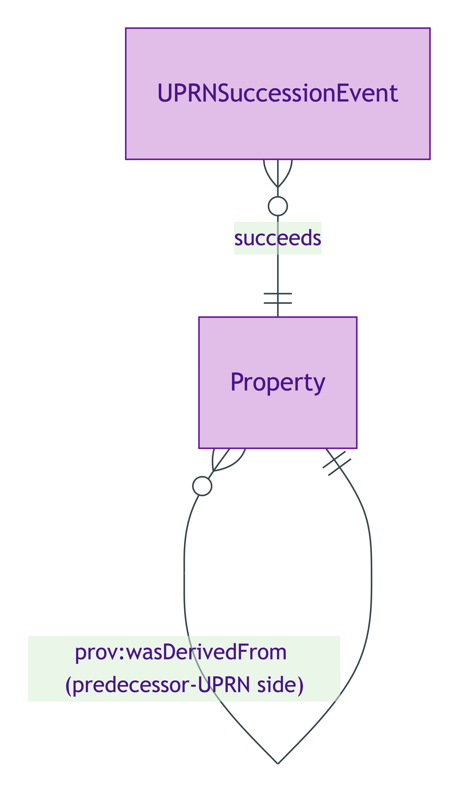
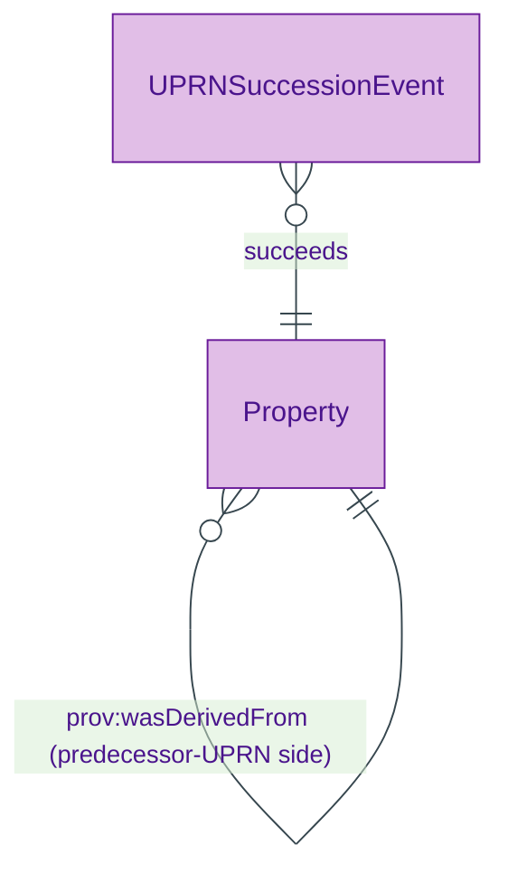

# UPRN Succession Event

## Summary

Reified PROV-O activity recording an administrative re-numbering of UPRN for a single physical [Property](./property.md). [Event particular; UFO Event particular / DOLCE Achievement or Accomplishment]. The Property's identity PERSISTS through UPRN succession per ODR-0005 Rule 6. Canonical succession form per Gandon W3C-side recommendation (S005 Q4) — own URI, dereferenceable identity, audit trail. Coexists with the denormalised `previousUPRN` literal-pair convenience (authoritative form: this reified event).
[Concept tier →](../../concept/property/uprn-succession-event.md)

## Attributes

This entity declares no module-local datatype properties. Timestamp lives on the inherited `prov:Activity` predicate (`prov:atTime` for an instantaneous re-issuance).

## Relationships

This entity declares no module-local object properties. The event references the Property whose UPRN was changed and the predecessor / successor UPRN values via PROV-O predicates (`prov:wasGeneratedBy`, `prov:wasDerivedFrom` on the Property).

## Identity key

Identity key = `(Property, prov-timestamp)` tuple. Each re-numbering event has its own URI; identity is established by the (property-affected, re-issuance-timestamp) pair.

## Constraints

No SHACL Violation/Warning shapes emitted on UPRNSuccessionEvent at this tier. The `Property.hasUPRNSuccessionStatus` derived attribute (on the Property side) is the observable surface that this event materialises.

## Derived attributes

None on the event itself — see [`Property.hasUPRNSuccessionStatus`](./property.md#derived-attributes) for the Property-side materialisation.

## ER diagram

Mermaid Source

## Source ODR + ADR

- [ODR-0005 — Property + LegalEstate + RegisteredTitle](../../../ontology/odr/ODR-0005-property-legal-estate-registered-title.md), §6a UPRN succession (Rule 6)
- [ADR-0011 — Module TBox emission](../../../adr/ADR-0011-module-tbox-emission.md) — implementation
- [ADR-0012 — SHACL + DPV annotation emission](../../../adr/ADR-0012-shacl-and-dpv-annotation-emission.md) — UPRNSuccessionRule
