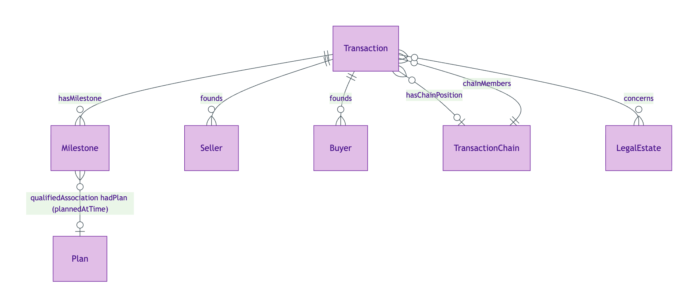
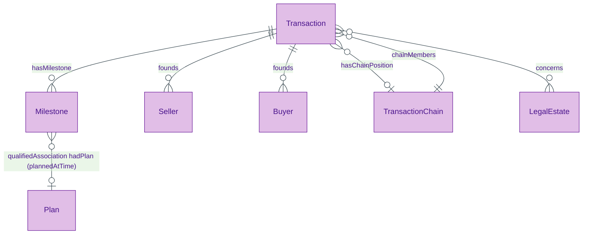
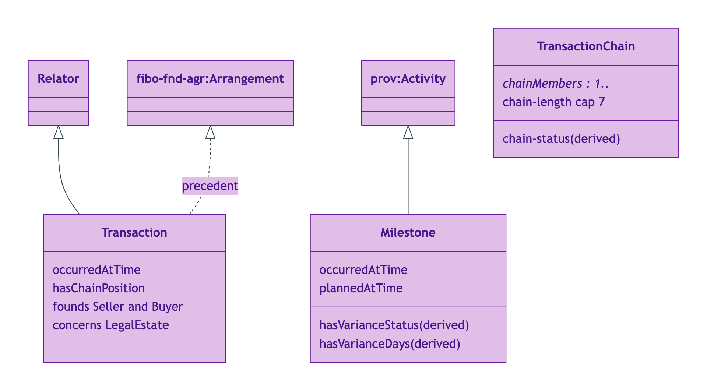
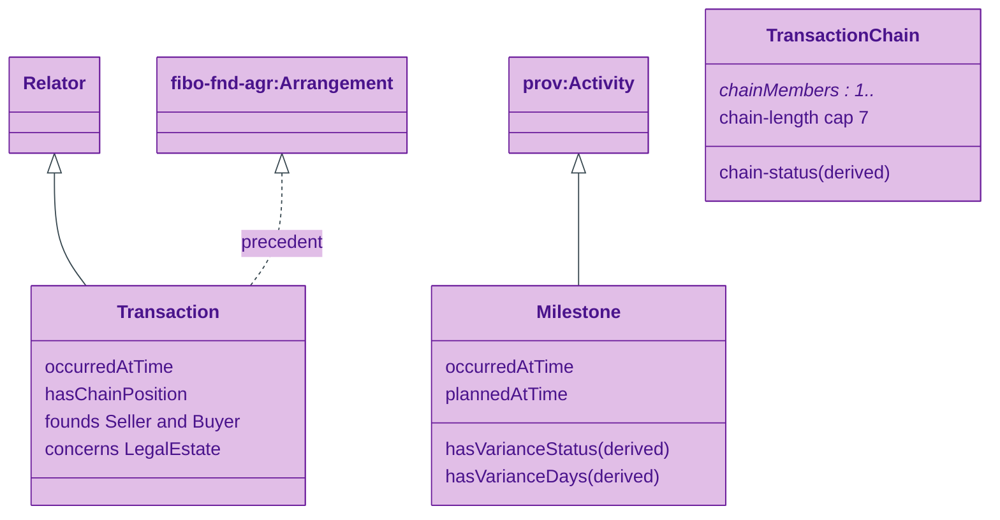
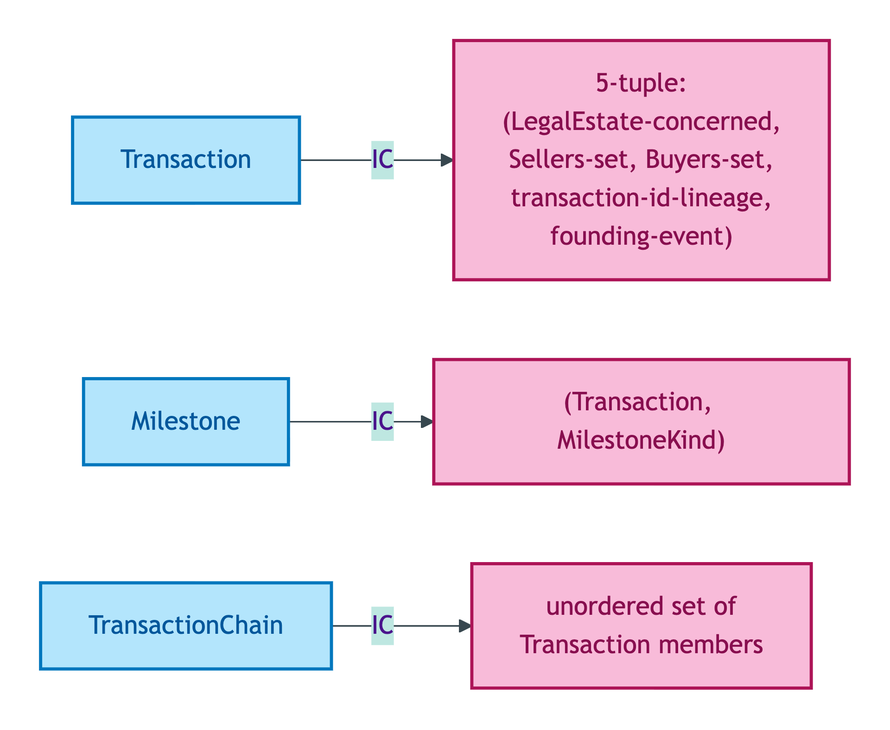
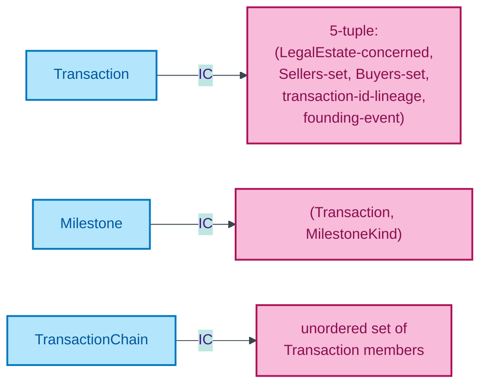

# Transaction module

The Transaction Relator (which founds Buyer and Seller Roles), its lifecycle Milestones (instruction / offer-accepted / exchange / completion / registration), and the TransactionChain aggregate that groups dependent Transactions linked by buyer-also-seller participant overlap.

## Entity inventory

| Entity | UFO meta-category | Notes |
|---|---|---|
| [Milestone](./milestone.md) | Event particular | PROV-O Activity; hybrid instant/interval typing per S007 Q2 |
| [Transaction](./transaction.md) | Relator | FIBO Arrangement precedent; founds Seller + Buyer Roles |
| [TransactionChain](./transaction-chain.md) | Aggregate | Recursive predicate + Chain-with-members dual modelling per S007 Q4 |

## Enumerations bound by this module

| Scheme | Used by attribute | Closed/Open |
|---|---|---|
| [MilestoneKindScheme](./enumerations/milestone-kind-scheme.md) | Milestone kind notation | Closed (5 members) |
| [TransactionStatusScheme](./enumerations/transaction-status-scheme.md) | Transaction lifecycle phase | Closed (5 members) |

## ER diagram

Mermaid Source

Source file: [`../diagrams/transaction-er.mmd`](../diagrams/transaction-er.mmd).

## Class hierarchy

OWL/RDFS subclass relationships. Transaction specialises foundation Relator. Milestone specialises `prov:Activity`. TransactionChain is an Aggregate.

Mermaid Source

## Identity-key summary

Mermaid Source

