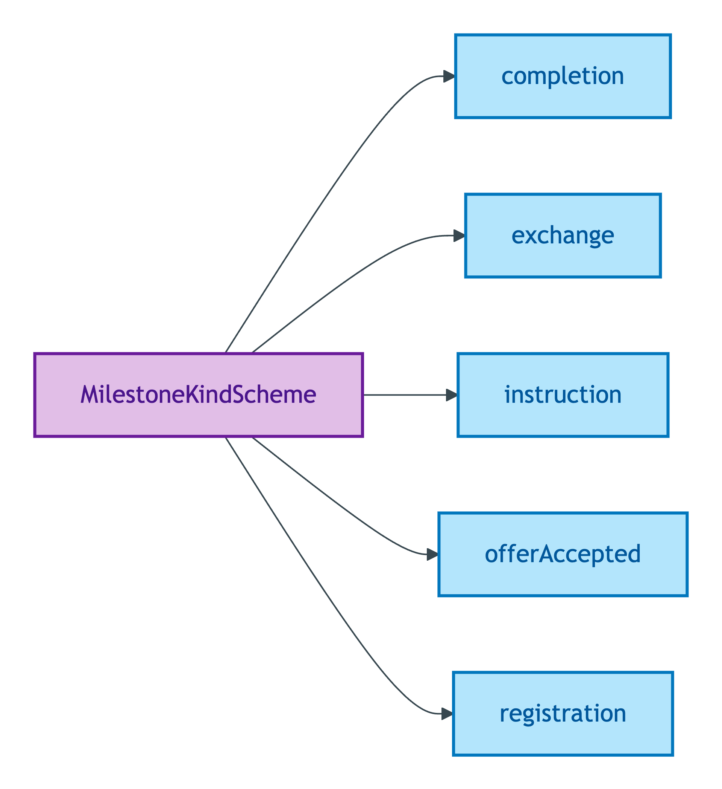
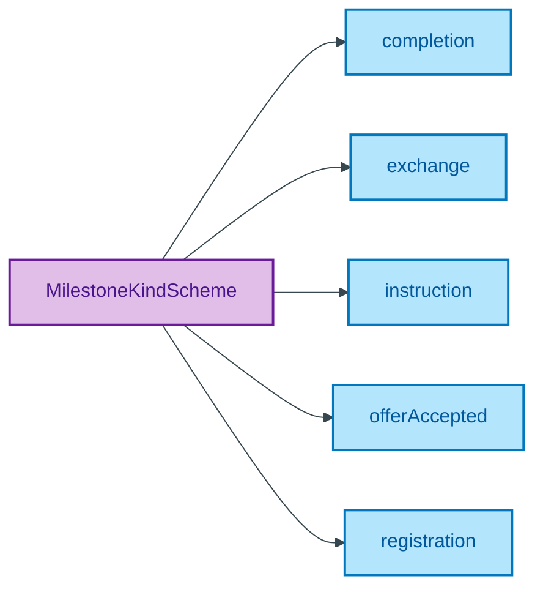

# MilestoneKindScheme

## Summary

Method/plan codes for the procedural milestones authorising stages of a Transaction Activity (instruction → offerAccepted → exchange → completion → registration). [UFO Method/plan code]. Codes are ratified by ODR-0007 §Q2 transaction-lifecycle pattern; each milestone corresponds to a stage transition in the PDTF process. Steward: Guizzardi (S007 Q2).
[Concept tier — Milestone →](../../../concept/transaction/milestone.md)

## Members

| Notation | Label | Definition | Source |
|---|---|---|---|
| `completion` | completion | Completion; legal title transfers; keys handed over | [ODR-0007 §Q2](../../../ontology/odr/ODR-0007-transaction-lifecycle.md) |
| `exchange` | exchange | Contracts exchanged; transaction binding on both parties | [ODR-0007 §Q2](../../../ontology/odr/ODR-0007-transaction-lifecycle.md) |
| `instruction` | instruction | Property instructed to market by Seller; transaction lifecycle begins | [ODR-0007 §Q2](../../../ontology/odr/ODR-0007-transaction-lifecycle.md) |
| `offerAccepted` | offerAccepted | Offer accepted by Seller; transaction enters Under Offer phase | [ODR-0007 §Q2](../../../ontology/odr/ODR-0007-transaction-lifecycle.md) |
| `registration` | registration | Registration completed at HM Land Registry | [ODR-0007 §Q2](../../../ontology/odr/ODR-0007-transaction-lifecycle.md) |

## Cardinality discipline

No core-tier attribute in the emitted TBox currently binds this scheme directly. Used by Milestone instances to discriminate the milestone Kind at the typed-class level (each canonical milestone may bind to a future Milestone sub-class via `skos:exactMatch` when the lifecycle taxonomy expands). Closed scheme — strict five-stage lifecycle.

## Concept hierarchy

Mermaid Source

## Source ODR + ADR

- [ODR-0007 — Transaction lifecycle](../../../ontology/odr/ODR-0007-transaction-lifecycle.md), §Q2 Milestone hybrid typing
- [ADR-0010 — SKOS vocabulary emission](../../../adr/ADR-0010-skos-vocabulary-emission.md) — implementation
