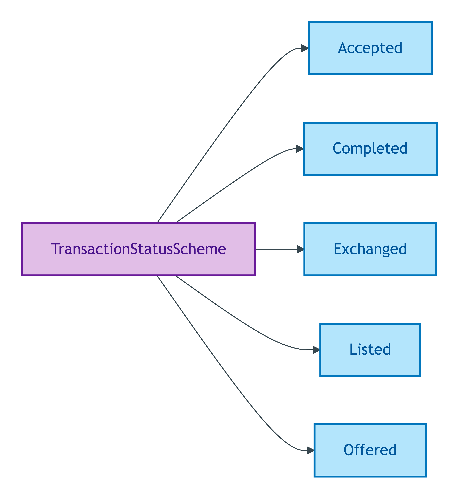
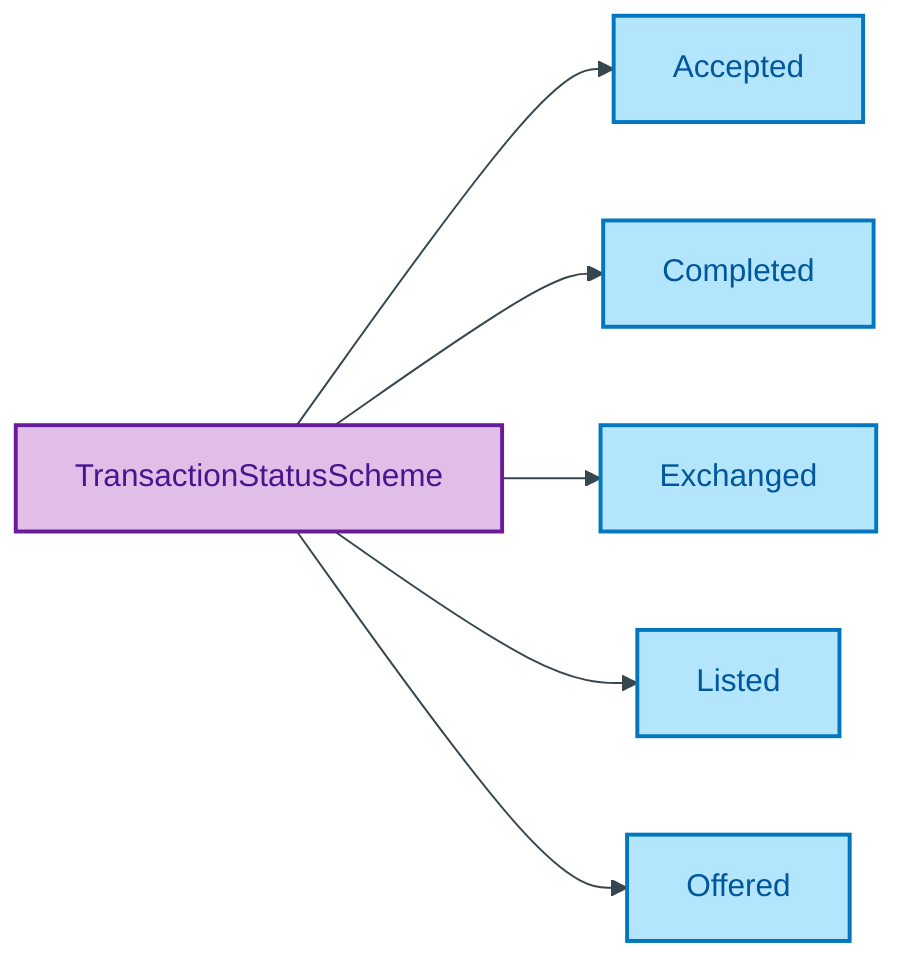

# TransactionStatusScheme

## Summary

Phase labels for the lifecycle of a Transaction Substance Kind, tracking the five canonical phases (Listed → Offered → Accepted → Exchanged → Completed). [UFO Phase label]. Data dictionary leaf `status` carries a broader 9-value enum (including marketing-side and let-side phases); the ADR-named five-phase canonical set is emitted here as the UFO phase set for the sale lifecycle. Per-member `prov:wasDerivedFrom` links each canonical label to the underlying data-dictionary enum value it sources from (G10 closure per ADR-0013). Steward: Guizzardi (S007 Q3).
[Concept tier — Transaction →](../../../concept/transaction/transaction.md)

## Members

| Notation | Label | Definition | Source |
|---|---|---|---|
| `Accepted` | Accepted | An offer has been accepted, transaction is in progress | [ODR-0011 §8a](../../../ontology/odr/ODR-0011-enumeration-vocabularies.md) (derived from data-dictionary `Sold subject to contract`) |
| `Completed` | Completed | Transaction has completed; legal title has transferred | [ODR-0011 §8a](../../../ontology/odr/ODR-0011-enumeration-vocabularies.md) (derived from data-dictionary `Completed`) |
| `Exchanged` | Exchanged | Contracts have been exchanged | [ODR-0011 §8a](../../../ontology/odr/ODR-0011-enumeration-vocabularies.md) (derived from data-dictionary `Contracts exchanged`) |
| `Listed` | Listed | Property is listed for sale | [ODR-0011 §8a](../../../ontology/odr/ODR-0011-enumeration-vocabularies.md) (derived from data-dictionary `For sale`) |
| `Offered` | Offered | An offer has been made on the property | [ODR-0011 §8a](../../../ontology/odr/ODR-0011-enumeration-vocabularies.md) (derived from data-dictionary `Under offer`) |

## Cardinality discipline

No core-tier attribute in the emitted TBox currently binds this scheme directly. Used by overlay-profile transaction-status attributes to discriminate the canonical five-phase sale lifecycle. Closed scheme — broader data-dictionary status values are mapped to the canonical five via `prov:wasDerivedFrom`.

## Concept hierarchy

Mermaid Source

## Source ODR + ADR

- [ODR-0007 — Transaction lifecycle](../../../ontology/odr/ODR-0007-transaction-lifecycle.md), §Q3 Transaction status
- [ODR-0011 — Enumeration vocabularies](../../../ontology/odr/ODR-0011-enumeration-vocabularies.md), §8a UFO meta-category
- [ADR-0010 — SKOS vocabulary emission](../../../adr/ADR-0010-skos-vocabulary-emission.md) — implementation
- [ADR-0013 — Overlay profile emission](../../../adr/ADR-0013-overlay-profile-emission.md) — G10 closure
