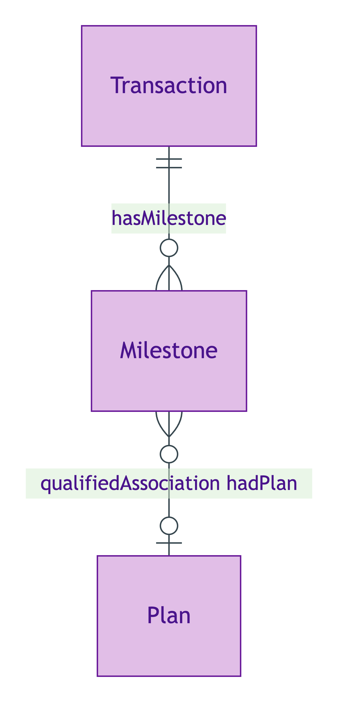
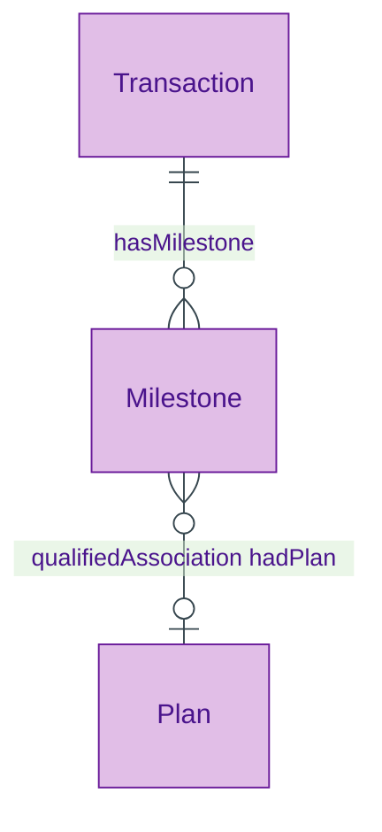
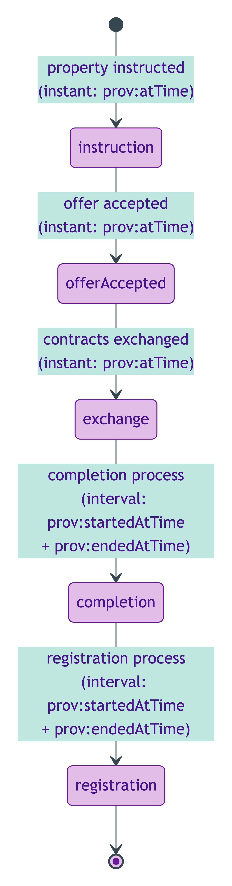
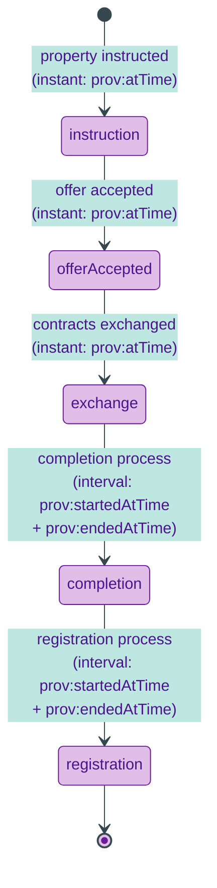

# Milestone

## Summary

Transaction lifecycle milestone. [Event particular; UFO Event particular / DOLCE Achievement (instant) or Accomplishment (interval) / PROV-O Activity]. Hybrid PROV-O typing per S007 Q2: instant milestones (instruction, offerAccepted, exchange) carry `prov:atTime`; interval milestones (completion-process, registration-process) carry `prov:startedAtTime` + `prov:endedAtTime` per Moreau W3C-grade discipline. Each Milestone Activity may pair with a `prov:Plan` carrying `plannedAtTime` for expected-vs-actual variance.
[Concept tier →](../../concept/transaction/milestone.md)

## Attributes

| Attribute | Type | Cardinality | Required | Identity-bearing | Description |
|---|---|---|---|---|---|
| `occurredAtTime` | `dateTime` | `0..1` | N | N | Actual completion instant (informational alias for `prov:atTime` on instant milestones) |
| `plannedAtTime` | `dateTime` | `0..1` | N | N | Expected completion timestamp; carried on the `prov:Plan` companion via the PROV-O qualified-form chain — declared on Milestone domain at this tier for ER simplicity |

## Relationships

This entity declares no module-local object properties. Inbound predicates: `Transaction.hasMilestone`. The plan-vs-activity link uses the inherited PROV-O predicates `prov:qualifiedAssociation` → `prov:Association` → `prov:hadPlan`.

## Identity key

Identity key = `(Transaction, MilestoneKind)` tuple — each transaction has at most one of each milestone Kind at a given lifecycle point. The surface IC element is `plannedAtTime` (when present). Cross-reference: Concept-tier [Milestone narrative](../../concept/transaction/milestone.md).

## Constraints

- `plannedAtTime` MUST be a single `dateTime` value when present (`Violation`, `MilestoneIdentityKeyShape`)

## Derived attributes

| Attribute | Derived from | Rule summary | Severity |
|---|---|---|---|
| `hasVarianceStatus` | `occurredAtTime` − `plannedAtTime` | `info-flagged` when slip < 14 days; `warning-flagged` otherwise (dynamic-severity surface; the rule itself stays `Info`) | `Info` |
| `hasVarianceDays` | `occurredAtTime` − `plannedAtTime` | Integer-day slip between planned and actual | `Info` |

## ER diagram

Mermaid Source

## Lifecycle state-transition diagram

Five canonical MilestoneKind events drive Transaction progression per ODR-0007 §Q2. Each milestone is a PROV-O Activity with hybrid instant/interval typing.

Mermaid Source

## Source ODR + ADR

- [ODR-0007 — Transaction lifecycle](../../../ontology/odr/ODR-0007-transaction-lifecycle.md), §Q2 Milestone hybrid typing; §Q6 Plan-vs-Activity reification
- [ADR-0011 — Module TBox emission](../../../adr/ADR-0011-module-tbox-emission.md) — implementation
- [ADR-0012 — SHACL + DPV annotation emission](../../../adr/ADR-0012-shacl-and-dpv-annotation-emission.md) — MilestoneVarianceRule
