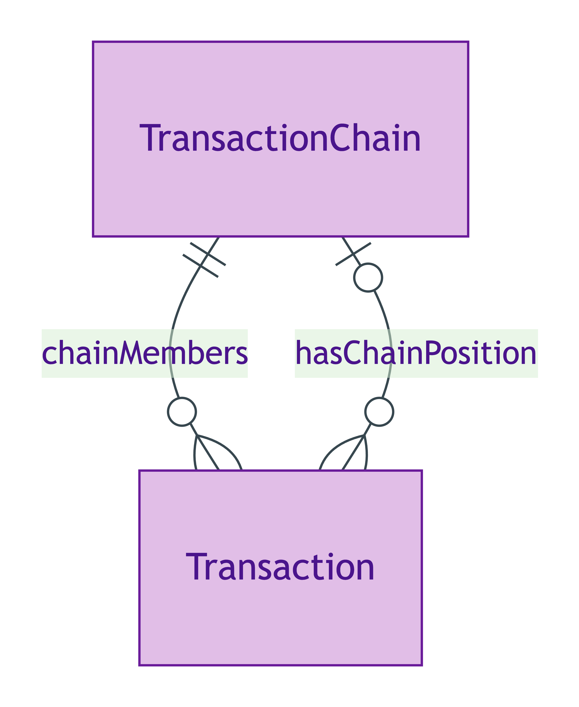
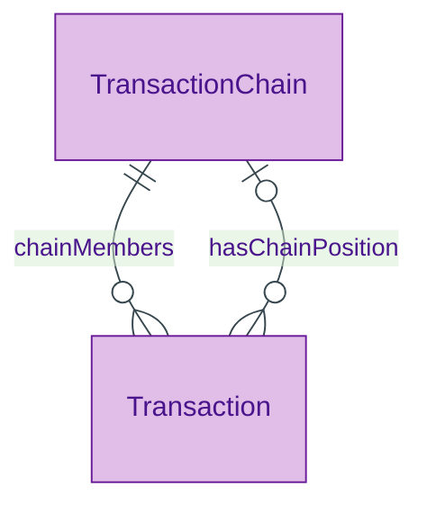

# Transaction Chain

## Summary

Aggregate of dependent [Transactions](./transaction.md) linked by buyer-also-seller participant overlap. [Aggregate; UFO Aggregate — collective of Relator instances]. S007 Q4 dual-mechanism: (a) recursive `dependsOnTransaction` predicate between Transactions; (b) `chainMembers` list-of-Transactions on a TransactionChain parent. Chain-length cap: `sh:maxInclusive 7` per CLC data. Chain status is derived (any-blocked → chain-blocked).
[Concept tier →](../../concept/transaction/transaction-chain.md)

## Attributes

This entity declares no module-local datatype properties. Chain-length cap (7) and chain-status derivation are emitted as SHACL shapes / rules at the overlay-profile level rather than as direct datatype properties.

## Relationships

| Predicate | Target entity | Cardinality | Inverse | Description |
|---|---|---|---|---|
| `chainMembers` | `Transaction` | `1..*` | `hasChainPosition` | List-of-Transactions inverse to `Transaction.hasChainPosition`; capped at 7 per CLC data |

## Identity key

Identity key = the unordered set of Transaction members (the chain is identified by its membership). Two TransactionChain instances with identical Transaction-member sets are the same chain.

## Constraints

- Chain-length cap: `chainMembers.count <= 7` per CLC data (enforced via SHACL `sh:maxInclusive` at the overlay-profile level)
- Chain status is derived from member-status aggregation (any-blocked → chain-blocked)

## Derived attributes

The chain-status derivation is overlay-profile-scoped and does not surface as an emitted core-tier derived attribute at this tier.

## ER diagram

Mermaid Source

## Source ODR + ADR

- [ODR-0007 — Transaction lifecycle](../../../ontology/odr/ODR-0007-transaction-lifecycle.md), §Q4 Chain dual modelling
- [ADR-0011 — Module TBox emission](../../../adr/ADR-0011-module-tbox-emission.md) — implementation
- [ADR-0012 — SHACL + DPV annotation emission](../../../adr/ADR-0012-shacl-and-dpv-annotation-emission.md) — chain-length cap
