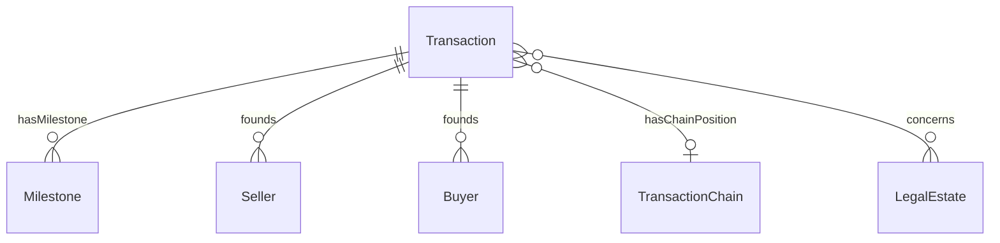

# Transaction

## Summary

Property-transaction Relator — the mediating endurant that founds [Seller](../agent/seller.md) and [Buyer](../agent/buyer.md) RoleMixins. [Relator; UFO Relator]. FIBO Arrangement precedent. Identity criterion = 5-tuple `(LegalEstate-concerned, Sellers-set, Buyers-set, transaction-id-lineage, founding-event)`. Hard cases per S007 Q1: party-substitution, estate-change, transaction-id reissuance, chain-link-break, aborted-transaction. Carries `transactionId` via `dct:identifier` and external-system refs via `externalIds`.
[Concept tier →](../../concept/transaction/transaction.md)

## Attributes

| Attribute | Type | Cardinality | Required | Identity-bearing | Description |
|---|---|---|---|---|---|
| `occurredAtTime` | `dateTime` | `0..1` | N | Y | Actual completion instant of the founding event (PROV-O `prov:atTime` alias) |

## Relationships

| Predicate | Target entity | Cardinality | Inverse | Description |
|---|---|---|---|---|
| `hasChainPosition` | `TransactionChain` | `0..1` | `chainMembers` | Join from a Transaction to its TransactionChain (S007 Q4 Aggregate side); mirror of `TransactionChain.chainMembers` |

Inbound predicates: founds Seller / Buyer Roles via the Relator pattern; concerns LegalEstate (cross-module).

## Identity key

Identity key = `(LegalEstate-concerned, Sellers-set, Buyers-set, transaction-id-lineage, founding-event)` 5-tuple per ODR-0007 §Q1. The surface identity-key element is `occurredAtTime` (the founding-event timestamp). Cross-reference: Concept-tier [Transaction IC narrative](../../concept/transaction/transaction.md#identity-criterion).

## Constraints

- `occurredAtTime` MUST be a single `dateTime` value when present (`Violation`, `TransactionIdentityKeyShape`)

## Derived attributes

None at this tier (the Milestone variance derived attribute lives on `Milestone`, not on the parent Transaction).

## ER diagram

## Source ODR + ADR

- [ODR-0007 — Transaction lifecycle](../../../ontology/odr/ODR-0007-transaction-lifecycle.md), §Q1 Transaction-as-Relator; §Q2 Milestone hybrid typing; §Q4 Chain dual modelling
- [ADR-0011 — Module TBox emission](../../../adr/ADR-0011-module-tbox-emission.md) — implementation
- [ADR-0012 — SHACL + DPV annotation emission](../../../adr/ADR-0012-shacl-and-dpv-annotation-emission.md) — shapes
