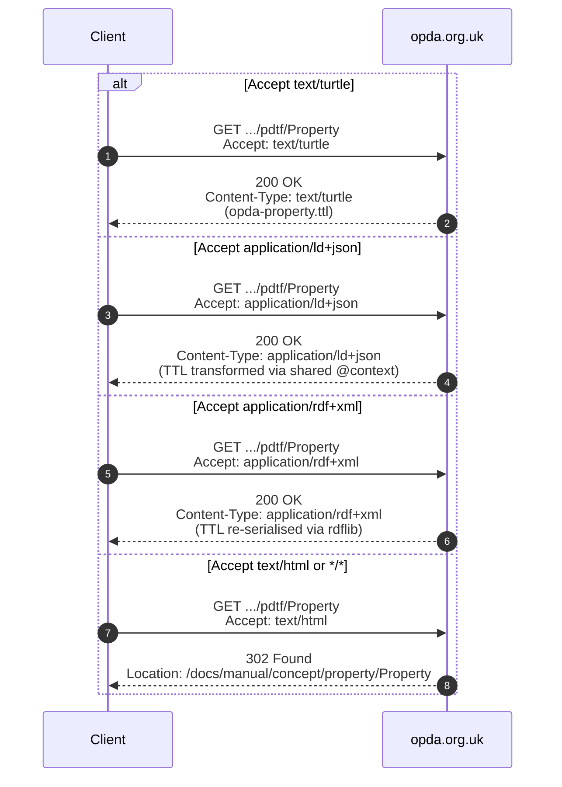

# Content negotiation

OPDA's persistent namespace is `https://opda.org.uk/pdtf/*` (per [ADR-0006](/modelling/adr/adr-0006)). These IRIs are **identifiers first** — graph-node names a consumer cites and compares. Dereferenceability is **optional and aspirational**, not required for the standard to be valid: a consumer never has to fetch an IRI to use the ontology (the council ranked resolution "aspirational, not required").

When resolution **is** offered, it is served **directly from opda-controlled hosting** — `opda.org.uk` DNS + origin under OPDA's control. There is **no W3C PICG redirect**: ADR-0006 dropped the `w3id.org/opda → openpropdata.org.uk` redirect chain when the base moved to `opda.org.uk`, because opda now owns the domain and serves RDF from it directly. The serving model below describes that **planned** behaviour; DNS for the per-term endpoints is not yet configured.

## Accept-header content-negotiation flow

When served, consumers fetch resources via standard HTTP with `Accept:` headers; the origin returns TTL, JSON-LD, RDF/XML, or HTML depending on the header.

Mermaid Source

The HTML branch is a `302 Found` to the Concept-tier page (not a permanent redirect), so the human-readable target stays editable as the manual evolves.

## Accept-header routing

The origin responds to the `Accept` header per the matrix below:

| Accept value | Response format | Source |
|---|---|---|
| `text/turtle` | Turtle (RDF 1.1) | source TTLs in `source/03-standards/ontology/` or derived profile |
| `application/ld+json` | JSON-LD 1.1 with shared `@context` | TTL transformed via shared context (see [jsonld-context.md](./jsonld-context.md)) |
| `application/rdf+xml` | RDF/XML | TTL re-serialised via rdflib |
| `text/html`, `application/xhtml+xml`, `*/*` (no preference) | HTML — redirect to Concept-tier page | Concept tier at `docs/manual/concept/<module>/<entity>.md` rendered as Astro page |

Per-resource availability is documented in the [format matrix](./format-matrix.md).

## JSON-LD context

A **single canonical `@context`** applies to every JSON-LD response, regardless of which resource the consumer requests. The context is documented in [jsonld-context.md](./jsonld-context.md) and is served at `https://opda.org.uk/pdtf/context.jsonld`.

Per [ADR-0013](/modelling/adr/adr-0013), the canonical context preserves:

- `@vocab` → `https://opda.org.uk/pdtf/` (so all unqualified terms resolve to OPDA's flat term namespace)
- Standard ontology prefixes: `dct:`, `dpv:`, `owl:`, `rdf:`, `rdfs:`, `skos:`, `sh:`, `dash:`, `xsd:`, `vann:`, `prov:`
- OPDA-specific predicate type-coercions so a JSON consumer can treat `opda:hasSpecialCategoryData` as a boolean, `opda:formVersion` as a string, etc., without explicit `@type` annotations on every literal.

## Per-resource format availability

See [format-matrix.md](./format-matrix.md) for the per-resource table:

- Foundation namespace `https://opda.org.uk/pdtf/`
- Release snapshot `https://opda.org.uk/pdtf/harness/release/1.0.0/` (immutable; the `owl:versionIRI` target, bumps on every release)
- BASPI5 profile `https://opda.org.uk/pdtf/shape/profiles/baspi5`
- Per-entity dereference `https://opda.org.uk/pdtf/<EntityLocalName>` (e.g. `https://opda.org.uk/pdtf/Property`)

## Caching

- TTL / JSON-LD / RDF/XML responses: `Cache-Control: public, max-age=3600` for release-snapshot URIs (immutable per release); shorter for the foundation namespace and per-entity dereferences (revalidate against `ETag`).
- The HTML-branch `302` to the Concept-tier page is uncached on the consumer side by spec; the origin RDF responses are cacheable per the above.

## Source ADR

- [ADR-0006 — w3id.org/opda ontology namespace](/modelling/adr/adr-0006) — namespace scheme + opda-direct serving (the original w3id/PICG redirect was dropped when the base moved to `opda.org.uk`).
- [ADR-0013 — Overlay profile emission](/modelling/adr/adr-0013) — derived-profile composition feeding content negotiation.
