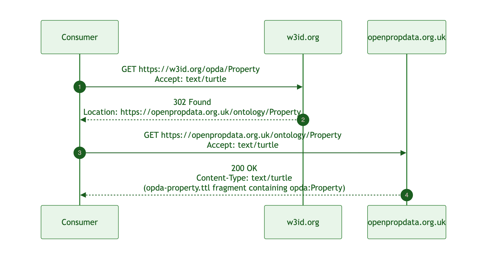
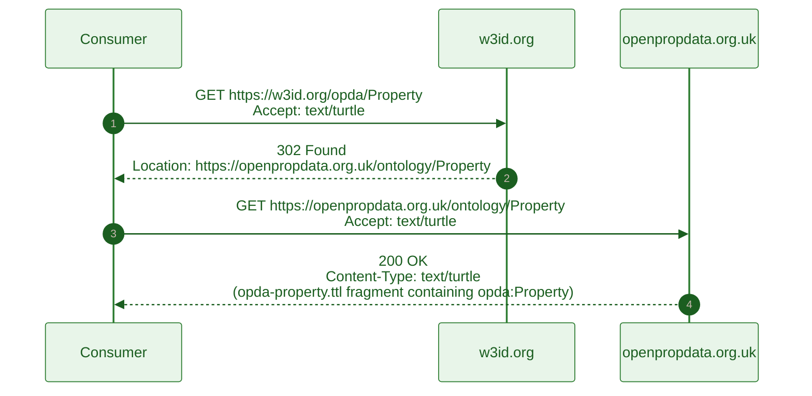
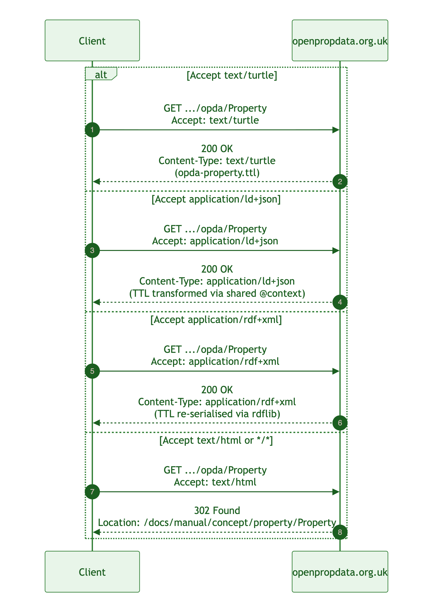
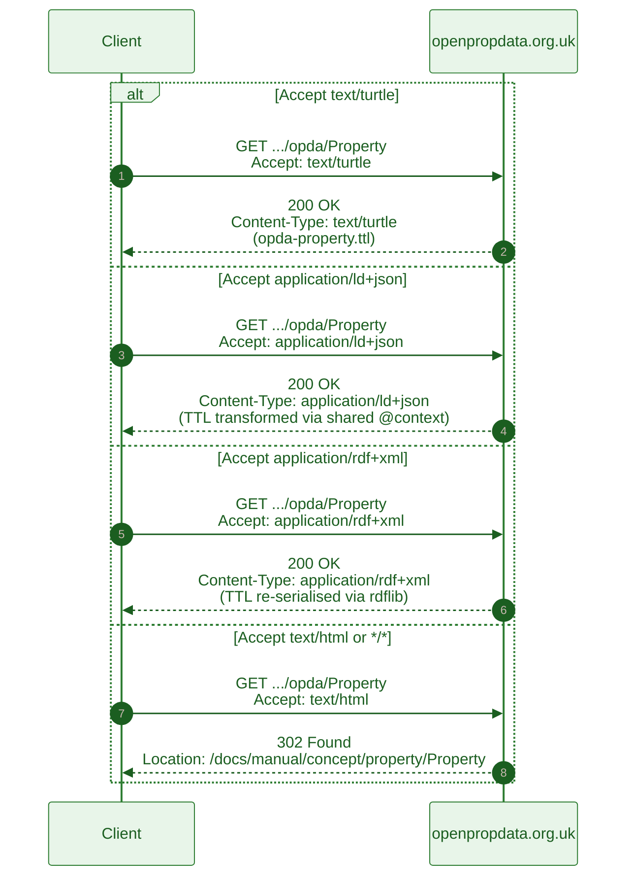

# Content negotiation

OPDA's persistent namespace is `https://w3id.org/opda/*`, served via the W3C PICG redirect (per [ADR-0006](../../../adr/ADR-0006-w3id-opda-ontology-namespace.md)). The redirect target is `https://openpropdata.org.uk/ontology/` (the OPDA institutional domain). Consumers fetch resources via standard HTTP with `Accept:` headers; the deployment serves TTL, JSON-LD, RDF/XML, or HTML depending on the header.

## The redirect chain

Mermaid Source

## Accept-header content-negotiation flow

Mermaid Source

The redirect is `302 Found` (not `301 Moved Permanently`) per [ADR-0006](../../../adr/ADR-0006-w3id-opda-ontology-namespace.md): the redirect target stays editable without breaking cached consumers, until the hosting target stabilises.

## Accept-header routing

The server responds to the `Accept` header per the matrix below:

| Accept value | Response format | Source |
|---|---|---|
| `text/turtle` | Turtle (RDF 1.1) | source TTLs in `source/03-standards/ontology/` or derived profile |
| `application/ld+json` | JSON-LD 1.1 with shared `@context` | TTL transformed via shared context (see [jsonld-context.md](./jsonld-context.md)) |
| `application/rdf+xml` | RDF/XML | TTL re-serialised via rdflib |
| `text/html`, `application/xhtml+xml`, `*/*` (no preference) | HTML — redirect to Concept-tier page | Concept tier at `docs/manual/concept/<module>/<entity>.md` rendered as Astro page |

Per-resource availability is documented in the [format matrix](./format-matrix.md).

## JSON-LD context

A **single canonical `@context`** applies to every JSON-LD response, regardless of which resource the consumer requests. The context is documented in [jsonld-context.md](./jsonld-context.md) and is served at `https://w3id.org/opda/context.jsonld`.

Per [ADR-0013](../../../adr/ADR-0013-overlay-profile-emission.md), the canonical context preserves:

- `@vocab` → `https://w3id.org/opda/#` (so all unqualified terms resolve to OPDA's HASH namespace)
- Standard ontology prefixes: `dct:`, `dpv:`, `owl:`, `rdf:`, `rdfs:`, `skos:`, `sh:`, `dash:`, `xsd:`, `vann:`, `prov:`
- OPDA-specific predicate type-coercions so a JSON consumer can treat `opda:hasSpecialCategoryData` as a boolean, `opda:formVersion` as a string, etc., without explicit `@type` annotations on every literal.

## Per-resource format availability

See [format-matrix.md](./format-matrix.md) for the per-resource table:

- Foundation namespace `https://w3id.org/opda/`
- Version-IRI `https://w3id.org/opda/1.0.0/` (immutable; bumps on every release)
- BASPI5 profile `https://w3id.org/opda/profiles/baspi5`
- Per-entity dereference `https://w3id.org/opda/<EntityLocalName>` (e.g. `https://w3id.org/opda/Property`)

## Caching

- TTL / JSON-LD / RDF/XML responses: `Cache-Control: public, max-age=3600` for version-IRI URIs (immutable per release); shorter for the foundation namespace and per-entity dereferences (revalidate against `ETag`).
- The 302 redirect from `w3id.org` is uncached on the consumer side by spec; the origin response is cacheable per the above.

## Source ADR

- [ADR-0006 — w3id.org/opda ontology namespace](../../../adr/ADR-0006-w3id-opda-ontology-namespace.md) — namespace + redirect chain.
- [ADR-0013 — Overlay profile emission](../../../adr/ADR-0013-overlay-profile-emission.md) — derived-profile composition feeding content negotiation.
