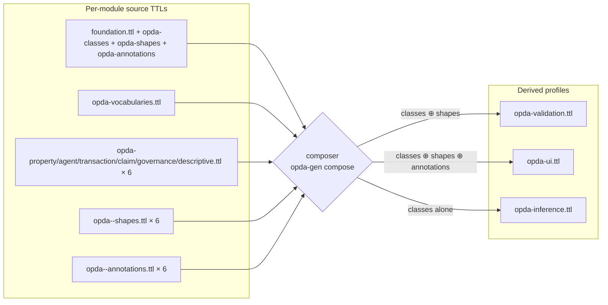

# Derived consumer profiles

The build-step composer ([ADR-0013](../../../adr/ADR-0013-overlay-profile-emission.md), [ODR-0004 §3a](../../../ontology/odr/ODR-0004-pdtf-ontology-foundation.md)) projects the 24 source TTLs into **three derived consumer profiles**, each optimised for a specific consumer scenario. Consumers can fetch the per-module source TTLs and compose locally, but most will fetch a derived profile to avoid the load-order and projection-rule logic.

## Activation status

The composer body has not yet been implemented. The current state:

- **`source/03-standards/ontology/derived/` directory does not exist** in the repository.
- The composer stub at `tools/opda-gen/src/opda_gen/composer.py` raises `NotImplementedError("Derived consumer profile composition is realised in ADR-0013 (build-step composition).")` when invoked.
- The `opda-gen compose --output <dir>` CLI subcommand is wired in [`cli.py`](../../../../tools/opda-gen/src/opda_gen/cli.py) but delegates to the stub.

The three profile pages below specify the **planned composition rules** so consumers (and the composer implementer) have an unambiguous spec. Each profile is marked **"spec only; composer activation pending"** until the composer body lands.

## Composition rules at a glance

| Profile | Classes | Shapes | Annotations | Audience |
|---|---|---|---|---|
| [opda-validation](./opda-validation.md) | yes | yes | no | pyshacl / TopBraid SHACL consumers running production validation |
| [opda-ui](./opda-ui.md) | yes | yes | yes | DASH form-rendering clients, JSON-LD UI consumers showing DPV context |
| [opda-inference](./opda-inference.md) | yes | no | no | OWL 2 reasoners (HermiT, Pellet, Konclude) running TBox classification |

The three profiles are **graph-union compositions**, not entailment closures. The composer concatenates source-graph triples and rewrites cross-graph blank-node references; it does NOT materialise inferred triples. Consumers that need entailment run their reasoner over the derived profile.

## Composer pipeline

The composer enforces three invariants per [ODR-0004 §3a](../../../ontology/odr/ODR-0004-pdtf-ontology-foundation.md):

1. **No `owl:Class` triples in `opda-validation.ttl`'s shape projection** (three-graph separation preserved across composition).
2. **No `sh:NodeShape` triples in `opda-inference.ttl`** (classes-alone — reasoner input must be pure TBox).
3. **No DPV `dct:references` triples in `opda-validation.ttl`** (DPV is UI-time concern, not validation-time).

The byte-identity CI gate ([operations/byte-identity-ci.md](../operations/byte-identity-ci.md)) extends to derived-profile regeneration once the composer body lands; until then, the `--exclude=derived` flag in the workflow's `diff -rq` step keeps the gate green.

## Why three profiles, not one merged graph?

Per [ADR-0013](../../../adr/ADR-0013-overlay-profile-emission.md) §"Module pluralism": different consumers have orthogonal needs:

- **SHACL validators** want classes (for `sh:targetClass` resolution) + shapes (for constraints), but DPV annotations would slow validation without contributing constraint logic.
- **DASH UI renderers** want classes + shapes + DPV annotations (the latter drive consent / data-category disclosures in forms).
- **OWL 2 reasoners** want classes alone; SHACL shapes confuse classical-logic reasoners, and DPV annotations are noise.

A single merged graph would force every consumer to filter at load time, defeating the build-step composition purpose. Per-profile derivation moves the filter to build time so deployment serves pre-filtered artefacts.

## Source ADR + ODR

- [ADR-0013 — Overlay profile emission](../../../adr/ADR-0013-overlay-profile-emission.md) §"Module pluralism".
- [ADR-0012 — SHACL + DPV annotation emission](../../../adr/ADR-0012-shacl-and-dpv-annotation-emission.md) §"Annotation reference-not-import".
- [ODR-0004 — PDTF ontology foundation](../../../ontology/odr/ODR-0004-pdtf-ontology-foundation.md) §3a five-part separation contract.
