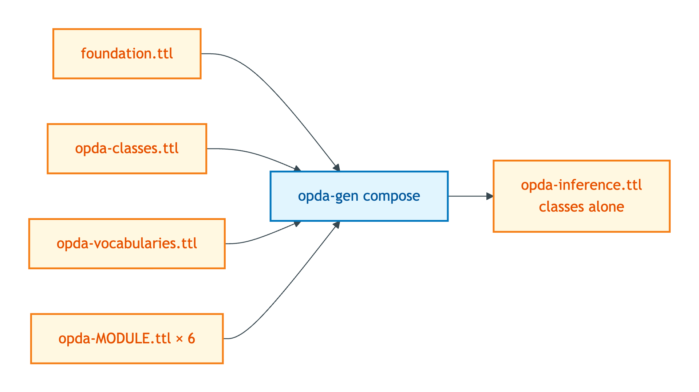
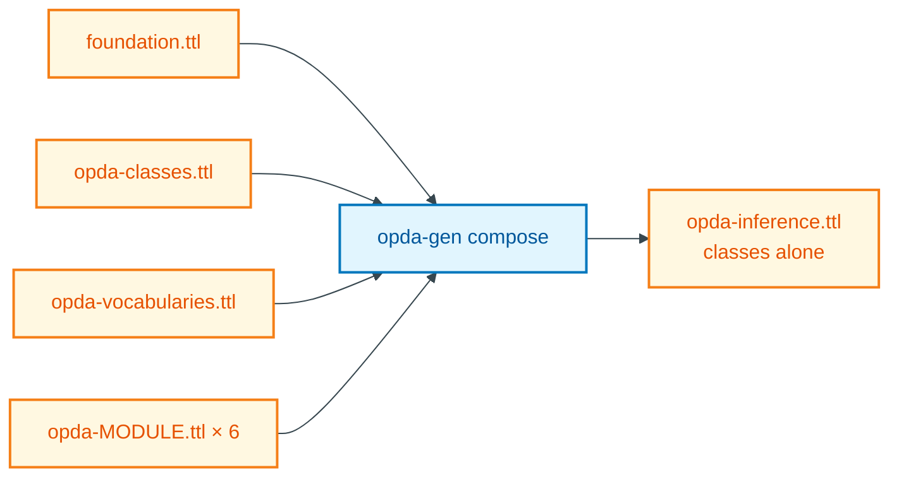

# opda-inference

**Status: spec only; composer activation pending.** See [README.md](./README.md) §"Activation status".

## Summary

`opda-inference.ttl` serves OWL 2 reasoners (HermiT, Pellet, Konclude) running classical-logic TBox classification. Reasoners need pure ontology axioms — `owl:Class`, `rdfs:subClassOf`, `owl:DatatypeProperty`, `owl:ObjectProperty`, `owl:disjointWith` etc. — and are confused by SHACL shapes (which look like class definitions but aren't) and slowed by DPV annotations (which contribute no inferences). This profile is the classes-alone projection.

## Composition recipe

Mermaid Source

## Included graphs

| Source graph | Projection rule |
|---|---|
| `foundation.ttl` | `owl:Ontology` header + provenance triples (license, creator, versionIRI) only; `sh:declare` stripped |
| `opda-classes.ttl` | `owl:Class`, `owl:DatatypeProperty`, `owl:ObjectProperty`, `rdfs:subClassOf`, `rdfs:domain`, `rdfs:range`, `owl:equivalentClass`, `owl:disjointWith`, `rdfs:label`, `rdfs:comment`, `skos:scopeNote` |
| `opda-vocabularies.ttl` | `skos:ConceptScheme`, `skos:Concept`, `skos:inScheme`, `skos:broader`, `skos:narrower`, `skos:related`, `skos:prefLabel`, `skos:definition` — SKOS is OWL-compatible; reasoners treat it as a class hierarchy |
| `opda-property.ttl` | same projection as `opda-classes.ttl` |
| `opda-agent.ttl` | same |
| `opda-transaction.ttl` | same |
| `opda-claim.ttl` | same |
| `opda-governance.ttl` | same |
| `opda-descriptive.ttl` | same |

## Excluded

- `opda-shapes.ttl` and `opda-<module>-shapes.ttl` × 6 — SHACL shapes confuse OWL 2 reasoners. `sh:NodeShape` looks like an `owl:Class` to a reasoner but carries no classical-logic semantics; including shapes either causes false-positive classifications or runtime errors depending on reasoner strictness.
- `opda-annotations.ttl` and `opda-<module>-annotations.ttl` × 6 — DPV `dct:references` triples contribute nothing to classification; their inclusion would balloon ABox size for no inference benefit.
- `profiles/baspi5.ttl` and other overlay profiles — overlay profiles are shape graphs (excluded for the same reason as `opda-<module>-shapes.ttl`).

## Deployment artefact

- **Path:** `source/03-standards/ontology/derived/opda-inference.ttl`
- **Content-type:** `text/turtle`
- **Size:** to be measured after composer activation
- **sha256:** to be computed after composer activation
- **Status:** directory does not yet exist; composer body pending

## Source ADR

- [ADR-0013 — Overlay profile emission](../../../adr/ADR-0013-overlay-profile-emission.md) §"Module pluralism".
- [ODR-0004 — PDTF ontology foundation](../../../ontology/odr/ODR-0004-pdtf-ontology-foundation.md) §3a — three-graph separation invariant (classes / shapes / annotations); this profile takes only the classes column.
