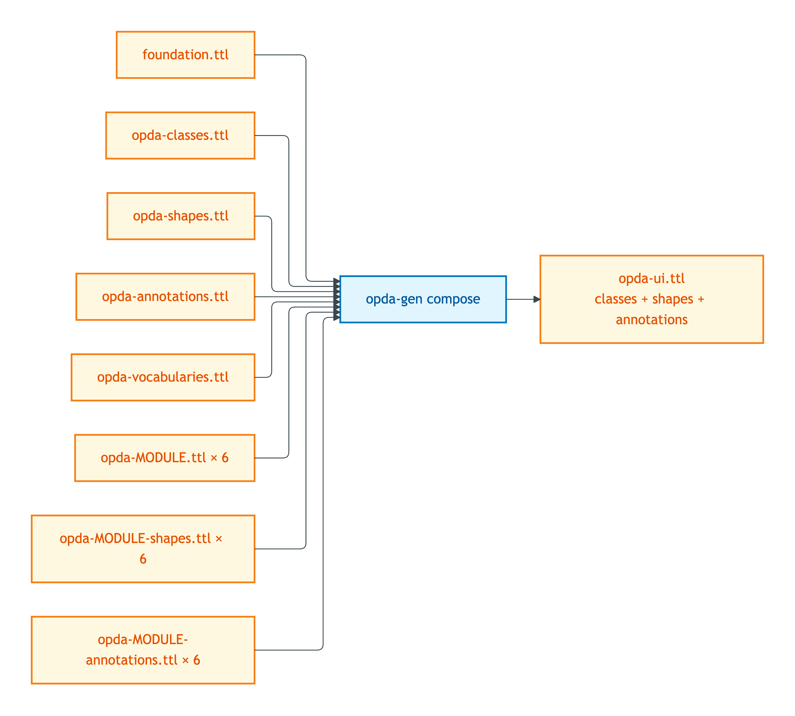
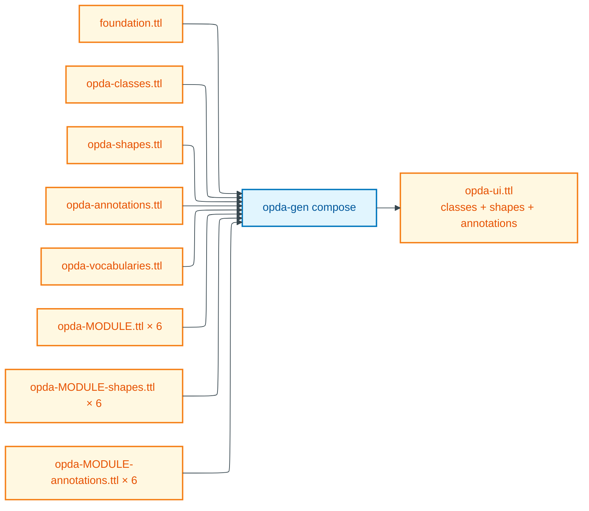

# opda-ui

**Status: spec only; composer activation pending.** See [README.md](./README.md) §"Activation status".

## Summary

`opda-ui.ttl` serves DASH form-rendering clients and JSON-LD UI consumers that need both validation constraints (`sh:` predicates) AND data-category disclosures (DPV `dct:references` and class-level annotations). It is the union of every class graph, every shape graph, AND every DPV annotation graph — i.e. the maximal information surface for an interactive consumer.

## Composition recipe

Mermaid Source

## Included graphs

| Source graph | Projection rule |
|---|---|
| `foundation.ttl` | all triples |
| `opda-classes.ttl` | all triples |
| `opda-shapes.ttl` | all triples |
| `opda-annotations.ttl` | all triples |
| `opda-vocabularies.ttl` | all triples (UI dropdowns / radio enums bind to SKOS schemes) |
| `opda-property.ttl` | all triples (UI needs `rdfs:label` + `rdfs:comment` for form labels + helper text) |
| `opda-agent.ttl` | all triples |
| `opda-transaction.ttl` | all triples |
| `opda-claim.ttl` | all triples |
| `opda-governance.ttl` | all triples |
| `opda-descriptive.ttl` | all triples |
| `opda-property-shapes.ttl` | all triples (DASH UI predicates `dash:viewer`, `dash:editor`, `sh:order`, `sh:group` ride on `sh:property`) |
| `opda-agent-shapes.ttl` | all triples |
| `opda-transaction-shapes.ttl` | all triples |
| `opda-claim-shapes.ttl` | all triples |
| `opda-governance-shapes.ttl` | all triples |
| `opda-descriptive-shapes.ttl` | all triples |
| `opda-property-annotations.ttl` | all triples (DPV baseline categories + variant-conditional refinement maps — drive consent disclosures and PII-handling UI affordances) |
| `opda-agent-annotations.ttl` | all triples |
| `opda-transaction-annotations.ttl` | all triples |
| `opda-claim-annotations.ttl` | all triples |
| `opda-governance-annotations.ttl` | all triples |
| `opda-descriptive-annotations.ttl` | all triples |

## Excluded

- `profiles/baspi5.ttl` and other overlay profiles — overlay UI is opt-in per consumer; consumers loading BASPI5 fetch it separately and the DASH renderer composes the overlay's `dash:viewer`/`dash:editor`/`sh:order`/`sh:group` predicates over the base UI profile.

The exclusion list is short by design: this is the maximal-information derived profile. The only excluded artefacts are overlay-specific (consumer chooses which form to render).

## Deployment artefact

- **Path:** `source/03-standards/ontology/derived/opda-ui.ttl`
- **Content-type:** `text/turtle`
- **Size:** to be measured after composer activation
- **sha256:** to be computed after composer activation
- **Status:** directory does not yet exist; composer body pending

## Source ADR

- [ADR-0013 — Overlay profile emission](/modelling/adr/adr-0013) §"Module pluralism".
- [ADR-0012 — SHACL + DPV annotation emission](/modelling/adr/adr-0012) — DPV co-annotation surface that this profile exposes to UI consumers.
- [ODR-0010 — Overlay profile mechanism](../../../ontology/odr/) §Q4 — DASH UI predicates ride on shape graphs (consumed by this profile through the per-module shape inclusions).
