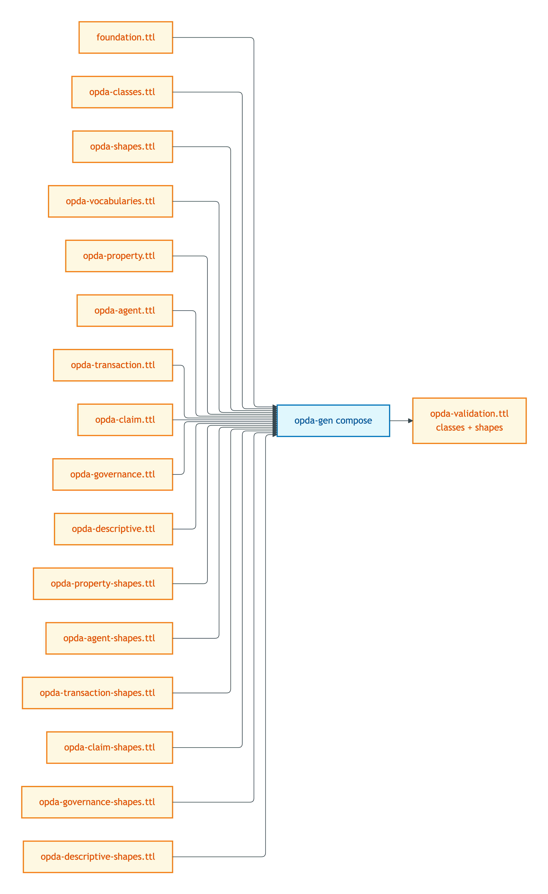
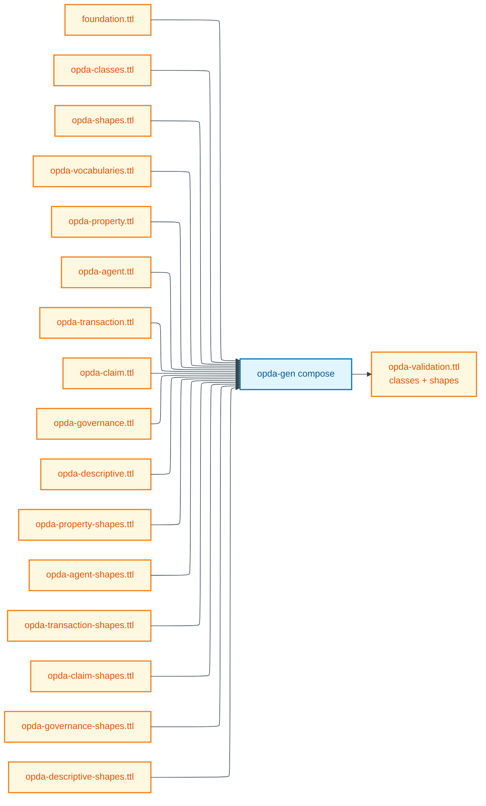

# opda-validation

**Status: spec only; composer activation pending.** The composer body has not yet been implemented (see [README.md](./README.md) §"Activation status"). The composition rules below are the contract the composer body will realise.

## Summary

`opda-validation.ttl` serves pyshacl / TopBraid SHACL / shacl-rs and similar SHACL validators running production validation against OPDA instance data. It is the union of every class graph (so `sh:targetClass` resolves) and every shape graph (so constraints fire) — but excludes the DPV annotation graphs, which contribute no constraint logic and slow load time without benefit.

## Composition recipe

Mermaid Source

## Included graphs

| Source graph | Projection rule |
|---|---|
| `foundation.ttl` | all triples |
| `opda-classes.ttl` | all triples (six foundation classes + ADR-0014 G14 `opda:hasSpecialCategoryData`) |
| `opda-shapes.ttl` | all triples (foundation meta-shapes + cross-cutting SHACL-AF rules) |
| `opda-vocabularies.ttl` | all triples (23 SKOS Concept Schemes; needed for `sh:in` value resolution) |
| `opda-property.ttl` | `owl:Class`, `owl:DatatypeProperty`, `owl:ObjectProperty`, `rdfs:subClassOf`, `rdfs:label`, `rdfs:comment` |
| `opda-agent.ttl` | same projection as property |
| `opda-transaction.ttl` | same |
| `opda-claim.ttl` | same |
| `opda-governance.ttl` | same |
| `opda-descriptive.ttl` | same |
| `opda-property-shapes.ttl` | all triples |
| `opda-agent-shapes.ttl` | all triples |
| `opda-transaction-shapes.ttl` | all triples |
| `opda-claim-shapes.ttl` | all triples |
| `opda-governance-shapes.ttl` | all triples |
| `opda-descriptive-shapes.ttl` | all triples |

## Excluded

- `opda-annotations.ttl` — meta-annotation scaffolding; nothing the validator needs.
- `opda-property-annotations.ttl` × 6 — DPV class-level baselines + variant-conditional refinement maps; DPV co-annotation is a UI-time concern (see [opda-ui.md](./opda-ui.md)), not validation-time.
- `profiles/baspi5.ttl` and other overlay profiles — overlay validation is opt-in per consumer; consumers loading BASPI5 fetch it separately and merge with this base.

## Deployment artefact

- **Path:** `source/03-standards/ontology/derived/opda-validation.ttl`
- **Content-type:** `text/turtle`
- **Size:** to be measured after composer activation
- **sha256:** to be computed after composer activation
- **Status:** directory does not yet exist; composer body pending

## Source ADR

- [ADR-0013 — Overlay profile emission](/modelling/adr/adr-0013) §"Module pluralism" — three derived profiles spec.
- [ADR-0012 — SHACL + DPV annotation emission](/modelling/adr/adr-0012) §"Annotation reference-not-import" — DPV exclusion rationale.
- [ODR-0004 — PDTF ontology foundation](/modelling/odr/odr-0004) §3a — three-graph separation invariant the composer preserves.
