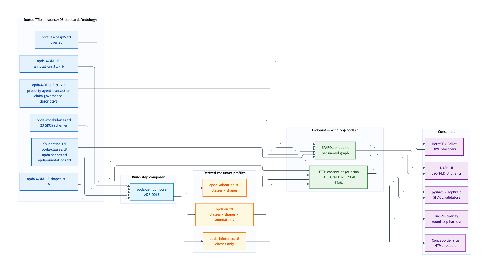
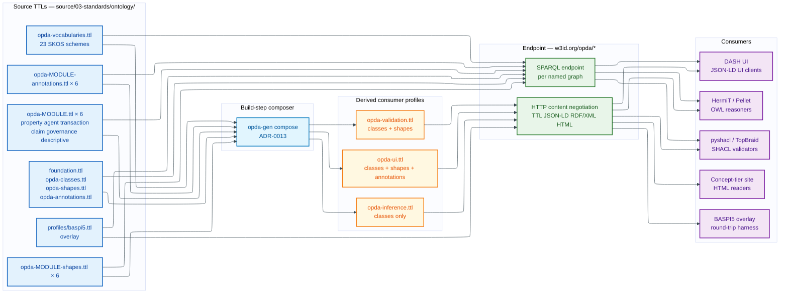
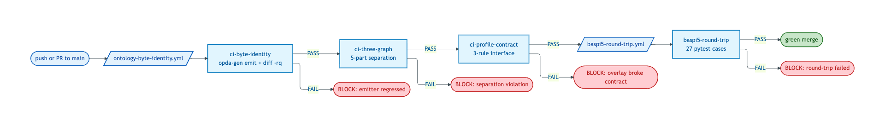

# Deployment topology + named-graph catalogue

OPDA's ontology deploys as **24 source TTLs** (foundation + vocabularies + six module-TBoxes + six module-shapes + six module-annotations + meta-shapes + meta-annotations) plus **one overlay profile** (BASPI5). The deployment exposes these as named graphs under the persistent `https://w3id.org/opda/*` namespace via the W3C PICG redirect ratified by [ADR-0006](../../adr/ADR-0006-w3id-opda-ontology-namespace.md).

A build-step composer ([ADR-0013](../../adr/ADR-0013-overlay-profile-emission.md)) projects the 24 source TTLs into **three derived consumer profiles** — `opda-validation.ttl`, `opda-ui.ttl`, `opda-inference.ttl` — and the deployment serves each via HTTP content negotiation.

## Master deployment topology

Mermaid Source

## CI gates pipeline

```mermaid
---
config:
  layout: elk
  elk:
    mergeEdges: false
    nodePlacementStrategy: BRANDES_KOEPF
---
%%{init: {"theme": "base", "themeVariables": {"primaryColor": "#E1F5FE", "primaryTextColor": "#01579B", "primaryBorderColor": "#0277BD", "lineColor": "#37474F"}}}%%
flowchart LR
    accTitle: OPDA CI gates pipeline
    accDescr: Shows the four-stage CI gate sequence with pass-fail branches and the GitHub Actions workflow files that run each stage.

    classDef process fill:#E1F5FE,stroke:#0277BD,stroke-width:2px,color:#01579B
    classDef success fill:#C8E6C9,stroke:#2E7D32,stroke-width:2px,color:#1B5E20
    classDef error fill:#FFCDD2,stroke:#C62828,stroke-width:2px,color:#B71C1C
    classDef infra fill:#E3F2FD,stroke:#1565C0,stroke-width:2px,color:#0D47A1

    START(["push or PR to main"]):::infra

    G1["ci-byte-identity<br/>opda-gen emit + diff -rq"]:::process
    G2["ci-three-graph<br/>5-part separation"]:::process
    G3["ci-profile-contract<br/>3-rule interface"]:::process
    G4["baspi5-round-trip<br/>27 pytest cases"]:::process

    WF1[/"ontology-byte-identity.yml"/]:::infra
    WF2[/"baspi5-round-trip.yml"/]:::infra

    PASS(["green merge"]):::success
    FAIL1(["BLOCK: emitter regressed"]):::error
    FAIL2(["BLOCK: separation violation"]):::error
    FAIL3(["BLOCK: overlay broke contract"]):::error
    FAIL4(["BLOCK: round-trip failed"]):::error

    START --> WF1
    WF1 --> G1
    G1 -->|PASS| G2
    G1 -->|FAIL| FAIL1
    G2 -->|PASS| G3
    G2 -->|FAIL| FAIL2
    G3 -->|PASS| WF2
    G3 -->|FAIL| FAIL3
    WF2 --> G4
    G4 -->|PASS| PASS
    G4 -->|FAIL| FAIL4
```

Mermaid Source

## Named-graph catalogue

The 25 named graphs the deployment exposes, grouped by role. Triple counts measured against the committed TTLs at HEAD; see [named-graphs.md](./named-graphs.md) for per-graph load order + version IRIs.

### Foundation graphs

| Named graph IRI | Source TTL | Triples |
|---|---|---|
| `https://w3id.org/opda/` (default graph) | `foundation.ttl` | 15 |
| *(no ontology IRI — class graph)* | `opda-classes.ttl` | 36 |
| `https://w3id.org/opda/shapes` | `opda-shapes.ttl` | 51 |
| `https://w3id.org/opda/annotations` | `opda-annotations.ttl` | 3 |

### Vocabulary graph

| Named graph IRI | Source TTL | Triples |
|---|---|---|
| *(no ontology IRI — SKOS scheme aggregate)* | `opda-vocabularies.ttl` | 873 |

### Module-TBox graphs

| Named graph IRI | Source TTL | Triples |
|---|---|---|
| `https://w3id.org/opda/property/` | `opda-property.ttl` | 199 |
| `https://w3id.org/opda/agent/` | `opda-agent.ttl` | 77 |
| `https://w3id.org/opda/transaction/` | `opda-transaction.ttl` | 39 |
| `https://w3id.org/opda/claim/` | `opda-claim.ttl` | 86 |
| `https://w3id.org/opda/governance/` | `opda-governance.ttl` | 42 |
| `https://w3id.org/opda/descriptive/` | `opda-descriptive.ttl` | 35 |

### Module-shape graphs

| Named graph IRI | Source TTL | Triples |
|---|---|---|
| `https://w3id.org/opda/property-shapes/` | `opda-property-shapes.ttl` | 54 |
| `https://w3id.org/opda/agent-shapes/` | `opda-agent-shapes.ttl` | 44 |
| `https://w3id.org/opda/transaction-shapes/` | `opda-transaction-shapes.ttl` | 37 |
| `https://w3id.org/opda/claim-shapes/` | `opda-claim-shapes.ttl` | 45 |
| `https://w3id.org/opda/governance-shapes/` | `opda-governance-shapes.ttl` | 13 |
| `https://w3id.org/opda/descriptive-shapes/` | `opda-descriptive-shapes.ttl` | 27 |

### Module-annotation graphs

| Named graph IRI | Source TTL | Triples |
|---|---|---|
| `https://w3id.org/opda/property-annotations/` | `opda-property-annotations.ttl` | 31 |
| `https://w3id.org/opda/agent-annotations/` | `opda-agent-annotations.ttl` | 22 |
| `https://w3id.org/opda/transaction-annotations/` | `opda-transaction-annotations.ttl` | 6 |
| `https://w3id.org/opda/claim-annotations/` | `opda-claim-annotations.ttl` | 27 |
| `https://w3id.org/opda/governance-annotations/` | `opda-governance-annotations.ttl` | 6 |
| `https://w3id.org/opda/descriptive-annotations/` | `opda-descriptive-annotations.ttl` | 14 |

### Overlay-profile graph

| Named graph IRI | Source TTL | Triples |
|---|---|---|
| `https://w3id.org/opda/profiles/baspi5` | `profiles/baspi5.ttl` | 488 |

**Corpus total: 2 273 triples across 25 named graphs** (24 source TTLs + 1 overlay profile).

## Derived consumer profiles

The composer projects the source TTLs into three deployable consumer profiles. The directory `source/03-standards/ontology/derived/` does not yet exist (composer body activation pending per [ADR-0013](../../adr/ADR-0013-overlay-profile-emission.md)); each profile below documents the planned composition.

| Profile | Composition | Audience | Artefact path |
|---|---|---|---|
| [opda-validation](./derived-profiles/opda-validation.md) | classes ⊕ shapes | pyshacl / TopBraid SHACL consumers | `source/03-standards/ontology/derived/opda-validation.ttl` |
| [opda-ui](./derived-profiles/opda-ui.md) | classes ⊕ shapes ⊕ annotations | DASH form rendering, JSON-LD UI clients | `source/03-standards/ontology/derived/opda-ui.ttl` |
| [opda-inference](./derived-profiles/opda-inference.md) | classes alone | OWL 2 reasoners (HermiT, Pellet) | `source/03-standards/ontology/derived/opda-inference.ttl` |

## Per-module breakdown

For "what's deployed for this module" queries, see the per-module pages under [modules/](./modules/). Each page shows source TTL(s), named-graph declarations, derived-profile membership, overlay bindings, and content-negotiation entry points for one module, with a per-module deployment-graph diagram.

| Module | Page |
|---|---|
| Foundation | [modules/foundation.md](./modules/foundation.md) |
| Property | [modules/property.md](./modules/property.md) |
| Agent | [modules/agent.md](./modules/agent.md) |
| Transaction | [modules/transaction.md](./modules/transaction.md) |
| Claim | [modules/claim.md](./modules/claim.md) |
| Governance | [modules/governance.md](./modules/governance.md) |
| Descriptive | [modules/descriptive.md](./modules/descriptive.md) |

## CI gates

Three CI gates protect the deployment from drift. See [operations/](./operations/) for full details.

| Gate | Workflow | Command |
|---|---|---|
| [Byte-identity](./operations/byte-identity-ci.md) | `.github/workflows/ontology-byte-identity.yml` | `opda-gen ci-byte-identity` |
| [Three-graph separation](./operations/three-graph-ci.md) | `.github/workflows/ontology-byte-identity.yml` (job: `Three-graph CI test`) | `opda-gen ci-three-graph` |
| [Round-trip MVP](./operations/round-trip-ci.md) | `.github/workflows/baspi5-round-trip.yml` | `opda-gen ci-profile-contract` + `pytest tests/baspi5_round_trip` |
