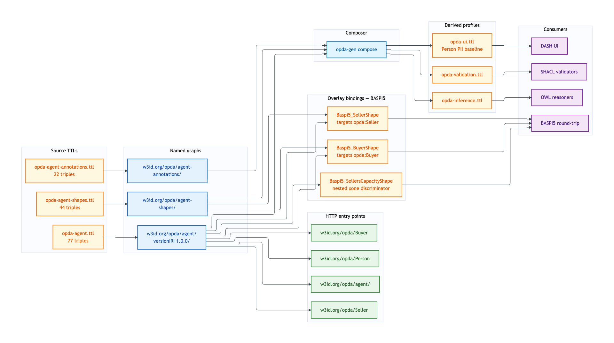
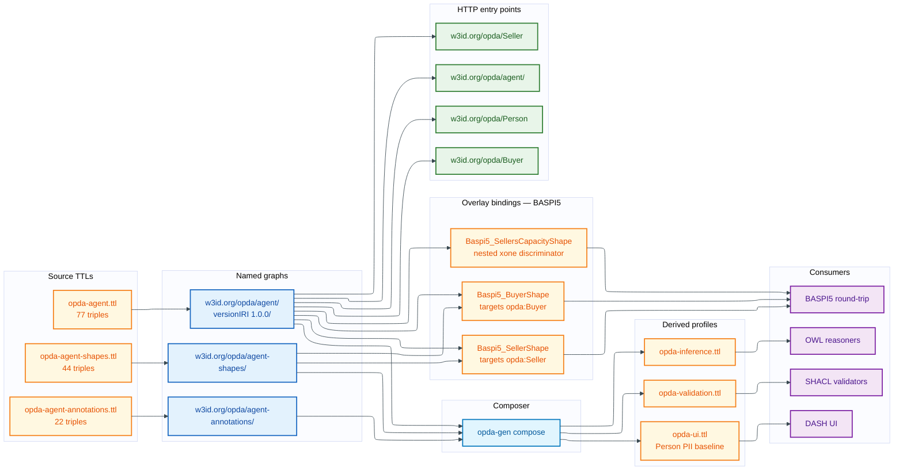

# Agent — deployment view

The Agent module covers Person, Organisation, Proprietor + Proprietorship Relator, Seller / Buyer roles, NameChangeEvent. It is the second module bound by the BASPI5 overlay (Seller + Buyer participate as roles in the conveyancing form).

## Source TTL(s)

| File | Role | Physical-Ontology tier |
|---|---|---|
| [`opda-agent.ttl`](../../../../source/03-standards/ontology/opda-agent.ttl) | TBox: Person, Organisation, Proprietor, Seller, Buyer, NameChangeEvent | [agent/classes.md](../../physical-ontology/agent/classes.md) |
| [`opda-agent-shapes.ttl`](../../../../source/03-standards/ontology/opda-agent-shapes.ttl) | Identity-key + IC-breach shapes | [agent/shapes.md](../../physical-ontology/agent/shapes.md) |
| [`opda-agent-annotations.ttl`](../../../../source/03-standards/ontology/opda-agent-annotations.ttl) | DPV baseline (Person carries PII baseline categories) | [agent/annotations.md](../../physical-ontology/agent/annotations.md) |

## Named graph(s)

| Named graph IRI | Source TTL | Triples | `owl:versionIRI` |
|---|---|---|---|
| `https://w3id.org/opda/agent/` | `opda-agent.ttl` | 77 | `https://w3id.org/opda/agent/1.0.0/` |
| `https://w3id.org/opda/agent-shapes/` | `opda-agent-shapes.ttl` | 44 | — |
| `https://w3id.org/opda/agent-annotations/` | `opda-agent-annotations.ttl` | 22 | — |

**Load order:** TBox graph imports foundation + vocabularies:

```turtle
owl:imports <https://w3id.org/opda/1.0.0/>, <https://w3id.org/opda/vocabularies/>
```

Shape + annotation graphs load alongside the TBox graph.

## Derived-profile membership

| Profile | `opda-agent.ttl` | `opda-agent-shapes.ttl` | `opda-agent-annotations.ttl` |
|---|---|---|---|
| [opda-validation](../derived-profiles/opda-validation.md) | included (classes + properties + subClassOf + labels) | included (all triples) | excluded |
| [opda-ui](../derived-profiles/opda-ui.md) | included (all triples) | included (all triples) | included (all triples; **Person PII baseline** drives consent disclosures) |
| [opda-inference](../derived-profiles/opda-inference.md) | included (classical-logic axioms only) | excluded | excluded |

The DPV annotation graph is particularly load-bearing for the Agent module: Person carries the GDPR Article 9 special-category baseline (race, religion, health, etc.) per ODR-0012 §Q5, and UI consumers need this surface to render the appropriate consent affordances.

## Overlay bindings

**BASPI5** binds two Agent-module roles via `sh:targetClass`:

| BASPI5 shape | Target class | Module-shape graph counterpart |
|---|---|---|
| `Baspi5_SellerShape` | `opda:Seller` | `opda:SellerIdentityShape` (Cat 1) |
| `Baspi5_BuyerShape` | `opda:Buyer` | `opda:BuyerIdentityShape` (Cat 1) |
| `Baspi5_SellersCapacityShape` (discriminator) | `opda:Seller` (nested `sellersCapacity` `oneOf`) | — |

`Baspi5_SellersCapacityShape` is the discriminator shape per ODR-0010 §Q5 (`oneOf` → `sh:xone`). It does not bind a new identity key; it carries the per-form enumeration of seller capacities under the BASPI5 form-version 5.0.3.

## Content-negotiation entry points

| Resource path | Resolves to |
|---|---|
| `https://w3id.org/opda/agent/` | agent module TBox |
| `https://w3id.org/opda/agent/1.0.0/` | agent versionIRI snapshot |
| `https://w3id.org/opda/agent-shapes/` | agent shape graph |
| `https://w3id.org/opda/agent-annotations/` | agent annotation graph |
| `https://w3id.org/opda/Person` | per-entity dereference |
| `https://w3id.org/opda/Organisation` | per-entity dereference |
| `https://w3id.org/opda/Proprietor` | per-entity dereference |
| `https://w3id.org/opda/Proprietorship` | per-entity dereference |
| `https://w3id.org/opda/Seller` | per-entity dereference |
| `https://w3id.org/opda/Buyer` | per-entity dereference |
| `https://w3id.org/opda/NameChangeEvent` | per-entity dereference |

## Deployment graph



<details>
<summary>Mermaid Source</summary>



</details>

## Cross-tier links

- **Logical tier:** [`docs/manual/logical/agent/`](../../logical/agent/) — typed attributes + ER diagrams for Person, Organisation, Proprietorship Relator.
- **Physical-Ontology tier:** [`docs/manual/physical-ontology/agent/`](../../physical-ontology/agent/) — Turtle source layout + per-class blocks + per-shape constraint bodies.
- **Overlay deployment:** [`docs/manual/physical-database/overlay-deployment/baspi5.md`](../overlay-deployment/baspi5.md) — BASPI5 Seller / Buyer bindings.
- **Operations:** [round-trip CI](../operations/round-trip-ci.md) validates Agent exemplars (person-with-name-change, organisation-with-merger, proprietorship-relator-multi-proprietor).
