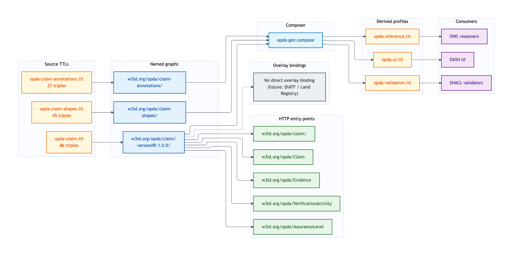
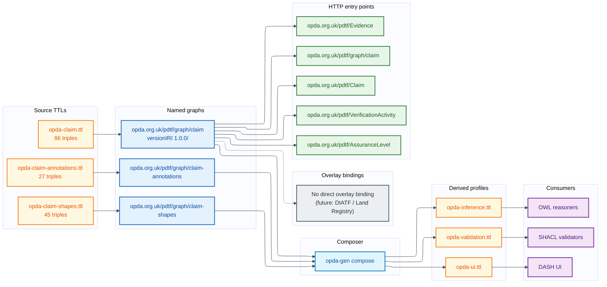

# Claim — deployment view

The Claim module covers Claim, three Evidence subtypes (Document, ElectronicRecord, Vouch), VerificationActivity, AssuranceLevel, and TrustFramework. It is the trust-and-evidence substrate of OPDA — every other module's data ultimately rests on Claims with attached Evidence and a measurable AssuranceLevel.

## Source TTL(s)

| File | Role | Physical-Ontology tier |
|---|---|---|
| [`opda-claim.ttl`](../../../../source/03-standards/ontology/opda-claim.ttl) | TBox: Claim, Document/ElectronicRecord/Vouch Evidence, VerificationActivity, AssuranceLevel, TrustFramework | [claim/classes.md](../../physical-ontology/claim/classes.md) |
| [`opda-claim-shapes.ttl`](../../../../source/03-standards/ontology/opda-claim-shapes.ttl) | Identity-key + IC-breach shapes for Claim, Evidence, VerificationActivity | [claim/shapes.md](../../physical-ontology/claim/shapes.md) |
| [`opda-claim-annotations.ttl`](../../../../source/03-standards/ontology/opda-claim-annotations.ttl) | DPV baseline (evidence may carry PII; provenance) | [claim/annotations.md](../../physical-ontology/claim/annotations.md) |

## Named graph(s)

| Named graph IRI | Source TTL | Triples | `owl:versionIRI` |
|---|---|---|---|
| `https://opda.org.uk/pdtf/graph/claim` | `opda-claim.ttl` | 86 | `https://opda.org.uk/pdtf/harness/release/claim/1.0.0/` |
| `https://opda.org.uk/pdtf/graph/claim-shapes` | `opda-claim-shapes.ttl` | 45 | — |
| `https://opda.org.uk/pdtf/graph/claim-annotations` | `opda-claim-annotations.ttl` | 27 | — |

**Load order:** TBox graph imports foundation + vocabularies. Claim is the second-largest business module by triple count (158 across three TTLs) after Property.

## Derived-profile membership

| Profile | `opda-claim.ttl` | `opda-claim-shapes.ttl` | `opda-claim-annotations.ttl` |
|---|---|---|---|
| [opda-validation](../derived-profiles/opda-validation.md) | included (classes + properties + subClassOf + labels) | included (all triples) | excluded |
| [opda-ui](../derived-profiles/opda-ui.md) | included (all triples) | included (all triples) | included (all triples) |
| [opda-inference](../derived-profiles/opda-inference.md) | included (classical-logic axioms only) | excluded | excluded |

## Overlay bindings

**No overlay currently targets Claim classes directly.** BASPI5's Property + Address + LegalEstate shapes reference Claim transitively (any BASPI5 field that requires evidence — e.g. EPC certificate proof — points at `opda:Claim` via `opda:hasEvidence`), but no `Baspi5_ClaimShape` exists.

A future Land Registry conveyancing overlay or trust-framework-specific overlay (e.g. DIATF Trust Mark scheme) would be the natural first overlay to target `opda:VerificationActivity` and `opda:AssuranceLevel` directly.

## Content-negotiation entry points

| Resource path | Resolves to |
|---|---|
| `https://opda.org.uk/pdtf/graph/claim` | claim module TBox |
| `https://opda.org.uk/pdtf/harness/release/claim/1.0.0/` | claim versionIRI snapshot |
| `https://opda.org.uk/pdtf/graph/claim-shapes` | claim shape graph |
| `https://opda.org.uk/pdtf/graph/claim-annotations` | claim annotation graph |
| `https://opda.org.uk/pdtf/Claim` | per-entity dereference |
| `https://opda.org.uk/pdtf/Evidence` | per-entity dereference (Evidence supertype) |
| `https://opda.org.uk/pdtf/Document` | per-entity dereference |
| `https://opda.org.uk/pdtf/ElectronicRecord` | per-entity dereference |
| `https://opda.org.uk/pdtf/Vouch` | per-entity dereference |
| `https://opda.org.uk/pdtf/VerificationActivity` | per-entity dereference |
| `https://opda.org.uk/pdtf/AssuranceLevel` | per-entity dereference |
| `https://opda.org.uk/pdtf/TrustFramework` | per-entity dereference |

## Deployment graph

Mermaid Source

## Cross-tier links

- **Logical tier:** [`docs/manual/logical/claim/`](../../logical/claim/) — typed attributes + ER diagrams for Claim, Evidence subtypes, AssuranceLevel.
- **Physical-Ontology tier:** [`docs/manual/physical-ontology/claim/`](../../physical-ontology/claim/) — Turtle source layout + per-class blocks.
- **Operations:** [round-trip CI](../operations/round-trip-ci.md) validates Claim exemplars (claim-with-document-evidence, claim-with-electronic-record-evidence, claim-with-vouch-evidence).
