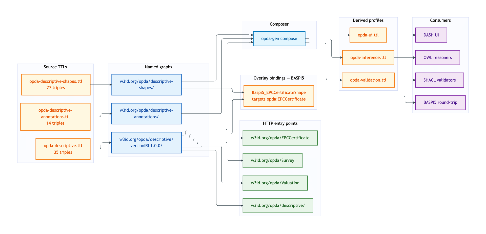
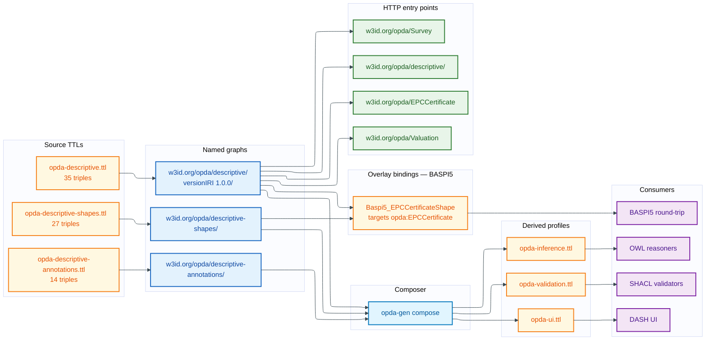

# Descriptive — deployment view

The Descriptive module covers EPCCertificate, Search, Survey, Valuation, Comparable — the descriptive-record entities that surround a Property and underpin BASPI5's energy-performance, search, and survey form fields. EPCCertificate is the one Descriptive class bound by the BASPI5 overlay today.

## Source TTL(s)

| File | Role | Physical-Ontology tier |
|---|---|---|
| [`opda-descriptive.ttl`](../../../../source/03-standards/ontology/opda-descriptive.ttl) | TBox: EPCCertificate, Search, Survey, Valuation, Comparable | [descriptive/classes.md](../../physical-ontology/descriptive/classes.md) |
| [`opda-descriptive-shapes.ttl`](../../../../source/03-standards/ontology/opda-descriptive-shapes.ttl) | Identity-key + IC-breach shapes for descriptive records | [descriptive/shapes.md](../../physical-ontology/descriptive/shapes.md) |
| [`opda-descriptive-annotations.ttl`](../../../../source/03-standards/ontology/opda-descriptive-annotations.ttl) | DPV baseline (EPC may carry energy + address; Survey carries valuation PII) | [descriptive/annotations.md](../../physical-ontology/descriptive/annotations.md) |

## Named graph(s)

| Named graph IRI | Source TTL | Triples | `owl:versionIRI` |
|---|---|---|---|
| `https://w3id.org/opda/descriptive/` | `opda-descriptive.ttl` | 35 | `https://w3id.org/opda/descriptive/1.0.0/` |
| `https://w3id.org/opda/descriptive-shapes/` | `opda-descriptive-shapes.ttl` | 27 | — |
| `https://w3id.org/opda/descriptive-annotations/` | `opda-descriptive-annotations.ttl` | 14 | — |

**Load order:** TBox graph imports foundation + vocabularies. Shape graph carries per-class identity keys (e.g. `opda:EPCCertificate` identity by EPC certificate number + Address).

## Derived-profile membership

| Profile | `opda-descriptive.ttl` | `opda-descriptive-shapes.ttl` | `opda-descriptive-annotations.ttl` |
|---|---|---|---|
| [opda-validation](../derived-profiles/opda-validation.md) | included (classes + properties + subClassOf + labels) | included (all triples) | excluded |
| [opda-ui](../derived-profiles/opda-ui.md) | included (all triples) | included (all triples) | included (all triples) |
| [opda-inference](../derived-profiles/opda-inference.md) | included (classical-logic axioms only) | excluded | excluded |

## Overlay bindings

**BASPI5** binds one Descriptive-module class via `sh:targetClass`:

| BASPI5 shape | Target class | Module-shape graph counterpart |
|---|---|---|
| `Baspi5_EPCCertificateShape` | `opda:EPCCertificate` | `opda:EPCCertificateIdentityShape` (Cat 1) |

BASPI5's `Baspi5ValidationContext` also declares `opda:Survey` in its `opda:requires` list (a BASPI5 submission must reference at least one Survey artefact when the form question applies), but no `Baspi5_SurveyShape` exists yet — Survey is referenced by identifier, not constrained by a dedicated overlay shape.

A future home-condition-overlay or RICS-survey overlay is the expected first overlay to target `opda:Survey` and `opda:Valuation` directly.

## Content-negotiation entry points

| Resource path | Resolves to |
|---|---|
| `https://w3id.org/opda/descriptive/` | descriptive module TBox |
| `https://w3id.org/opda/descriptive/1.0.0/` | descriptive versionIRI snapshot |
| `https://w3id.org/opda/descriptive-shapes/` | descriptive shape graph |
| `https://w3id.org/opda/descriptive-annotations/` | descriptive annotation graph |
| `https://w3id.org/opda/EPCCertificate` | per-entity dereference |
| `https://w3id.org/opda/Search` | per-entity dereference |
| `https://w3id.org/opda/Survey` | per-entity dereference |
| `https://w3id.org/opda/Valuation` | per-entity dereference |
| `https://w3id.org/opda/Comparable` | per-entity dereference |

## Deployment graph

Mermaid Source

## Cross-tier links

- **Logical tier:** [`docs/manual/logical/descriptive/`](../../logical/descriptive/) — typed attributes + ER diagrams for EPC, Search, Survey, Valuation.
- **Physical-Ontology tier:** [`docs/manual/physical-ontology/descriptive/`](../../physical-ontology/descriptive/) — Turtle source layout + per-class blocks + per-shape constraint bodies.
- **Overlay deployment:** [`docs/manual/physical-database/overlay-deployment/baspi5.md`](../overlay-deployment/baspi5.md) — BASPI5 EPCCertificate binding.
- **Operations:** [round-trip CI](../operations/round-trip-ci.md) validates EPC-bearing exemplars through the registered-freehold-house, flat-with-split-uprn, and listed-building-divergent-addresses Property exemplars.
