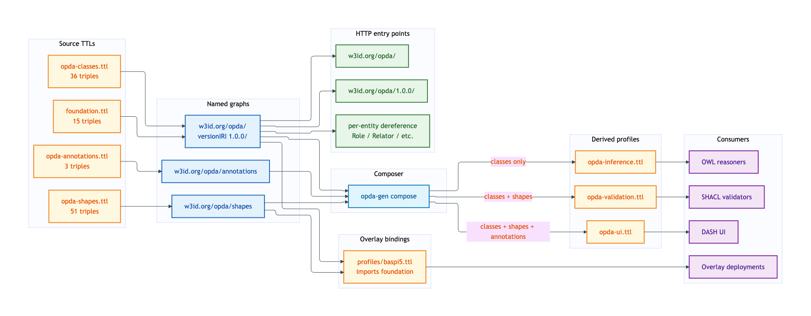
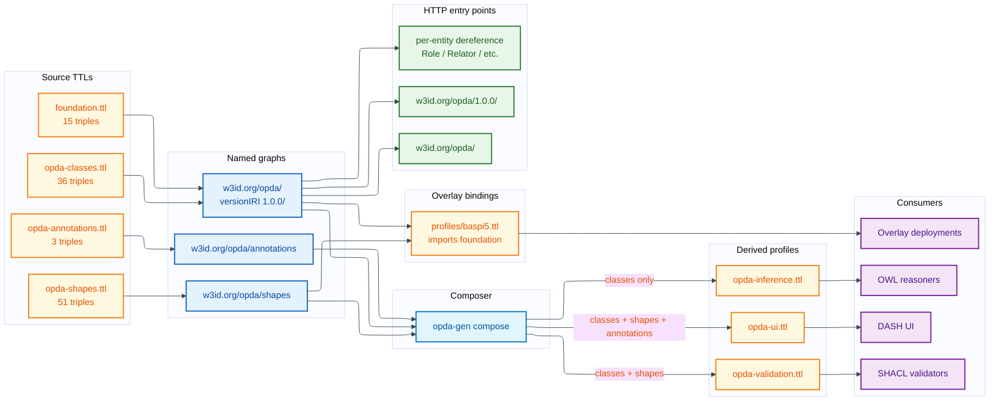

# Foundation — deployment view

The foundation module is the base of every other module. It declares the OPDA namespace, the cross-cutting UFO meta-classes, the foundation meta-shapes (no-identity-override, three-rule interface contract, meta-shape justification), and the header-only annotation graph.

## Source TTL(s)

| File | Role | Physical-Ontology tier |
|---|---|---|
| [`foundation.ttl`](../../../../source/03-standards/ontology/foundation.ttl) | `owl:Ontology` header + metadata (license, creator, versionIRI) | [foundation/README.md](../../physical-ontology/foundation/README.md) |
| [`opda-classes.ttl`](../../../../source/03-standards/ontology/opda-classes.ttl) | 6 foundation classes + `opda:hasSpecialCategoryData` datatype property | [foundation/classes.md](../../physical-ontology/foundation/classes.md) |
| [`opda-shapes.ttl`](../../../../source/03-standards/ontology/opda-shapes.ttl) | 5 foundation meta-shapes + 2 SHACL-AF cross-cutting rules | [foundation/meta-shapes.md](../../physical-ontology/foundation/meta-shapes.md) |
| [`opda-annotations.ttl`](../../../../source/03-standards/ontology/opda-annotations.ttl) | Header-only DPV meta-annotation scaffolding | [foundation/README.md](../../physical-ontology/foundation/README.md) |

## Named graph(s)

| Named graph IRI | Source TTL | Triples | `owl:versionIRI` |
|---|---|---|---|
| `https://w3id.org/opda/` | `foundation.ttl` | 15 | `https://w3id.org/opda/1.0.0/` |
| *(no ontology IRI — class graph)* | `opda-classes.ttl` | 36 | — (rides on foundation versionIRI) |
| `https://w3id.org/opda/shapes` | `opda-shapes.ttl` | 51 | — |
| `https://w3id.org/opda/annotations` | `opda-annotations.ttl` | 3 | — |

**Load order:** foundation graphs have no `owl:imports`. They are loaded first by every consumer. Every per-module TBox graph imports `<https://w3id.org/opda/1.0.0/>` (the foundation versionIRI) as one of its two foundation-substrate imports.

See [named-graphs.md §Foundation graphs](../named-graphs.md#foundation-graphs) for per-graph details.

## Derived-profile membership

| Profile | `foundation.ttl` | `opda-classes.ttl` | `opda-shapes.ttl` | `opda-annotations.ttl` |
|---|---|---|---|---|
| [opda-validation](../derived-profiles/opda-validation.md) | included (all triples) | included (all triples) | included (all triples) | excluded |
| [opda-ui](../derived-profiles/opda-ui.md) | included (all triples) | included (all triples) | included (all triples) | included (all triples) |
| [opda-inference](../derived-profiles/opda-inference.md) | included (header + provenance only; `sh:declare` stripped) | included (class axioms only) | excluded | excluded |

Foundation classes appear in all three profiles because they are the substrate every consumer needs to resolve `sh:targetClass` or run TBox classification. Foundation meta-shapes appear in validation + UI but not inference (reasoner confusion). The annotation graph appears only in UI (DPV is a UI-time concern).

## Overlay bindings

**Every** deployed overlay imports the foundation graph via `owl:imports <https://w3id.org/opda/1.0.0/>`. The BASPI5 overlay is the only overlay currently in production:

- [`profiles/baspi5.ttl`](../../../../source/03-standards/ontology/profiles/baspi5.ttl) imports foundation + uses `opda:ValidationContext` to reify its `opda:Baspi5ValidationContext` instance per ODR-0010 §Q1.

The foundation meta-shapes (Cat 3 NoIdentityOverride, Cat 5 MetaShapeOverShapeGraph, three-rule interface contract `ShInSemantics` + `ShViolationFloor`) constrain every overlay — overlays cannot suppress foundation identity keys or downgrade foundation severity floors. See [overlay-deployment/baspi5.md §Three-rule interface contract status](../overlay-deployment/baspi5.md#three-rule-interface-contract-status).

## Content-negotiation entry points

| Resource path | Resolves to |
|---|---|
| `https://w3id.org/opda/` | foundation default graph (`foundation.ttl`) |
| `https://w3id.org/opda/1.0.0/` | foundation versionIRI snapshot (immutable per release) |
| `https://w3id.org/opda/DiagnosticExemplar` | per-entity dereference into `opda-classes.ttl` |
| `https://w3id.org/opda/GeneratorRun` | per-entity dereference into `opda-classes.ttl` |
| `https://w3id.org/opda/Relator` | per-entity dereference into `opda-classes.ttl` |
| `https://w3id.org/opda/Role` | per-entity dereference into `opda-classes.ttl` |
| `https://w3id.org/opda/RoleMixin` | per-entity dereference into `opda-classes.ttl` |
| `https://w3id.org/opda/ValidationContext` | per-entity dereference into `opda-classes.ttl` |
| `https://w3id.org/opda/hasSpecialCategoryData` | per-entity dereference into `opda-classes.ttl` |
| `https://w3id.org/opda/shapes` | `opda-shapes.ttl` (named-graph endpoint) |
| `https://w3id.org/opda/annotations` | `opda-annotations.ttl` (named-graph endpoint) |

Content-type routing per the [Accept-header matrix](../content-negotiation/README.md#accept-header-routing).

## Deployment graph

Mermaid Source

## Cross-tier links

- **Logical tier:** [`docs/manual/logical/foundation/`](../../logical/foundation/) — typed attributes + cardinalities for the foundation classes.
- **Physical-Ontology tier:** [`docs/manual/physical-ontology/foundation/`](../../physical-ontology/foundation/) — Turtle source layout + per-class blocks + meta-shape constraint bodies.
- **Operations:** [byte-identity CI](../operations/byte-identity-ci.md) regenerates the four foundation TTLs; [three-graph CI](../operations/three-graph-ci.md) enforces separation per ODR-0004 §3a.
