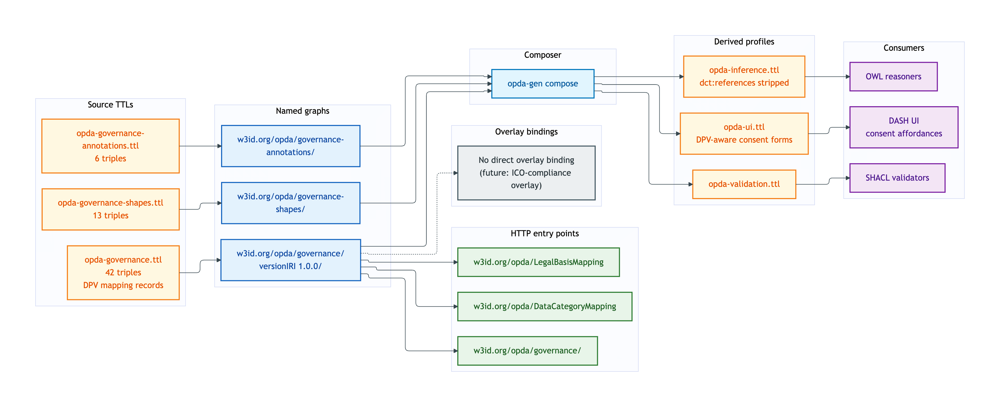
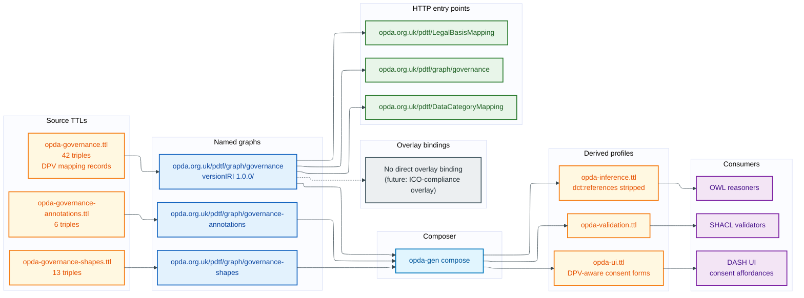

# Governance — deployment view

The Governance module is the smallest business module by triple count (54 across three TTLs). It carries the **DPV mapping records** that link OPDA kinds to GDPR personal-data categories — the load-bearing surface for the consent / data-category / data-subject-rights affordances that the UI consumer profile exposes.

## Source TTL(s)

| File | Role | Physical-Ontology tier |
|---|---|---|
| [`opda-governance.ttl`](../../../../source/03-standards/ontology/opda-governance.ttl) | TBox: DPV mapping records (`DataCategoryMapping`, `LegalBasisMapping`, etc.) | [governance/classes.md](../../physical-ontology/governance/classes.md) |
| [`opda-governance-shapes.ttl`](../../../../source/03-standards/ontology/opda-governance-shapes.ttl) | Mapping-record identity + IC-breach shapes | [governance/shapes.md](../../physical-ontology/governance/shapes.md) |
| [`opda-governance-annotations.ttl`](../../../../source/03-standards/ontology/opda-governance-annotations.ttl) | DPV self-referential annotations (this module *is* the DPV mapping; its annotation graph documents the mapping discipline itself) | [governance/annotations.md](../../physical-ontology/governance/annotations.md) |

## Named graph(s)

| Named graph IRI | Source TTL | Triples | `owl:versionIRI` |
|---|---|---|---|
| `https://opda.org.uk/pdtf/graph/governance` | `opda-governance.ttl` | 42 | `https://opda.org.uk/pdtf/harness/release/governance/1.0.0/` |
| `https://opda.org.uk/pdtf/graph/governance-shapes` | `opda-governance-shapes.ttl` | 13 | — |
| `https://opda.org.uk/pdtf/graph/governance-annotations` | `opda-governance-annotations.ttl` | 6 | — |

**Load order:** TBox graph imports foundation + vocabularies. Governance mapping records reference DPV terms via `dct:references` per [ADR-0012](/modelling/adr/adr-0012) (reference-not-import).

## Derived-profile membership

| Profile | `opda-governance.ttl` | `opda-governance-shapes.ttl` | `opda-governance-annotations.ttl` |
|---|---|---|---|
| [opda-validation](../derived-profiles/opda-validation.md) | included (classes + properties + subClassOf + labels) | included (all triples) | excluded |
| [opda-ui](../derived-profiles/opda-ui.md) | included (all triples; UI consumers drive DPV-aware consent forms from these mappings) | included (all triples) | included (all triples) |
| [opda-inference](../derived-profiles/opda-inference.md) | included (classical-logic axioms only; DPV `dct:references` triples stripped) | excluded | excluded |

The Governance module is structurally peculiar: it is itself the mapping-records layer that the other modules' `-annotations.ttl` files cite. Its own annotation graph carries mostly meta-commentary on the DPV mapping discipline rather than per-class baselines.

## Overlay bindings

**No overlay targets Governance classes directly.** Mapping records are referenced by overlays through the modules' annotation graphs (when the UI profile renders a BASPI5 Person field, the DPV mapping record in `opda-governance.ttl` is what drives the special-category-data disclosure), but no overlay binds Governance shapes via `sh:targetClass`.

A future ICO-compliance overlay or DPIA-mandated overlay is the expected first overlay to target Governance.

## Content-negotiation entry points

| Resource path | Resolves to |
|---|---|
| `https://opda.org.uk/pdtf/graph/governance` | governance module TBox |
| `https://opda.org.uk/pdtf/harness/release/governance/1.0.0/` | governance versionIRI snapshot |
| `https://opda.org.uk/pdtf/graph/governance-shapes` | governance shape graph |
| `https://opda.org.uk/pdtf/graph/governance-annotations` | governance annotation graph |
| `https://opda.org.uk/pdtf/DataCategoryMapping` | per-entity dereference |
| `https://opda.org.uk/pdtf/LegalBasisMapping` | per-entity dereference |

## Deployment graph

Mermaid Source

## Cross-tier links

- **Logical tier:** [`docs/manual/logical/governance/`](../../logical/governance/) — typed attributes for DataCategoryMapping and LegalBasisMapping.
- **Physical-Ontology tier:** [`docs/manual/physical-ontology/governance/`](../../physical-ontology/governance/) — Turtle source layout + DPV reference discipline (per ADR-0012).
- **Operations:** [three-graph CI](../operations/three-graph-ci.md) rule 4 enforces that DPV `dct:references` triples only appear in `-annotations.ttl` files — Governance is the canonical site for DPV reference discipline.
