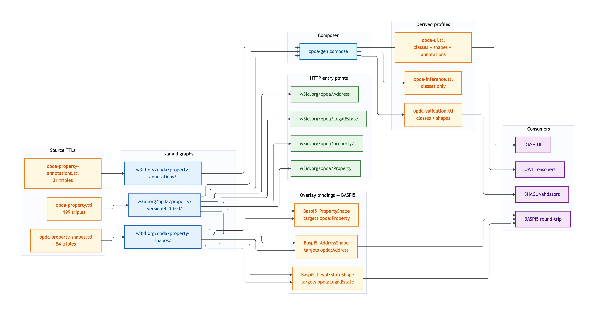
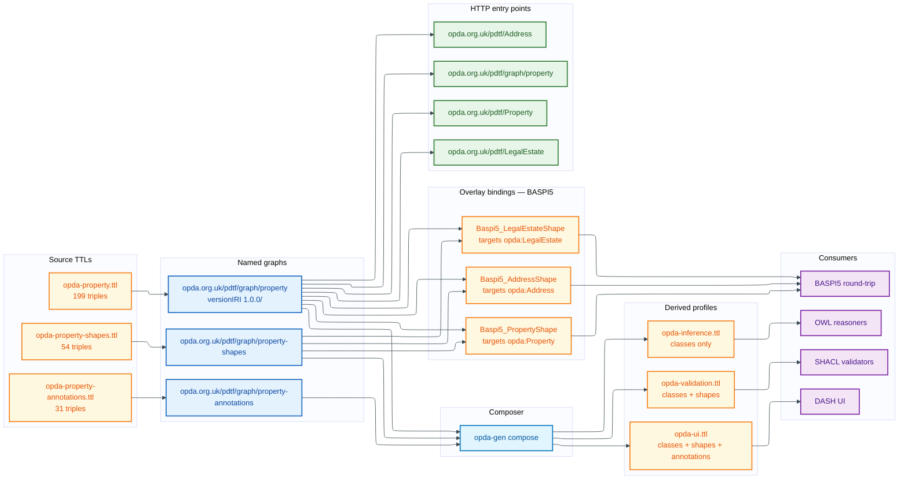

# Property — deployment view

The Property module is the **Identity-Criterion crux** of OPDA. Property, LegalEstate, RegisteredTitle, Address + variant-specific subclasses, Lease-Term, UPRNSuccessionEvent, LeaseExtensionEvent — the deployment graph for the Property module is the largest of the six business modules.

## Source TTL(s)

| File | Role | Physical-Ontology tier |
|---|---|---|
| [`opda-property.ttl`](../../../../source/03-standards/ontology/opda-property.ttl) | TBox: classes + properties + variants | [property/classes.md](../../physical-ontology/property/classes.md) |
| [`opda-property-shapes.ttl`](../../../../source/03-standards/ontology/opda-property-shapes.ttl) | Identity-key + IC-breach shapes + SHACL-AF quality rules | [property/shapes.md](../../physical-ontology/property/shapes.md) |
| [`opda-property-annotations.ttl`](../../../../source/03-standards/ontology/opda-property-annotations.ttl) | DPV baseline + variant-conditional refinement maps | [property/annotations.md](../../physical-ontology/property/annotations.md) |

## Named graph(s)

| Named graph IRI | Source TTL | Triples | `owl:versionIRI` |
|---|---|---|---|
| `https://opda.org.uk/pdtf/graph/property` | `opda-property.ttl` | 199 | `https://opda.org.uk/pdtf/harness/release/property/1.0.0/` |
| `https://opda.org.uk/pdtf/graph/property-shapes` | `opda-property-shapes.ttl` | 54 | — |
| `https://opda.org.uk/pdtf/graph/property-annotations` | `opda-property-annotations.ttl` | 31 | — |

**Load order:** the TBox graph imports the foundation + vocabularies substrate:

```turtle
owl:imports <https://opda.org.uk/pdtf/harness/release/1.0.0/>, <https://opda.org.uk/pdtf/scheme/>
```

Consumers must load the foundation graphs first (transitively via `owl:imports`). Property shape + annotation graphs declare no `owl:imports` and load alongside the TBox graph.

See [named-graphs.md §Module-TBox graphs](../named-graphs.md#https-w3id-org-opda-property) for details.

## Derived-profile membership

| Profile | `opda-property.ttl` | `opda-property-shapes.ttl` | `opda-property-annotations.ttl` |
|---|---|---|---|
| [opda-validation](../derived-profiles/opda-validation.md) | included (classes + properties + subClassOf + labels) | included (all triples) | excluded (DPV is UI-time) |
| [opda-ui](../derived-profiles/opda-ui.md) | included (all triples) | included (all triples; DASH UI predicates) | included (all triples; DPV disclosures drive form affordances) |
| [opda-inference](../derived-profiles/opda-inference.md) | included (classical-logic axioms only) | excluded (shapes confuse reasoners) | excluded (no inference contribution) |

## Overlay bindings

**BASPI5** binds three Property-module classes via `sh:targetClass`:

| BASPI5 shape | Target class | Module-shape graph counterpart |
|---|---|---|
| `Baspi5_PropertyShape` | `opda:Property` | `opda:PropertyIdentityShape` (Cat 1) |
| `Baspi5_AddressShape` | `opda:Address` | `opda:AddressIdentityShape` (Cat 1) |
| `Baspi5_LegalEstateShape` | `opda:LegalEstate` | `opda:LegalEstateIdentityShape` (Cat 1) |

The overlay cannot redefine foundation identity keys per the Cat 3 NoIdentityOverride meta-shape; it constrains BASPI5-specific per-form cardinality + enum subsets + DASH UI on top of the foundation shapes.

See [overlay-deployment/baspi5.md §Source profile TTL](../overlay-deployment/baspi5.md#source-profile-ttl) for the full ValidationContext reification.

## Content-negotiation entry points

| Resource path | Resolves to |
|---|---|
| `https://opda.org.uk/pdtf/graph/property` | property module TBox (`opda-property.ttl`) |
| `https://opda.org.uk/pdtf/harness/release/property/1.0.0/` | property versionIRI snapshot |
| `https://opda.org.uk/pdtf/graph/property-shapes` | property shape graph (`opda-property-shapes.ttl`) |
| `https://opda.org.uk/pdtf/graph/property-annotations` | property annotation graph (`opda-property-annotations.ttl`) |
| `https://opda.org.uk/pdtf/Property` | per-entity dereference (TBox + matching shape fragment) |
| `https://opda.org.uk/pdtf/Address` | per-entity dereference |
| `https://opda.org.uk/pdtf/LegalEstate` | per-entity dereference |
| `https://opda.org.uk/pdtf/RegisteredTitle` | per-entity dereference |
| `https://opda.org.uk/pdtf/UPRNSuccessionEvent` | per-entity dereference |
| `https://opda.org.uk/pdtf/LeaseExtensionEvent` | per-entity dereference |

Content-type routing per the [Accept-header matrix](../content-negotiation/README.md#accept-header-routing).

## Deployment graph



<details>
<summary>Mermaid Source</summary>



</details>

## Cross-tier links

- **Logical tier:** [`docs/manual/logical/property/`](../../logical/property/) — typed attributes + cardinalities + ER diagrams for Property classes.
- **Physical-Ontology tier:** [`docs/manual/physical-ontology/property/`](../../physical-ontology/property/) — Turtle source layout + per-class blocks + per-shape constraint bodies.
- **Overlay deployment:** [`docs/manual/physical-database/overlay-deployment/baspi5.md`](../overlay-deployment/baspi5.md) — BASPI5 Property bindings.
- **Operations:** [byte-identity CI](../operations/byte-identity-ci.md) regenerates the three Property TTLs; [round-trip CI](../operations/round-trip-ci.md) validates Property exemplars (registered-freehold-house, flat-with-split-uprn, etc.).
