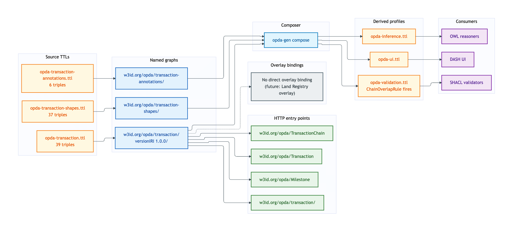
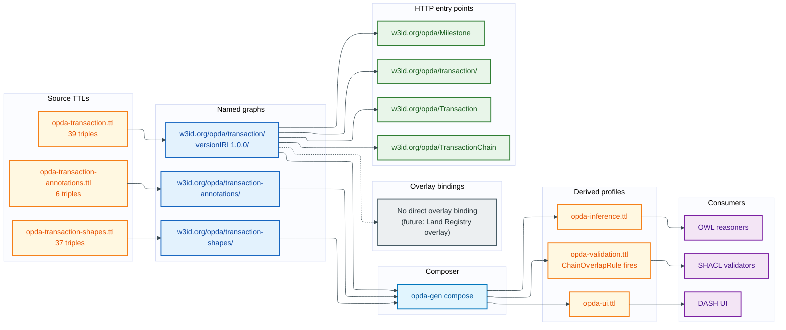

# Transaction — deployment view

The Transaction module covers the Transaction Relator, Milestones, and TransactionChain. It is the smallest of the six business modules by triple count (82 triples across three TTLs). No overlay currently binds Transaction classes; BASPI5 references Transaction implicitly via Property + Seller + Buyer, but does not target Transaction shapes directly.

## Source TTL(s)

| File | Role | Physical-Ontology tier |
|---|---|---|
| [`opda-transaction.ttl`](../../../../source/03-standards/ontology/opda-transaction.ttl) | TBox: Transaction Relator, Milestone, TransactionChain | [transaction/classes.md](../../physical-ontology/transaction/classes.md) |
| [`opda-transaction-shapes.ttl`](../../../../source/03-standards/ontology/opda-transaction-shapes.ttl) | Identity-key + IC-breach shapes; SHACL-AF chain-overlap detection rule | [transaction/shapes.md](../../physical-ontology/transaction/shapes.md) |
| [`opda-transaction-annotations.ttl`](../../../../source/03-standards/ontology/opda-transaction-annotations.ttl) | DPV baseline (minimal — transactions surface PII via linked Person + Property) | [transaction/annotations.md](../../physical-ontology/transaction/annotations.md) |

## Named graph(s)

| Named graph IRI | Source TTL | Triples | `owl:versionIRI` |
|---|---|---|---|
| `https://w3id.org/opda/transaction/` | `opda-transaction.ttl` | 39 | `https://w3id.org/opda/transaction/1.0.0/` |
| `https://w3id.org/opda/transaction-shapes/` | `opda-transaction-shapes.ttl` | 37 | — |
| `https://w3id.org/opda/transaction-annotations/` | `opda-transaction-annotations.ttl` | 6 | — |

**Load order:** TBox graph imports foundation + vocabularies. Shape graph carries the `ChainOverlapDetectionRule` SHACL-AF rule that flags multi-transaction chains where chain links contradict.

## Derived-profile membership

| Profile | `opda-transaction.ttl` | `opda-transaction-shapes.ttl` | `opda-transaction-annotations.ttl` |
|---|---|---|---|
| [opda-validation](../derived-profiles/opda-validation.md) | included (classes + properties + subClassOf + labels) | included (all triples; the chain-overlap rule fires here) | excluded |
| [opda-ui](../derived-profiles/opda-ui.md) | included (all triples) | included (all triples) | included (all triples) |
| [opda-inference](../derived-profiles/opda-inference.md) | included (classical-logic axioms only) | excluded | excluded |

## Overlay bindings

**No overlay currently targets Transaction classes directly.** BASPI5 covers the property transaction surface via Property + Seller + Buyer; Transaction itself is a relational endurant that the overlay references transitively through `opda:Buyer` and `opda:Seller` participation, not via `sh:targetClass`.

A future overlay (e.g. a Land Registry conveyancing overlay) is the expected first overlay to bind Transaction; tracked in the deferred-work register at [`docs/governance/deferred-work.md`](../../../governance/deferred-work.md).

## Content-negotiation entry points

| Resource path | Resolves to |
|---|---|
| `https://w3id.org/opda/transaction/` | transaction module TBox |
| `https://w3id.org/opda/transaction/1.0.0/` | transaction versionIRI snapshot |
| `https://w3id.org/opda/transaction-shapes/` | transaction shape graph |
| `https://w3id.org/opda/transaction-annotations/` | transaction annotation graph |
| `https://w3id.org/opda/Transaction` | per-entity dereference |
| `https://w3id.org/opda/Milestone` | per-entity dereference |
| `https://w3id.org/opda/TransactionChain` | per-entity dereference |

## Deployment graph

Mermaid Source

## Cross-tier links

- **Logical tier:** [`docs/manual/logical/transaction/`](../../logical/transaction/) — typed attributes + ER diagrams for Transaction Relator and TransactionChain.
- **Physical-Ontology tier:** [`docs/manual/physical-ontology/transaction/`](../../physical-ontology/transaction/) — Turtle source layout + per-class blocks + ChainOverlap SHACL-AF rule body.
- **Operations:** [round-trip CI](../operations/round-trip-ci.md) validates Transaction exemplars (simple-transaction-with-milestones, lease-extension-transaction, chain-of-transactions).
