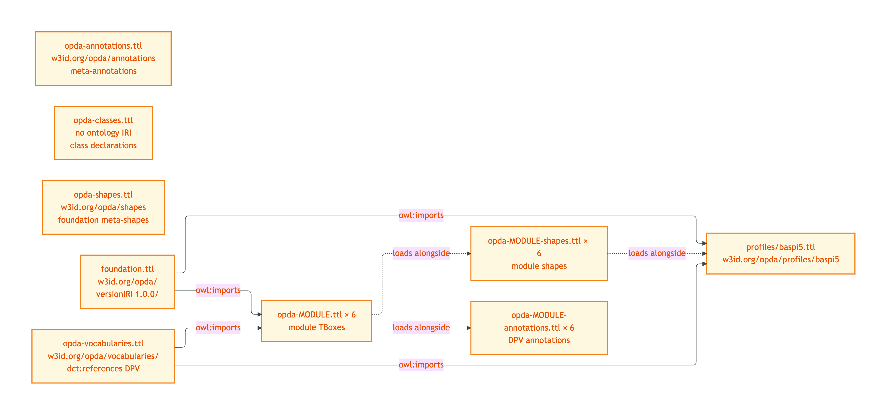
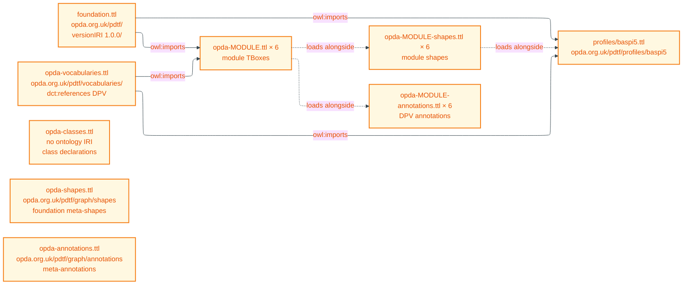
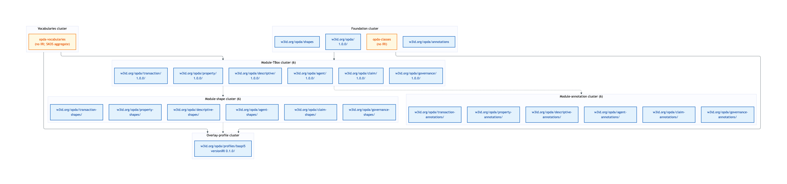
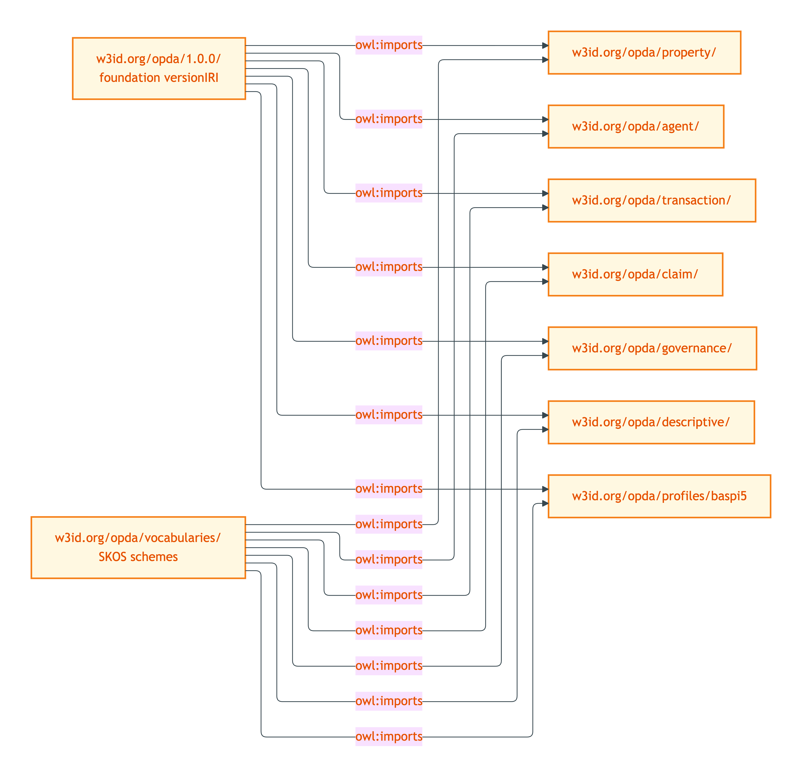
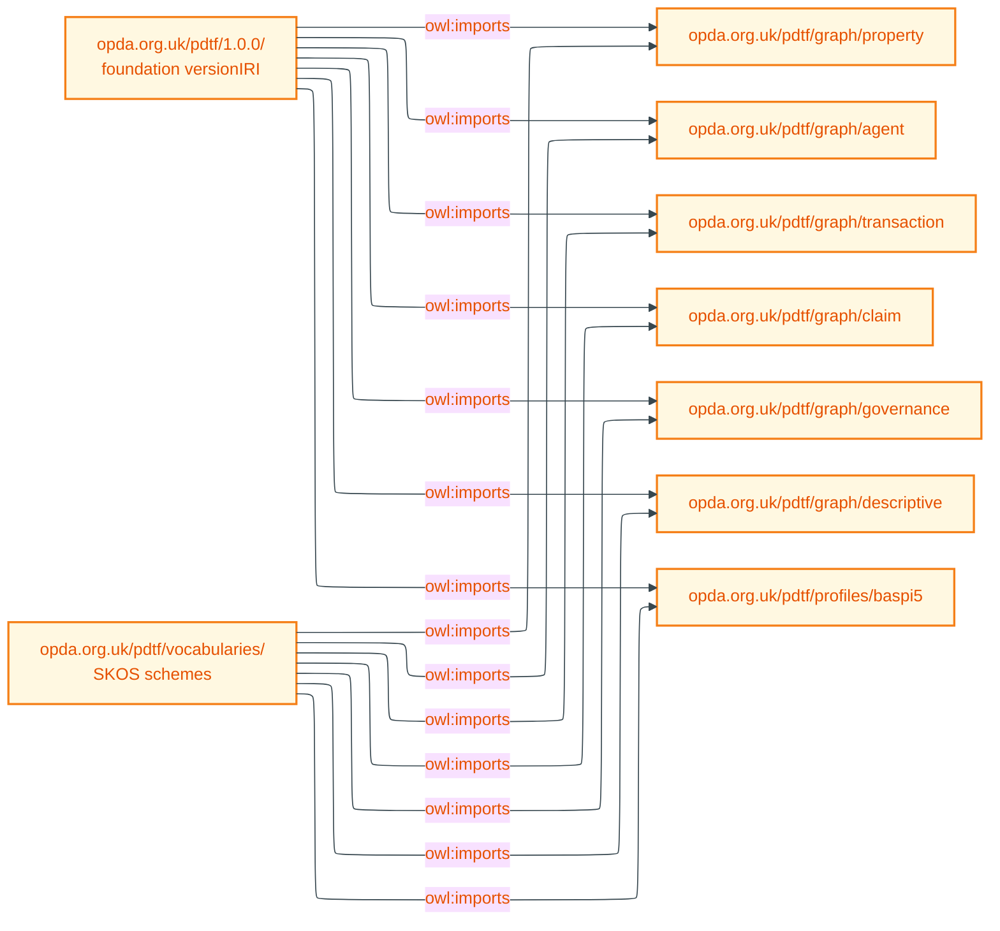

# Per-named-graph layout

One section per named graph the deployment exposes. Triple counts measured by `rdflib.Graph().parse(<file>)` against the committed TTLs at HEAD. Load order resolves `owl:imports` chains; graphs without `owl:Ontology` declarations (`opda-classes.ttl`, `opda-vocabularies.ttl`) participate in the default-graph union and have no `owl:imports` of their own.

## Load order summary

Mermaid Source

## Named-graph layout — clusters

The 25 named graphs cluster by role. Foundation graphs are loaded first; module-TBox graphs import the foundation substrate; module-shape and module-annotation graphs ride alongside their matching TBox graph; overlay profiles cite the foundation but the consumer typically merges all six module-shape graphs for full BASPI5 validation.

```mermaid
---
config:
  layout: elk
  elk:
    mergeEdges: false
    nodePlacementStrategy: BRANDES_KOEPF
---
%%{init: {"theme": "base", "themeVariables": {"primaryColor": "#FFF8E1", "primaryTextColor": "#E65100", "primaryBorderColor": "#F57F17", "lineColor": "#37474F"}}}%%
flowchart TB
    accTitle: Named-graph layout by cluster
    accDescr: Groups the 25 named graphs by role - foundation, vocabularies, module-classes, module-shapes, module-annotations, and overlay profiles - with version IRI annotations on the TBox graphs.

    classDef data fill:#FFF8E1,stroke:#F57F17,stroke-width:2px,color:#E65100
    classDef infra fill:#E3F2FD,stroke:#1565C0,stroke-width:2px,color:#0D47A1

    subgraph FND["Foundation cluster"]
        FN1["opda.org.uk/pdtf/<br/>1.0.0/"]:::infra
        FN2["opda-classes<br/>(no IRI)"]:::data
        FN3["opda.org.uk/pdtf/graph/shapes"]:::infra
        FN4["opda.org.uk/pdtf/graph/annotations"]:::infra
    end

    subgraph VOC["Vocabularies cluster"]
        VC1["opda-vocabularies<br/>(no IRI; SKOS aggregate)"]:::data
    end

    subgraph MCLS["Module-TBox cluster (6)"]
        MC1["opda.org.uk/pdtf/graph/property<br/>1.0.0/"]:::infra
        MC2["opda.org.uk/pdtf/graph/agent<br/>1.0.0/"]:::infra
        MC3["opda.org.uk/pdtf/graph/transaction<br/>1.0.0/"]:::infra
        MC4["opda.org.uk/pdtf/graph/claim<br/>1.0.0/"]:::infra
        MC5["opda.org.uk/pdtf/graph/governance<br/>1.0.0/"]:::infra
        MC6["opda.org.uk/pdtf/graph/descriptive<br/>1.0.0/"]:::infra
    end

    subgraph MSH["Module-shape cluster (6)"]
        MS1["opda.org.uk/pdtf/graph/property-shapes"]:::infra
        MS2["opda.org.uk/pdtf/graph/agent-shapes"]:::infra
        MS3["opda.org.uk/pdtf/graph/transaction-shapes"]:::infra
        MS4["opda.org.uk/pdtf/graph/claim-shapes"]:::infra
        MS5["opda.org.uk/pdtf/graph/governance-shapes"]:::infra
        MS6["opda.org.uk/pdtf/graph/descriptive-shapes"]:::infra
    end

    subgraph MAN["Module-annotation cluster (6)"]
        MA1["opda.org.uk/pdtf/graph/property-annotations"]:::infra
        MA2["opda.org.uk/pdtf/graph/agent-annotations"]:::infra
        MA3["opda.org.uk/pdtf/graph/transaction-annotations"]:::infra
        MA4["opda.org.uk/pdtf/graph/claim-annotations"]:::infra
        MA5["opda.org.uk/pdtf/graph/governance-annotations"]:::infra
        MA6["opda.org.uk/pdtf/graph/descriptive-annotations"]:::infra
    end

    subgraph OVR["Overlay-profile cluster"]
        OB1["opda.org.uk/pdtf/profiles/baspi5<br/>versionIRI 0.1.0/"]:::infra
    end

    FND --> MCLS
    VOC --> MCLS
    MCLS -.-> MSH
    MCLS -.-> MAN
    FND --> OVR
    VOC --> OVR
    MSH -.-> OVR
```

Mermaid Source

## Named-graph dependency graph

`owl:imports` chains across the deployment. The foundation versionIRI `https://opda.org.uk/pdtf/harness/release/1.0.0/` is imported by every module-TBox graph and by every overlay profile. The vocabularies graph (cited as `https://opda.org.uk/pdtf/scheme/`) is imported alongside the foundation in every module TBox and overlay. Shape graphs declare no `owl:imports` (per ODR-0004 §3a separation rule 3) and load alongside their matching TBox graph.

Mermaid Source

## Foundation graphs

### https://opda.org.uk/pdtf/

#### Source TTL(s)

- [`foundation.ttl`](../../../source/03-standards/ontology/foundation.ttl) ([Physical-Ontology tier →](../physical-ontology/foundation/))

#### Purpose

Default-graph entry point. Carries the `owl:Ontology` declaration for the OPDA namespace, the foundation metadata (creator, license, issued, modified, version), the `vann:preferredNamespacePrefix`, and the global `sh:declare` for the `opda:` prefix. This is the graph a consumer loads first.

#### Load order

- No `owl:imports`. Loaded first.

#### Triple count

15 triples (HEAD; bytes 1 851; sha256 `6e328d3acd24…`).

#### Version IRI

`https://opda.org.uk/pdtf/harness/release/1.0.0/`. Bumped on every module-TBox or vocabulary release per [ADR-0013](/modelling/adr/adr-0013). Last bump: 1.0.0 (foundation + SKOS vocabularies + UFO meta-classes + module shapes + DPV annotations + overlay profiles + ValidationContext + hasSpecialCategoryData — ADR-0009..ADR-0014).

### (no ontology IRI — class graph)

#### Source TTL(s)

- [`opda-classes.ttl`](../../../source/03-standards/ontology/opda-classes.ttl) ([Physical-Ontology tier →](../physical-ontology/foundation/))

#### Purpose

The class graph carries the six foundation `owl:Class` declarations (DiagnosticExemplar, GeneratorRun, RoleMixin, Role, Relator, ValidationContext) plus the single ADR-0014 G14 `opda:hasSpecialCategoryData` `owl:DatatypeProperty`. Three-graph separation per [ODR-0004 §3a](/modelling/odr/odr-0004) requires this file MUST NOT contain `sh:NodeShape` triples; those live in the matching `-shapes.ttl`.

#### Load order

- No `owl:imports`. Merges into the default-graph union alongside `foundation.ttl`.

#### Triple count

36 triples (HEAD; bytes 6 756; sha256 `7494bad0c6c9…`).

#### Version IRI

None at file level — class graph rides on the foundation `owl:versionIRI`.

### https://opda.org.uk/pdtf/graph/shapes

#### Source TTL(s)

- [`opda-shapes.ttl`](../../../source/03-standards/ontology/opda-shapes.ttl) ([Physical-Ontology tier →](../physical-ontology/foundation/))

#### Purpose

Foundation SHACL meta-shapes (Cat 3 NoIdentityOverride, Cat 5 MetaShapeOverShapeGraph, three-rule interface contract: ShInSemantics + ShViolationFloor) plus two cross-cutting SHACL-AF rules (PIIWithoutDPVCoAnnotationRule per [ODR-0012](../../ontology/odr/) §Q5; DeprecationChainRule per ODR-0011 §5a). MUST NOT contain `owl:Class` or `owl:imports` triples per three-graph separation.

#### Load order

- No `owl:imports`. Loaded after foundation + class graphs for SHACL validation.

#### Triple count

51 triples (HEAD; bytes 7 493; sha256 `52f8442ba3ab…`).

#### Version IRI

None at file level.

### https://opda.org.uk/pdtf/graph/annotations

#### Source TTL(s)

- [`opda-annotations.ttl`](../../../source/03-standards/ontology/opda-annotations.ttl) ([Physical-Ontology tier →](../physical-ontology/foundation/))

#### Purpose

Foundation meta-annotation graph (DPV co-annotation scaffolding). Minimal at MVP; per-module annotation graphs do the substantive work.

#### Load order

- No `owl:imports`.

#### Triple count

3 triples (HEAD; bytes 1 224; sha256 `cd0282bbfea1…`).

#### Version IRI

None at file level.

## Vocabulary graph

### (no ontology IRI — SKOS scheme aggregate)

#### Source TTL(s)

- [`opda-vocabularies.ttl`](../../../source/03-standards/ontology/opda-vocabularies.ttl) ([Physical-Ontology tier →](../physical-ontology/vocabularies/))

#### Purpose

The 23 SKOS Concept Schemes per [ODR-0011 §1a + §8a](../../ontology/odr/) seven-category UFO framework: AddressVariantScheme, AssuranceLevelScheme, and 21 others. References DPV via `dct:references` (reference-not-import per [ADR-0010](/modelling/adr/adr-0010)). The lifecycle SHACL-AF rule body for deprecated concepts lives in `opda-shapes.ttl`.

#### Load order

- No `owl:imports`. Pure SKOS-scheme aggregate. Loaded by every module TBox via the canonical `https://opda.org.uk/pdtf/scheme/` import.

#### Triple count

873 triples (HEAD; bytes 62 450; sha256 `bff1c21289dd…`).

#### Version IRI

None at file level; module imports cite `https://opda.org.uk/pdtf/scheme/` as the canonical import target (the redirect serves this file).

## Module-TBox graphs

Each module-TBox graph imports the foundation + vocabularies via canonical URLs. The composer rewrites these to local file paths during build; at deploy time the W3C PICG redirect resolves them.

### https://opda.org.uk/pdtf/graph/property

#### Source TTL(s)

- [`opda-property.ttl`](../../../source/03-standards/ontology/opda-property.ttl) ([Physical-Ontology tier →](../physical-ontology/property/))

#### Purpose

Property module TBox: physical Property, LegalEstate, RegisteredTitle, Address + variant-specific subclasses, Lease-Term, UPRNSuccessionEvent, LeaseExtensionEvent. The Identity-Criterion crux of OPDA.

#### Load order

- `owl:imports <https://opda.org.uk/pdtf/harness/release/1.0.0/>` — foundation.
- `owl:imports <https://opda.org.uk/pdtf/scheme/>` — SKOS schemes.

#### Triple count

199 triples (HEAD; bytes 18 845; sha256 `5bb1f05454d5…`).

#### Version IRI

`https://opda.org.uk/pdtf/harness/release/property/1.0.0/`.

### https://opda.org.uk/pdtf/graph/agent

#### Source TTL(s)

- [`opda-agent.ttl`](../../../source/03-standards/ontology/opda-agent.ttl) ([Physical-Ontology tier →](../physical-ontology/agent/))

#### Purpose

Agent module TBox: Person, Organisation, Proprietor + Proprietorship Relator, Seller / Buyer roles, NameChangeEvent.

#### Load order

- `owl:imports <https://opda.org.uk/pdtf/harness/release/1.0.0/>`.
- `owl:imports <https://opda.org.uk/pdtf/scheme/>`.

#### Triple count

77 triples (HEAD; bytes 9 203; sha256 `e2e0841bbf80…`).

#### Version IRI

`https://opda.org.uk/pdtf/harness/release/agent/1.0.0/`.

### https://opda.org.uk/pdtf/graph/transaction

#### Source TTL(s)

- [`opda-transaction.ttl`](../../../source/03-standards/ontology/opda-transaction.ttl) ([Physical-Ontology tier →](../physical-ontology/transaction/))

#### Purpose

Transaction module TBox: Transaction Relator, Milestone, TransactionChain.

#### Load order

- `owl:imports <https://opda.org.uk/pdtf/harness/release/1.0.0/>`.
- `owl:imports <https://opda.org.uk/pdtf/scheme/>`.

#### Triple count

39 triples (HEAD; bytes 5 391; sha256 `fb85b3b680af…`).

#### Version IRI

`https://opda.org.uk/pdtf/harness/release/transaction/1.0.0/`.

### https://opda.org.uk/pdtf/graph/claim

#### Source TTL(s)

- [`opda-claim.ttl`](../../../source/03-standards/ontology/opda-claim.ttl) ([Physical-Ontology tier →](../physical-ontology/claim/))

#### Purpose

Claim module TBox: Claim, three Evidence subtypes (Document, ElectronicRecord, Vouch), VerificationActivity, AssuranceLevel, TrustFramework.

#### Load order

- `owl:imports <https://opda.org.uk/pdtf/harness/release/1.0.0/>`.
- `owl:imports <https://opda.org.uk/pdtf/scheme/>`.

#### Triple count

86 triples (HEAD; bytes 9 534; sha256 `93c577b0545e…`).

#### Version IRI

`https://opda.org.uk/pdtf/harness/release/claim/1.0.0/`.

### https://opda.org.uk/pdtf/graph/governance

#### Source TTL(s)

- [`opda-governance.ttl`](../../../source/03-standards/ontology/opda-governance.ttl) ([Physical-Ontology tier →](../physical-ontology/governance/))

#### Purpose

Governance module TBox: DPV mapping records that link OPDA kinds to GDPR personal-data categories.

#### Load order

- `owl:imports <https://opda.org.uk/pdtf/harness/release/1.0.0/>`.
- `owl:imports <https://opda.org.uk/pdtf/scheme/>`.

#### Triple count

42 triples (HEAD; bytes 4 424; sha256 `f1fae7ca0722…`).

#### Version IRI

`https://opda.org.uk/pdtf/harness/release/governance/1.0.0/`.

### https://opda.org.uk/pdtf/graph/descriptive

#### Source TTL(s)

- [`opda-descriptive.ttl`](../../../source/03-standards/ontology/opda-descriptive.ttl) ([Physical-Ontology tier →](../physical-ontology/descriptive/))

#### Purpose

Descriptive module TBox: EPCCertificate, Search, Survey, Valuation, Comparable.

#### Load order

- `owl:imports <https://opda.org.uk/pdtf/harness/release/1.0.0/>`.
- `owl:imports <https://opda.org.uk/pdtf/scheme/>`.

#### Triple count

35 triples (HEAD; bytes 4 457; sha256 `1c236b44a11d…`).

#### Version IRI

`https://opda.org.uk/pdtf/harness/release/descriptive/1.0.0/`.

## Module-shape graphs

Each per-module shape graph carries Cat 1/2 identity + IC-breach shapes plus SHACL-AF non-blocking quality rules. None declare `owl:imports`; consumers load them alongside the matching TBox graph.

### https://opda.org.uk/pdtf/graph/property-shapes

#### Source TTL(s)

- [`opda-property-shapes.ttl`](../../../source/03-standards/ontology/opda-property-shapes.ttl) ([Physical-Ontology tier →](../physical-ontology/property/))

#### Purpose

Property identity-key shapes (e.g. UPRN-keyed identity), IC-breach (anti-pattern) shapes, SHACL-AF rules for property-level quality.

#### Load order

- No `owl:imports`. Loaded alongside `opda-property.ttl`.

#### Triple count

54 triples (HEAD; bytes 5 442; sha256 `60033df2aad7…`).

#### Version IRI

None at file level.

### https://opda.org.uk/pdtf/graph/agent-shapes

#### Source TTL(s)

- [`opda-agent-shapes.ttl`](../../../source/03-standards/ontology/opda-agent-shapes.ttl) ([Physical-Ontology tier →](../physical-ontology/agent/))

#### Purpose

Agent identity-key + IC-breach shapes.

#### Load order

- No `owl:imports`. Loaded alongside `opda-agent.ttl`.

#### Triple count

44 triples (HEAD; bytes 4 992; sha256 `03b3ef71747c…`).

#### Version IRI

None at file level.

### https://opda.org.uk/pdtf/graph/transaction-shapes

#### Source TTL(s)

- [`opda-transaction-shapes.ttl`](../../../source/03-standards/ontology/opda-transaction-shapes.ttl) ([Physical-Ontology tier →](../physical-ontology/transaction/))

#### Purpose

Transaction Relator and Milestone identity + IC-breach shapes; SHACL-AF rules for chain-overlap detection.

#### Load order

- No `owl:imports`. Loaded alongside `opda-transaction.ttl`.

#### Triple count

37 triples (HEAD; bytes 4 502; sha256 `92bdbecb9352…`).

#### Version IRI

None at file level.

### https://opda.org.uk/pdtf/graph/claim-shapes

#### Source TTL(s)

- [`opda-claim-shapes.ttl`](../../../source/03-standards/ontology/opda-claim-shapes.ttl) ([Physical-Ontology tier →](../physical-ontology/claim/))

#### Purpose

Claim, Evidence, VerificationActivity identity + IC-breach shapes.

#### Load order

- No `owl:imports`. Loaded alongside `opda-claim.ttl`.

#### Triple count

45 triples (HEAD; bytes 4 562; sha256 `87e46fd432a0…`).

#### Version IRI

None at file level.

### https://opda.org.uk/pdtf/graph/governance-shapes

#### Source TTL(s)

- [`opda-governance-shapes.ttl`](../../../source/03-standards/ontology/opda-governance-shapes.ttl) ([Physical-Ontology tier →](../physical-ontology/governance/))

#### Purpose

DPV mapping-record shapes.

#### Load order

- No `owl:imports`. Loaded alongside `opda-governance.ttl`.

#### Triple count

13 triples (HEAD; bytes 1 639; sha256 `2f3bd8a4b244…`).

#### Version IRI

None at file level.

### https://opda.org.uk/pdtf/graph/descriptive-shapes

#### Source TTL(s)

- [`opda-descriptive-shapes.ttl`](../../../source/03-standards/ontology/opda-descriptive-shapes.ttl) ([Physical-Ontology tier →](../physical-ontology/descriptive/))

#### Purpose

EPC / Search / Survey / Valuation / Comparable identity + IC-breach shapes.

#### Load order

- No `owl:imports`. Loaded alongside `opda-descriptive.ttl`.

#### Triple count

27 triples (HEAD; bytes 3 822; sha256 `4b8d458b7d49…`).

#### Version IRI

None at file level.

## Module-annotation graphs

Each per-module annotation graph carries DPV class-level baselines + variant-conditional refinement maps per [ODR-0018](../../ontology/odr/). Reference-not-import for DPV: DPV terms cited via `dct:references` and URIRef triples; no `owl:imports <https://w3id.org/dpv/pd>` per [ADR-0012](/modelling/adr/adr-0012).

### https://opda.org.uk/pdtf/graph/property-annotations

#### Source TTL(s)

- [`opda-property-annotations.ttl`](../../../source/03-standards/ontology/opda-property-annotations.ttl) ([Physical-Ontology tier →](../physical-ontology/property/))

#### Purpose

DPV annotations for Property module: baseline categories per class + per-variant refinements.

#### Load order

- No `owl:imports`. Loaded alongside `opda-property.ttl` for UI / DPV consumers.

#### Triple count

31 triples (HEAD; bytes 2 837; sha256 `a6cfbd2e353c…`).

#### Version IRI

None at file level.

### https://opda.org.uk/pdtf/graph/agent-annotations

#### Source TTL(s)

- [`opda-agent-annotations.ttl`](../../../source/03-standards/ontology/opda-agent-annotations.ttl) ([Physical-Ontology tier →](../physical-ontology/agent/))

#### Purpose

DPV annotations for Agent module (Person PII baseline, etc.).

#### Load order

- No `owl:imports`. Loaded alongside `opda-agent.ttl`.

#### Triple count

22 triples (HEAD; bytes 2 551; sha256 `eecead55b8bc…`).

#### Version IRI

None at file level.

### https://opda.org.uk/pdtf/graph/transaction-annotations

#### Source TTL(s)

- [`opda-transaction-annotations.ttl`](../../../source/03-standards/ontology/opda-transaction-annotations.ttl) ([Physical-Ontology tier →](../physical-ontology/transaction/))

#### Purpose

DPV annotations for Transaction module.

#### Load order

- No `owl:imports`. Loaded alongside `opda-transaction.ttl`.

#### Triple count

6 triples (HEAD; bytes 1 617; sha256 `49007a05cd6a…`).

#### Version IRI

None at file level.

### https://opda.org.uk/pdtf/graph/claim-annotations

#### Source TTL(s)

- [`opda-claim-annotations.ttl`](../../../source/03-standards/ontology/opda-claim-annotations.ttl) ([Physical-Ontology tier →](../physical-ontology/claim/))

#### Purpose

DPV annotations for Claim module.

#### Load order

- No `owl:imports`. Loaded alongside `opda-claim.ttl`.

#### Triple count

27 triples (HEAD; bytes 2 558; sha256 `9903c726fd3e…`).

#### Version IRI

None at file level.

### https://opda.org.uk/pdtf/graph/governance-annotations

#### Source TTL(s)

- [`opda-governance-annotations.ttl`](../../../source/03-standards/ontology/opda-governance-annotations.ttl) ([Physical-Ontology tier →](../physical-ontology/governance/))

#### Purpose

DPV annotations for Governance module.

#### Load order

- No `owl:imports`. Loaded alongside `opda-governance.ttl`.

#### Triple count

6 triples (HEAD; bytes 1 706; sha256 `02bb7b14a288…`).

#### Version IRI

None at file level.

### https://opda.org.uk/pdtf/graph/descriptive-annotations

#### Source TTL(s)

- [`opda-descriptive-annotations.ttl`](../../../source/03-standards/ontology/opda-descriptive-annotations.ttl) ([Physical-Ontology tier →](../physical-ontology/descriptive/))

#### Purpose

DPV annotations for Descriptive module.

#### Load order

- No `owl:imports`. Loaded alongside `opda-descriptive.ttl`.

#### Triple count

14 triples (HEAD; bytes 2 938; sha256 `d36e42030ad4…`).

#### Version IRI

None at file level.

## Overlay-profile graph

### https://opda.org.uk/pdtf/shape/profiles/baspi5

#### Source TTL(s)

- [`profiles/baspi5.ttl`](../../../source/03-standards/ontology/profiles/baspi5.ttl) ([Physical-Ontology tier →](../physical-ontology/profiles/baspi5.md))

#### Purpose

BASPI5 (British Association of Surveyors Property Information, version 5) overlay profile. Per-form cardinality, enum subsets, DASH UI rendering. Composes over the foundation + module TBox + base shapes per [ODR-0010](../../ontology/odr/). MVP gate per [ADR-0014](/modelling/adr/adr-0014).

#### Load order

- `owl:imports <https://opda.org.uk/pdtf/harness/release/1.0.0/>`.
- `owl:imports <https://opda.org.uk/pdtf/scheme/>`.
- Implicit: every per-module shape graph (consumers loading this profile typically merge with all 6 module-shape graphs for full validation).

#### Triple count

488 triples (HEAD; bytes 23 520; sha256 `c647c45e00ca…`).

#### Version IRI

`https://opda.org.uk/pdtf/shape/profiles/baspi5/0.1.0/`. Form version 5.0.3 (per `opda:Baspi5ValidationContext`).
