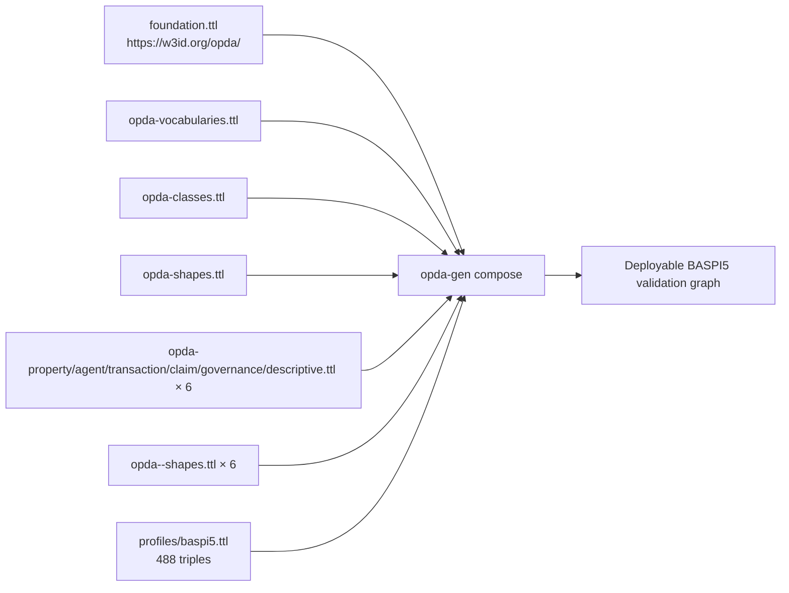

# BASPI5

## Summary

**Authority:** British Association of Surveyors Property Information (BASPI).
**Form version:** 5.0.3 (per `opda:Baspi5ValidationContext` in the profile TTL).
**Production status:** deployed; **MVP gate active**. BASPI5 round-trip success closes the ontology-implementation programme's MVP gate per [ADR-0014](../../../adr/ADR-0014-baspi5-round-trip-mvp-harness.md) + [ODR-0010 §Q7](../../../ontology/odr/) + [ODR-0003 §"Programme retirement criterion" condition (i)](../../../ontology/odr/).

## Source profile TTL

- [`profiles/baspi5.ttl`](../../../../source/03-standards/ontology/profiles/baspi5.ttl) ([Physical-Ontology tier →](../../physical-ontology/profiles/baspi5.md))
- Named graph IRI: `https://w3id.org/opda/profiles/baspi5`
- Version IRI: `https://w3id.org/opda/profiles/baspi5/0.1.0/`
- Triple count: 488 (HEAD; bytes 23 520; sha256 `c647c45e00ca…`)

The profile emits seven per-class `sh:NodeShape`s targeting Property, Address, LegalEstate, Seller, Buyer, EPCCertificate, plus the discriminator shape `Baspi5_SellersCapacityShape` for the nested `sellersCapacity` `oneOf`. Every shape carries `dct:source <https://www.basp.uk/forms/baspi5#…>` form-question IRIs per [ODR-0010 §Q3](../../../ontology/odr/). DASH UI predicates (`dash:viewer`, `dash:editor`, `dash:propertyRole`, `sh:order`, `sh:group`) ride on each `sh:property` per [ODR-0010 §Q4](../../../ontology/odr/).

## ValidationContext reification

The profile carries one `opda:Baspi5ValidationContext` instance per [ODR-0010 §Q1](../../../ontology/odr/):

| Predicate | Value |
|---|---|
| `rdf:type` | `opda:ValidationContext` |
| `opda:profileURI` | `https://w3id.org/opda/profiles/baspi5` |
| `opda:requires` | `opda:Address`, `opda:Buyer`, `opda:EPCCertificate`, `opda:LegalEstate`, `opda:Property`, `opda:Seller`, `opda:Survey` |
| `opda:overlaysContext` | `https://w3id.org/opda/profiles/foundation` |
| `opda:sourcedFrom` | `https://www.basp.uk/forms/baspi5` |
| `opda:formVersion` | `5.0.3` |
| `dct:source` | `https://w3id.org/opda/odr/ODR-0010#section-Q1` |

## Deployable composition



A consumer running BASPI5 validation loads:

1. **Foundation:** `foundation.ttl` + `opda-classes.ttl` + `opda-shapes.ttl` (default-graph union).
2. **Vocabularies:** `opda-vocabularies.ttl` (resolves `sh:in` value bindings against SKOS schemes).
3. **Module TBox graphs:** all six `opda-<module>.ttl` (so `sh:targetClass` resolves to declared classes).
4. **Module shape graphs:** all six `opda-<module>-shapes.ttl` (so foundation identity + IC-breach shapes fire).
5. **Overlay:** `profiles/baspi5.ttl` (the per-form cardinality + enum subsets + DASH UI).

The composer (pending; see [derived-profiles/README.md](../derived-profiles/README.md) §"Activation status") will eventually emit a single `source/03-standards/ontology/derived/baspi5-deployable.ttl` representing this graph union. Until composer activation, consumers fetch the seven graphs above and merge in their triplestore.

## Round-trip status

Per the three-layer harness ([ADR-0014](../../../adr/ADR-0014-baspi5-round-trip-mvp-harness.md), [`tests/baspi5_round_trip/`](../../../../tests/baspi5_round_trip/)):

**Last measured 2026-05-28: 27 of 27 tests passing.**

Breakdown:

| Layer | Test file | Tests | Result |
|---|---|---|---|
| 1 — Round-trip equivalence | [`test_round_trip.py`](../../../../tests/baspi5_round_trip/test_round_trip.py) | per Confirmation #3 + #6 | PASS |
| 1 — `dct:source` traceability | [`test_traceability.py`](../../../../tests/baspi5_round_trip/test_traceability.py) | per Confirmation #5 | PASS |
| 1 — Exemplar regression (combined) | [`test_exemplar_regression.py`](../../../../tests/baspi5_round_trip/test_exemplar_regression.py) | per Confirmation #4 | PASS |
| 2 — Per-exemplar matrix | each exemplar validated in isolation | 15 exemplars | PASS (covered in matrix CI) |
| 3 — Expected-report byte-identity | `opda-gen emit-exemplar-reports` regeneration | 15 expected-report files | PASS |

The CI matrix at [`.github/workflows/baspi5-round-trip.yml`](../../../../.github/workflows/baspi5-round-trip.yml) runs Layer 2 per-exemplar, fail-fast disabled, so a single exemplar failure isolates to its row in the matrix dashboard.

To reproduce locally:

```bash
cd /Users/henrik/source/opda
/Users/henrik/source/opda/tools/opda-gen/.venv/bin/python -m pytest tests/baspi5_round_trip -v
```

Expected tail: `27 passed`.

## Three-rule interface contract status

Per [ADR-0013](../../../adr/ADR-0013-overlay-profile-emission.md) §"Three-rule interface contract — CI enforcement":

| Rule | CI test | Status |
|---|---|---|
| `sh:in` semantics (overlay enums are subset-of-foundation) | `opda-gen ci-profile-contract` | PASS |
| `sh:Violation` floor (overlay severity ≥ foundation) | `opda-gen ci-profile-contract` | PASS |
| No-identity-override (overlay MUST NOT redefine foundation identity keys) | `opda-gen ci-profile-contract` (Cat 3 NoIdentityOverride meta-shape) | PASS |

Reproduce locally:

```bash
cd /Users/henrik/source/opda
/Users/henrik/source/opda/tools/opda-gen/.venv/bin/opda-gen ci-profile-contract --ontology-dir source/03-standards/ontology
```

Expected output: `profile contract CI: PASS (all 3 rules)`.

See [operations/round-trip-ci.md](../operations/round-trip-ci.md) for end-to-end CI gate documentation.

## Source ADR + ODR

- [ADR-0013 — Overlay profile emission](../../../adr/ADR-0013-overlay-profile-emission.md) — per-overlay emission template, BASPI5-first sequencing, three-rule interface contract.
- [ADR-0014 — BASPI5 round-trip MVP harness](../../../adr/ADR-0014-baspi5-round-trip-mvp-harness.md) — three-layer harness; MVP gate operational signal.
- [ODR-0010 — Overlay profile mechanism](../../../ontology/odr/) §Q1 (ValidationContext reification), §Q3 (`dct:source` form-question IRIs), §Q4 (DASH UI), §Q5 (oneOf → `sh:xone`), §Q6 (no-identity-override), §Q7 (BASPI5 MVP gate).
