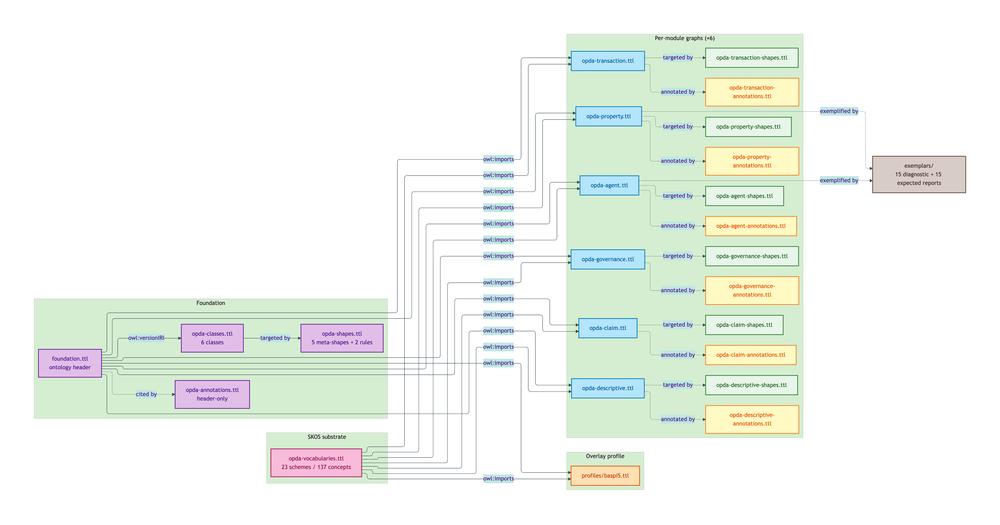
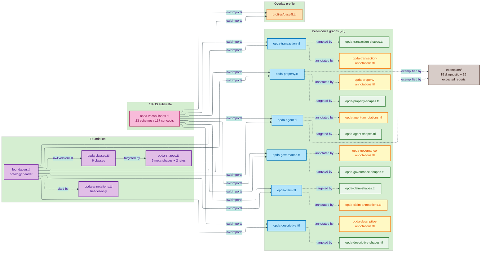

# Physical-Ontology tier

Audience: ontology engineers, SHACL implementers, SPARQL consumers, RDF tool authors, regulators interpreting machine-readable artefacts. Fluent in OWL / SHACL / SKOS / Turtle.

This tier documents the OWL / SHACL / SKOS Turtle artefacts that OPDA's generator emits. Every claim here is backed by a Turtle block copied verbatim from a source TTL at `source/03-standards/ontology/`.

## Ontology version pin

| Field | Value |
|---|---|
| `dct:title` | "OPDA — Open Property Data Association Ontology"@en |
| `dct:creator` | "OPDA Linked Data Council" |
| `dct:issued` | `2026-05-27` |
| `dct:modified` | `2026-05-28` |
| `dct:license` | <https://creativecommons.org/publicdomain/zero/1.0/> |
| `owl:versionIRI` | <https://opda.org.uk/pdtf/harness/release/1.0.0/> |
| `owl:versionInfo` | "1.0.0 — foundation + SKOS vocabularies + UFO meta-classes + module shapes + DPV annotations + overlay profiles + ValidationContext + hasSpecialCategoryData" |
| `vann:preferredNamespacePrefix` | `opda` |
| `vann:preferredNamespaceUri` | `https://opda.org.uk/pdtf/` |
| Generator version | `opda-gen-1.0.0` |

Source: [`foundation.ttl`](../../../source/03-standards/ontology/foundation.ttl).

## Load order

Per ADR-0011 (module TBox emission) + ADR-0010 (SKOS vocabulary emission) + ADR-0013 (overlay profile emission), consumers loading the full ontology should follow this order so `owl:imports` resolves:

1. `foundation.ttl` — ontology header (`<https://opda.org.uk/pdtf/>`, `owl:versionIRI <https://opda.org.uk/pdtf/harness/release/1.0.0/>`)
2. `opda-classes.ttl` — foundation class graph (6 classes + `opda:hasSpecialCategoryData`)
3. `opda-vocabularies.ttl` — 23 SKOS concept schemes (137 concepts)
4. `opda-<module>.ttl` × 6 (per-module class graphs):
   - `opda-property.ttl` (imports `<https://opda.org.uk/pdtf/harness/release/1.0.0/>` + `<https://opda.org.uk/pdtf/scheme/>`)
   - `opda-agent.ttl`
   - `opda-transaction.ttl`
   - `opda-claim.ttl`
   - `opda-descriptive.ttl`
   - `opda-governance.ttl`
5. `opda-shapes.ttl` — foundation meta-shapes + cross-cutting SHACL-AF rules
6. `opda-<module>-shapes.ttl` × 6 — per-module SHACL shapes (Cat 1/2 identity-key, IC-breach, succession rules)
7. `opda-annotations.ttl` — foundation annotations (header-only)
8. `opda-<module>-annotations.ttl` × 6 — DPV co-annotations
9. `profiles/baspi5.ttl` — BASPI5 overlay profile (imports `<https://opda.org.uk/pdtf/harness/release/1.0.0/>` + `<https://opda.org.uk/pdtf/scheme/>`)

Profiles are loaded after the base ontology + shapes; they compose without modifying upstream graphs.

## See also: Modelling section

The [Ontology (OWL)](/modelling/ontology), [SHACL shapes](/modelling/shacl-shapes), and [Concept taxonomy (SKOS)](/modelling/concept-taxonomy) pages in the Modelling section describe the design intent and authoring approach for the artefacts documented in this tier. This tier is the generator-emitted realisation (verbatim Turtle from source TTLs); those pages are the editorial framing and design rationale.

## Tier overview



<details>
<summary>Mermaid Source</summary>



</details>

## File layout

```
docs/manual/physical-ontology/
├── README.md                       Tier overview + class/property/scheme catalogue (this file)
├── three-graph-separation.md       Per ODR-0004 §3a — discipline + 5-part CI test
├── severity-tiers.md               Per ODR-0013 §Q1 — 4-tier framework + 5 sh:Violation categories
├── shacl-af-rules.md               Per ODR-0017 — 11 non-blocking quality rules + citing sites
├── foundation/                     6 foundation classes + 5 meta-shapes + 2 SHACL-AF rules
├── property/                       7 classes + 6 shapes + 2 SHACL-AF rules
├── agent/                          7 classes + 5 shapes + 2 SHACL-AF rules
├── transaction/                    3 classes + 4 shapes + 2 SHACL-AF rules
├── claim/                          10 classes + 5 shapes + 2 SHACL-AF rules
├── descriptive/                    5 classes + 5 shapes
├── governance/                     2 classes + 1 shape
├── vocabularies/                   23 SKOS schemes (137 concepts)
├── profiles/                       BASPI5 overlay (3-rule interface contract)
└── exemplars/                      15 diagnostic exemplars + 15 paired expected reports
```

## Class + property + scheme catalogue

Machine-derivable index of every minted term in OPDA's emitted ontology.

### Classes (40 total)

#### Foundation (6)

| Class | File | UFO category |
|---|---|---|
| `opda:DiagnosticExemplar` | [foundation/classes.md#opdadiagnosticexemplar](./foundation/classes.md#opdadiagnosticexemplar) | Substance Kind (informational) |
| `opda:GeneratorRun` | [foundation/classes.md#opdageneratorrun](./foundation/classes.md#opdageneratorrun) | Information Particular |
| `opda:Relator` | [foundation/classes.md#opdarelator](./foundation/classes.md#opdarelator) | UFO Relator meta-class |
| `opda:Role` | [foundation/classes.md#opdarole](./foundation/classes.md#opdarole) | UFO Role meta-class |
| `opda:RoleMixin` | [foundation/classes.md#opdarolemixin](./foundation/classes.md#opdarolemixin) | UFO RoleMixin meta-class |
| `opda:ValidationContext` | [foundation/classes.md#opdavalidationcontext](./foundation/classes.md#opdavalidationcontext) | Substance Kind (informational) |

#### Property (7)

| Class | File |
|---|---|
| `opda:Address` | [property/classes.md#opdaaddress](./property/classes.md#opdaaddress) |
| `opda:LeaseExtensionEvent` | [property/classes.md#opdaleaseextensionevent](./property/classes.md#opdaleaseextensionevent) |
| `opda:LeaseTerm` | [property/classes.md#opdaleaseterm](./property/classes.md#opdaleaseterm) |
| `opda:LegalEstate` | [property/classes.md#opdalegalestate](./property/classes.md#opdalegalestate) |
| `opda:Property` | [property/classes.md#opdaproperty](./property/classes.md#opdaproperty) |
| `opda:RegisteredTitle` | [property/classes.md#opdaregisteredtitle](./property/classes.md#opdaregisteredtitle) |
| `opda:UPRNSuccessionEvent` | [property/classes.md#opdauprnsuccessionevent](./property/classes.md#opdauprnsuccessionevent) |

#### Agent (7)

| Class | File |
|---|---|
| `opda:Buyer` | [agent/classes.md#opdabuyer](./agent/classes.md#opdabuyer) |
| `opda:NameChangeEvent` | [agent/classes.md#opdanamechangeevent](./agent/classes.md#opdanamechangeevent) |
| `opda:Organisation` | [agent/classes.md#opdaorganisation](./agent/classes.md#opdaorganisation) |
| `opda:Person` | [agent/classes.md#opdaperson](./agent/classes.md#opdaperson) |
| `opda:Proprietor` | [agent/classes.md#opdaproprietor](./agent/classes.md#opdaproprietor) |
| `opda:Proprietorship` | [agent/classes.md#opdaproprietorship](./agent/classes.md#opdaproprietorship) |
| `opda:Seller` | [agent/classes.md#opdaseller](./agent/classes.md#opdaseller) |

#### Transaction (3)

| Class | File |
|---|---|
| `opda:Milestone` | [transaction/classes.md#opdamilestone](./transaction/classes.md#opdamilestone) |
| `opda:Transaction` | [transaction/classes.md#opdatransaction](./transaction/classes.md#opdatransaction) |
| `opda:TransactionChain` | [transaction/classes.md#opdatransactionchain](./transaction/classes.md#opdatransactionchain) |

#### Claim (10)

| Class | File |
|---|---|
| `opda:AssuranceLevel` | [claim/classes.md#opdaassurancelevel](./claim/classes.md#opdaassurancelevel) |
| `opda:Claim` | [claim/classes.md#opdaclaim](./claim/classes.md#opdaclaim) |
| `opda:Document` | [claim/classes.md#opdadocument](./claim/classes.md#opdadocument) |
| `opda:DocumentEvidence` | [claim/classes.md#opdadocumentevidence](./claim/classes.md#opdadocumentevidence) |
| `opda:ElectronicRecord` | [claim/classes.md#opdaelectronicrecord](./claim/classes.md#opdaelectronicrecord) |
| `opda:ElectronicRecordEvidence` | [claim/classes.md#opdaelectronicrecordevidence](./claim/classes.md#opdaelectronicrecordevidence) |
| `opda:Evidence` | [claim/classes.md#opdaevidence](./claim/classes.md#opdaevidence) |
| `opda:TrustFramework` | [claim/classes.md#opdatrustframework](./claim/classes.md#opdatrustframework) |
| `opda:VerificationActivity` | [claim/classes.md#opdaverificationactivity](./claim/classes.md#opdaverificationactivity) |
| `opda:Vouch` | [claim/classes.md#opdavouch](./claim/classes.md#opdavouch) |
| `opda:VouchEvidence` | [claim/classes.md#opdavouchevidence](./claim/classes.md#opdavouchevidence) |

#### Descriptive (5)

| Class | File |
|---|---|
| `opda:Comparable` | [descriptive/classes.md#opdacomparable](./descriptive/classes.md#opdacomparable) |
| `opda:EPCCertificate` | [descriptive/classes.md#opdaepccertificate](./descriptive/classes.md#opdaepccertificate) |
| `opda:Search` | [descriptive/classes.md#opdasearch](./descriptive/classes.md#opdasearch) |
| `opda:Survey` | [descriptive/classes.md#opdasurvey](./descriptive/classes.md#opdasurvey) |
| `opda:Valuation` | [descriptive/classes.md#opdavaluation](./descriptive/classes.md#opdavaluation) |

#### Governance (2)

| Class | File |
|---|---|
| `opda:DPVMappingRecord` | [governance/classes.md#opdadpvmappingrecord](./governance/classes.md#opdadpvmappingrecord) |
| `opda:SpecialCategoryScheme` | [governance/classes.md#opdaspecialcategoryscheme](./governance/classes.md#opdaspecialcategoryscheme) |

### SHACL shapes (30 total)

#### Foundation (5 meta-shapes)

- `opda:NoIdentityOverride_MetaShape` (Cat 3)
- `opda:ShInSemantics_MetaShape` (Cat 5)
- `opda:ShViolationFloor_MetaShape` (Cat 5)
- `opda:MetaShapeOverShapeGraphMetaShape` (Cat 5)
- `opda:DeprecationChainRule`, `opda:PIIWithoutDPVCoAnnotationRule` (SHACL-AF rules — see below)

#### Per-module identity-key + IC-breach shapes

| Module | Shapes |
|---|---|
| Property | `AddressIdentityKeyShape`, `LegalEstateIdentityKeyShape`, `PropertyIdentityKeyShape`, `PropertyICBreachShape` |
| Agent | `OrganisationIdentityKeyShape`, `PersonIdentityKeyShape`, `SpecialCategoryPIIWithoutLawfulBasisShape` (Cat 4) |
| Transaction | `MilestoneIdentityKeyShape`, `TransactionIdentityKeyShape` |
| Claim | `ClaimIdentityKeyShape`, `EvidenceIdentityKeyShape`, `UnprovenancedClaimShape` |
| Descriptive | `ComparableIdentityKeyShape`, `EPCCertificateIdentityKeyShape`, `SearchIdentityKeyShape`, `SurveyIdentityKeyShape`, `ValuationIdentityKeyShape` |
| Governance | `DPVMappingRecordIdentityKeyShape` |

See [`severity-tiers.md`](./severity-tiers.md) for severity classification.

### SHACL-AF rules (11 total)

11 non-blocking quality rules per ODR-0017 §1a. Detailed in [`shacl-af-rules.md`](./shacl-af-rules.md).

| Citing site | Rule | Module |
|---|---|---|
| #1 | `opda:UPRNSuccessionRule` | property |
| #2 | `opda:DeprecationChainRule` | foundation |
| #3 | `opda:INSPIRESuccessionRule` | property |
| #4 | `opda:PROVOClaimsRule` | claim |
| #5 | `opda:IdentifierSuccessionRule` | agent |
| #6 | `opda:CapacityAuthorityMatchRule` | agent |
| #7 | `opda:LeaseTermSuccessionRule` | transaction |
| #8 | `opda:MilestoneVarianceRule` | transaction |
| #9 | `opda:VerificationActivitySuccessionRule` | claim |
| #10 | `opda:PIIWithoutDPVCoAnnotationRule` | foundation (cross-cutting) |
| #11 | (placeholder for future emission) | — |

### SKOS schemes (23 total)

See [vocabularies/README.md](./vocabularies/README.md) for the 7-category UFO framework.

| Scheme | UFO category | Members |
|---|---|---|
| `opda:AddressVariantScheme` | Quality Value | 4 |
| `opda:AssuranceLevelScheme` | Quality Value | 4 |
| `opda:BuiltFormScheme` | Quale-in-Region | 5 |
| `opda:CentralHeatingFuelTypeScheme` | Quale-in-Region | 6 |
| `opda:CouncilTaxBandSchemeEW` | Quale-in-Region | 8 |
| `opda:CouncilTaxBandSchemeScotland` | Quale-in-Region | 9 |
| `opda:CurrentEnergyRatingScheme` | Quale-in-Region | 7 |
| `opda:EvidenceMethodScheme` | Quality Value | 3 |
| `opda:HeatingTypeScheme` | Quale-in-Region | 4 |
| `opda:MilestoneKindScheme` | Method/plan code | 5 |
| `opda:OffMainsDrainageSystemTypeScheme` | Quale-in-Region | 6 |
| `opda:OwnerTypeScheme` | Substance Kind label | 2 |
| `opda:OwnershipTypeScheme` | Quale-in-Region | 4 |
| `opda:ParticipantStatusScheme` | Phase label | 4 |
| `opda:PropertyTypeScheme` | Substance Kind label | 6 |
| `opda:RoleScheme` | Role label | 12 |
| `opda:SellersCapacityScheme` | Method/plan code | 5 |
| `opda:TenureKindScheme` | Substance Kind label | 3 |
| `opda:TransactionStatusScheme` | Phase label | 5 |
| `opda:YesNoNotApplicableScheme` | Quale-in-Region | 3 |
| `opda:YesNoNotKnownScheme` | Quale-in-Region | 3 |
| `opda:YesNoNotRequiredScheme` | Quale-in-Region | 3 |
| `opda:YesNoScheme` | Quale-in-Region | 2 |

Total members: 137.

### Overlay profiles

- [`opda:Baspi5OverlayProfile`](./profiles/baspi5.md) — BASPI5 v5.0.3 overlay (7 per-Kind profile shapes; 9 property groups; DASH UI predicates)

### Diagnostic exemplars (15 paired with expected reports)

See [exemplars/README.md](./exemplars/README.md) for the full catalogue.

Property + identity (S005 + S015):
- registered-freehold-house, unregistered-pre-first-registration-house, flat-with-split-uprn
- flat-no-uprn-newly-converted, listed-building-divergent-addresses, rural-plot-inspire-no-uprn

Agent (S006):
- person-with-name-change, organisation-with-merger, proprietorship-relator-multi-proprietor

Claim (S009):
- claim-with-document-evidence, claim-with-electronic-record-evidence, claim-with-vouch-evidence

Transaction (S007):
- simple-transaction-with-milestones, chain-of-transactions, lease-extension-transaction

## Three-graph separation

Every module emits three files (classes / shapes / annotations) with strict isolation. See [`three-graph-separation.md`](./three-graph-separation.md) for the discipline + the 5-part CI test.

CRITICAL — content authors MUST NOT:

- Add `sh:*` or DPV triples to `opda-<module>.ttl` (classes file)
- Add `owl:Class` or `owl:imports` to `opda-<module>-shapes.ttl` (shapes file)
- Add `sh:*` or `owl:Class` to `opda-<module>-annotations.ttl` (annotations file)

CI-enforced by `opda-gen ci-three-graph` (ODR-0004 §3a).

## Severity tiers

Per ODR-0013 §Q1, every shape carries explicit `sh:severity`. See [`severity-tiers.md`](./severity-tiers.md) for the 4-tier framework + the 5 `sh:Violation` subcategories + each emitted shape grouped by severity.

## SHACL-AF rules

11 non-blocking quality rules per ODR-0017 §1a. See [`shacl-af-rules.md`](./shacl-af-rules.md) for the citing sites + each rule.

## Cross-tier mapping

| Tier | File path convention |
|---|---|
| Concept | `docs/manual/concept/<module>/<entity>.md` |
| Logical | `docs/manual/logical/<module>/<entity>.md` |
| Physical-DB | `docs/manual/physical-database/<module>/<entity>.md` |
| **Physical-Ontology** | `docs/manual/physical-ontology/<module>/classes.md#<entity>` |

Physical-Ontology consolidates per-class blocks into one `classes.md` per module rather than per-entity files (because Turtle blocks are short and the section structure is uniform).

## Source ADR + ODR

- [ADR-0007 — Ontology generator specification](../../adr/ADR-0007-ontology-generator-specification.md)
- [ADR-0008 — Generator implementation infrastructure](../../adr/ADR-0008-generator-implementation-infrastructure.md)
- [ADR-0010 — SKOS vocabulary emission](../../adr/ADR-0010-skos-vocabulary-emission.md)
- [ADR-0011 — Module TBox emission](../../adr/ADR-0011-module-tbox-emission.md)
- [ADR-0012 — SHACL + DPV annotation emission](../../adr/ADR-0012-shacl-and-dpv-annotation-emission.md)
- [ADR-0013 — Overlay profile emission](../../adr/ADR-0013-overlay-profile-emission.md)
- [ADR-0014 — BASPI5 round-trip MVP harness](../../adr/ADR-0014-baspi5-round-trip-mvp-harness.md)
- [ODR-0004 — PDTF ontology foundation](../../ontology/odr/ODR-0004-pdtf-ontology-foundation.md) (3a three-graph separation)
- [ODR-0010 — Overlay profile mechanism](../../ontology/odr/ODR-0010-overlay-profile-mechanism.md) (three-rule interface contract)
- [ODR-0011 — Enumeration vocabularies](../../ontology/odr/ODR-0011-enumeration-vocabularies.md) (7-category UFO framework)
- [ODR-0013 — SHACL validation and severity](../../ontology/odr/ODR-0013-shacl-validation-and-severity.md) (4-tier severity framework)
- [ODR-0017 — SHACL-AF quality rules pattern](../../ontology/odr/ODR-0017-shacl-af-quality-rules-pattern.md) (11 citing sites)
