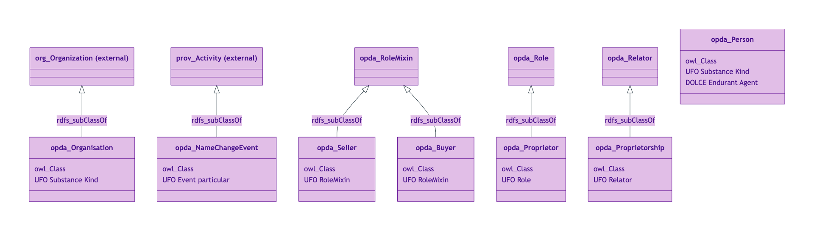
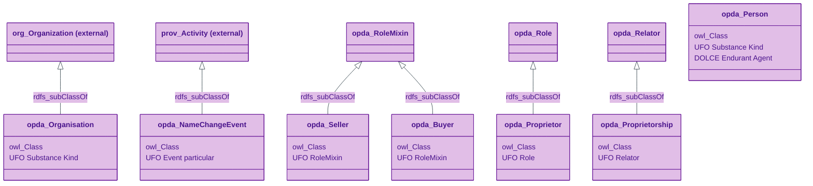
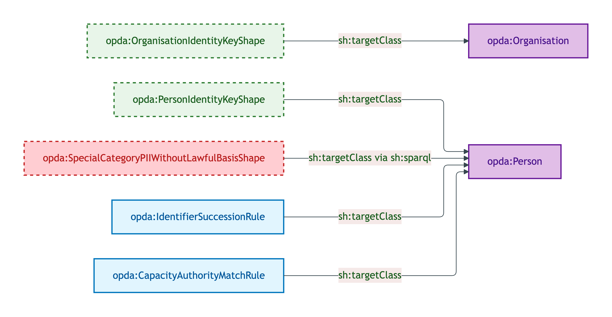
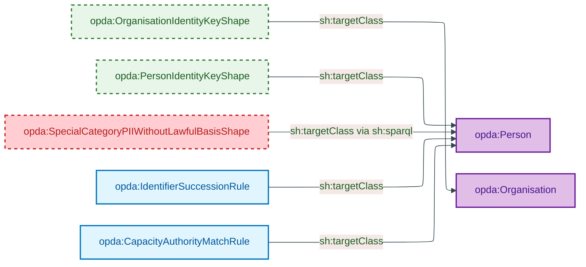
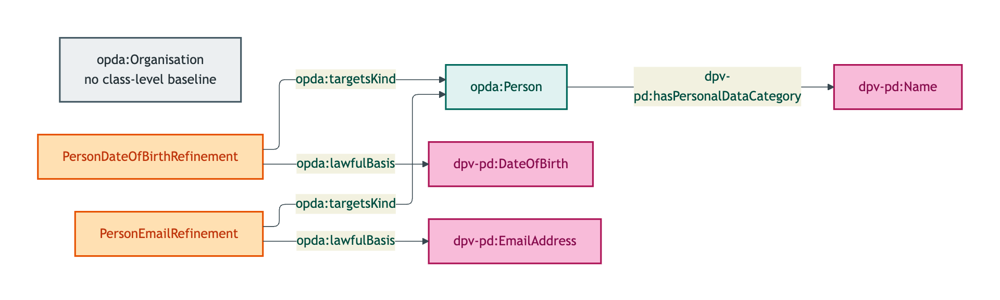
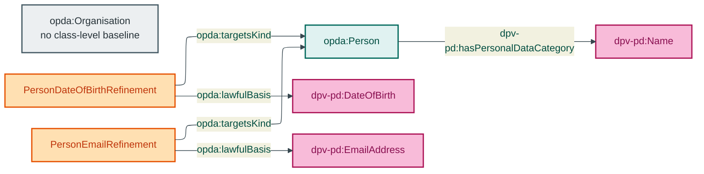

# Agent module

The Agent module emits 7 OWL classes: 2 Substance Kinds (Person, Organisation), 3 anti-rigid Roles/RoleMixins (Seller, Buyer, Proprietor), 1 Relator (Proprietorship), and 1 reified PROV-O Event (NameChangeEvent).

## Files

| File | Role | Source |
|---|---|---|
| `opda-agent.ttl` | 7 OWL classes + DatatypeProperty/ObjectProperty | [opda-agent.ttl](../../../../source/03-standards/ontology/opda-agent.ttl) |
| `opda-agent-shapes.ttl` | 2 identity-key + 2 SHACL-AF rules + 1 Cat 4 PII shape | [opda-agent-shapes.ttl](../../../../source/03-standards/ontology/opda-agent-shapes.ttl) |
| `opda-agent-annotations.ttl` | DPV class-level + 2 variant refinements | [opda-agent-annotations.ttl](../../../../source/03-standards/ontology/opda-agent-annotations.ttl) |

## Ontology header

```turtle
<https://opda.org.uk/pdtf/graph/agent>
    rdf:type owl:Ontology ;
    dct:title "OPDA Agent Module"@en ;
    owl:imports <https://opda.org.uk/pdtf/harness/release/1.0.0/>, <https://opda.org.uk/pdtf/scheme/> ;
    owl:versionIRI <https://opda.org.uk/pdtf/harness/release/agent/1.0.0/> .
```

## Import chain

- `<https://opda.org.uk/pdtf/harness/release/1.0.0/>` — foundation (Role, RoleMixin, Relator meta-classes)
- `<https://opda.org.uk/pdtf/scheme/>` — SKOS schemes (RoleScheme, OwnerType, SellersCapacity)

External vocabularies referenced (not imported):
- `org:Organization` — `opda:Organisation rdfs:subClassOf org:Organization`
- `prov:Activity` — superclass of `opda:NameChangeEvent`

## Classes (7)

| Class | UFO category | Bearer |
|---|---|---|
| `opda:Buyer` | RoleMixin | Person OR Organisation |
| `opda:NameChangeEvent` | Event particular | (event; no bearer) |
| `opda:Organisation` | Substance Kind | (independent; subclass of `org:Organization`) |
| `opda:Person` | Substance Kind | (independent) |
| `opda:Proprietor` | Role | Person (or Organisation under named specialisation) |
| `opda:Proprietorship` | Relator | Property + Proprietors + RegisteredTitle |
| `opda:Seller` | RoleMixin | Person OR Organisation |

See [`classes.md`](./classes.md) for per-class blocks.

## Module class hierarchy



<details>
<summary>Mermaid Source</summary>



</details>

## Module shape-target graph



<details>
<summary>Mermaid Source</summary>



</details>

## Module DPV co-annotation graph



<details>
<summary>Mermaid Source</summary>



</details>

## SHACL shapes (5 + 2 rules)

| Shape | Severity | Category |
|---|---|---|
| `opda:OrganisationIdentityKeyShape` | Violation | Cat 1 |
| `opda:PersonIdentityKeyShape` | Violation | Cat 1 |
| `opda:SpecialCategoryPIIWithoutLawfulBasisShape` | Violation | Cat 4 |
| `opda:CapacityAuthorityMatchRule` | Info | SHACL-AF |
| `opda:IdentifierSuccessionRule` | Info | SHACL-AF |

See [`shapes.md`](./shapes.md) for per-shape blocks.

## DPV annotations

Class-level + 2 variant refinements. See [`annotations.md`](./annotations.md).

## Source ODR + ADR

- [ODR-0006 — Agents and roles](../../../ontology/odr/ODR-0006-agents-and-roles.md)
- [ODR-0012 — SHACL + DPV annotation emission](../../../ontology/odr/ODR-0012-shacl-and-dpv-annotation-emission.md) (Cat 4)
- [ODR-0017 — SHACL-AF quality rules pattern](../../../ontology/odr/ODR-0017-shacl-af-quality-rules-pattern.md)
- [ADR-0011 — Module TBox emission](../../../adr/ADR-0011-module-tbox-emission.md)
- [ADR-0012 — SHACL + DPV annotation emission](../../../adr/ADR-0012-shacl-and-dpv-annotation-emission.md)
