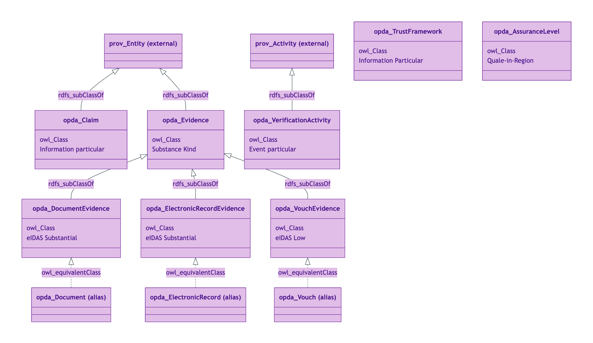
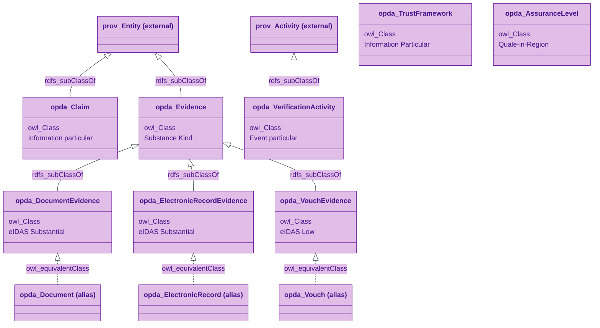
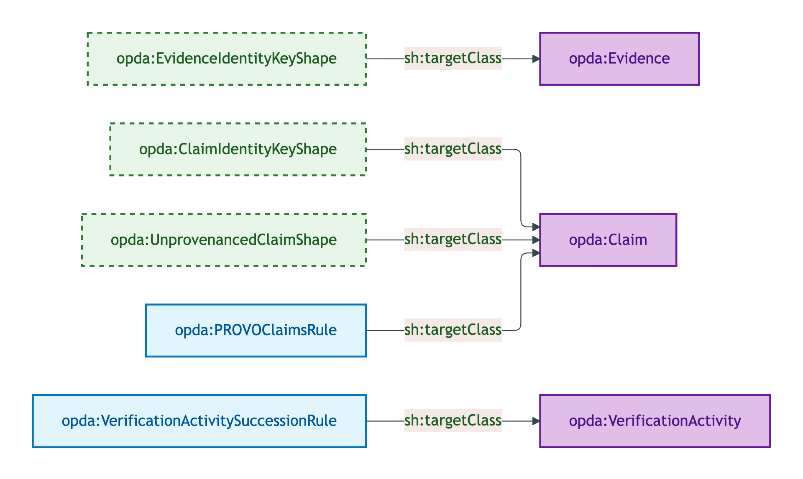
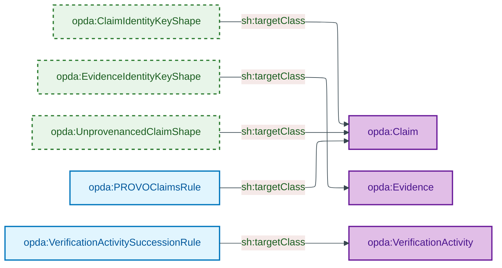
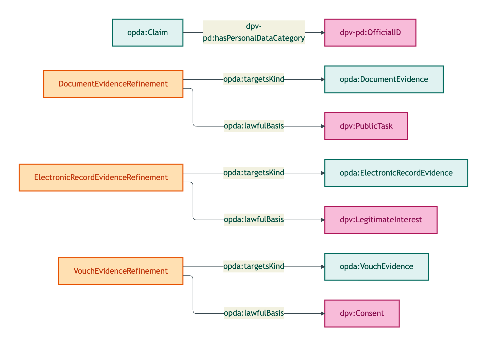
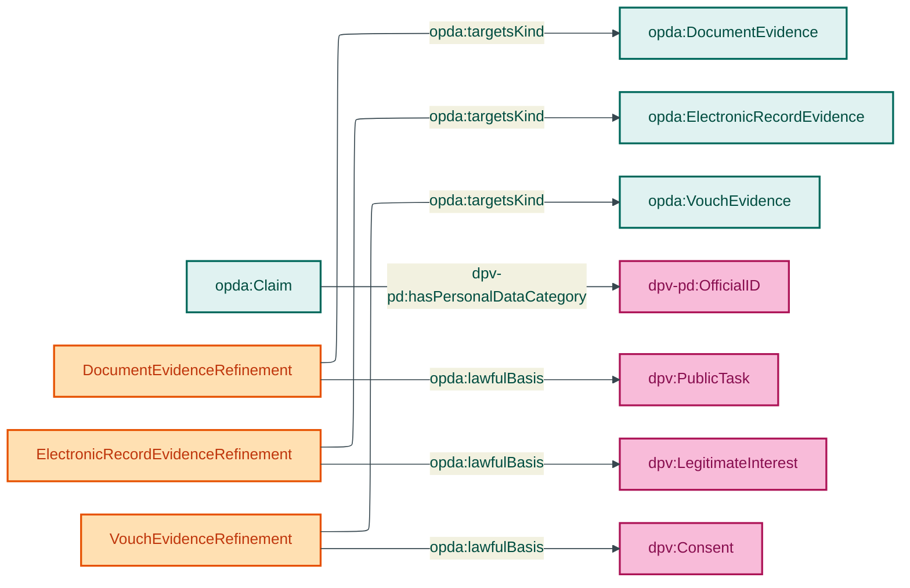

# Claim module

The Claim module emits 11 OWL classes covering verifiable claims (`Claim`), evidence subtypes (`DocumentEvidence`, `ElectronicRecordEvidence`, `VouchEvidence`), short-name aliases (`Document`, `ElectronicRecord`, `Vouch`), the verification activity (`VerificationActivity`), the trust framework citation (`TrustFramework`), and the assurance level quality (`AssuranceLevel`).

## Files

| File | Role | Source |
|---|---|---|
| `opda-claim.ttl` | 11 OWL classes + DatatypeProperty + 2 ObjectProperties | [opda-claim.ttl](../../../../source/03-standards/ontology/opda-claim.ttl) |
| `opda-claim-shapes.ttl` | 2 identity-key + 1 IC-breach + 2 SHACL-AF rules | [opda-claim-shapes.ttl](../../../../source/03-standards/ontology/opda-claim-shapes.ttl) |
| `opda-claim-annotations.ttl` | DPV class-level + 3 evidence refinements | [opda-claim-annotations.ttl](../../../../source/03-standards/ontology/opda-claim-annotations.ttl) |

## Ontology header

```turtle
<https://w3id.org/opda/claim/>
    rdf:type owl:Ontology ;
    dct:title "OPDA Claim Module"@en ;
    owl:imports <https://w3id.org/opda/1.0.0/>, <https://w3id.org/opda/vocabularies/> ;
    owl:versionIRI <https://w3id.org/opda/claim/1.0.0/> .
```

## Import chain

- `<https://w3id.org/opda/1.0.0/>` — foundation
- `<https://w3id.org/opda/vocabularies/>` — SKOS schemes (AssuranceLevel, EvidenceMethod)

External vocabularies referenced (not imported):
- `prov:Entity`, `prov:Activity`, `prov:Agent` — PROV-O alignment (S009 Rule 1 — 80%-PROV-O mapping)

## Classes (11)

| Class | UFO category | PROV-O parent |
|---|---|---|
| `opda:AssuranceLevel` | Quale-in-Region | (none — Quality Value) |
| `opda:Claim` | Information particular | `prov:Entity` |
| `opda:Document` | Substance Kind (alias) | (equivalent to `opda:DocumentEvidence`) |
| `opda:DocumentEvidence` | Substance Kind | subclass of `opda:Evidence` |
| `opda:ElectronicRecord` | Substance Kind (alias) | (equivalent to `opda:ElectronicRecordEvidence`) |
| `opda:ElectronicRecordEvidence` | Substance Kind | subclass of `opda:Evidence` |
| `opda:Evidence` | Substance Kind | `prov:Entity` |
| `opda:TrustFramework` | Information Particular | (cited via `dct:conformsTo`) |
| `opda:VerificationActivity` | Event particular | `prov:Activity` |
| `opda:Vouch` | Substance Kind (alias) | (equivalent to `opda:VouchEvidence`) |
| `opda:VouchEvidence` | Substance Kind | subclass of `opda:Evidence` |

Equivalent-class aliases (`Document` ↔ `DocumentEvidence`, etc.) retained for exemplar compatibility per ADR-0011 within-engineering option (b).

See [`classes.md`](./classes.md) for per-class blocks.

## Module class hierarchy



<details>
<summary>Mermaid Source</summary>



</details>

## Module shape-target graph



<details>
<summary>Mermaid Source</summary>



</details>

## Module DPV co-annotation graph



<details>
<summary>Mermaid Source</summary>



</details>

## SHACL shapes (5 + 2 rules)

| Shape | Severity | Category |
|---|---|---|
| `opda:ClaimIdentityKeyShape` | Violation | Cat 1 |
| `opda:EvidenceIdentityKeyShape` | Violation | Cat 1 |
| `opda:UnprovenancedClaimShape` | Violation | Cat 2 |
| `opda:PROVOClaimsRule` | Info | SHACL-AF |
| `opda:VerificationActivitySuccessionRule` | Info | SHACL-AF |

See [`shapes.md`](./shapes.md) for per-shape blocks.

## DPV annotations

Class-level + 3 evidence refinements. See [`annotations.md`](./annotations.md).

## Source ODR + ADR

- [ODR-0009 — Claims, evidence and provenance](../../../ontology/odr/ODR-0009-claims-evidence-and-provenance.md)
- [ODR-0013 — SHACL validation and severity](../../../ontology/odr/ODR-0013-shacl-validation-and-severity.md)
- [ODR-0017 — SHACL-AF quality rules pattern](../../../ontology/odr/ODR-0017-shacl-af-quality-rules-pattern.md)
- [ODR-0018 — DPV co-annotation pattern](../../../ontology/odr/ODR-0018-dpv-co-annotation-pattern.md)
- [ADR-0011 — Module TBox emission](../../../adr/ADR-0011-module-tbox-emission.md)
- [ADR-0012 — SHACL + DPV annotation emission](../../../adr/ADR-0012-shacl-and-dpv-annotation-emission.md)
