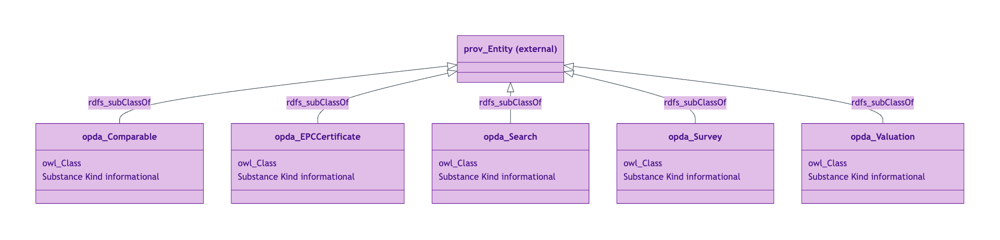
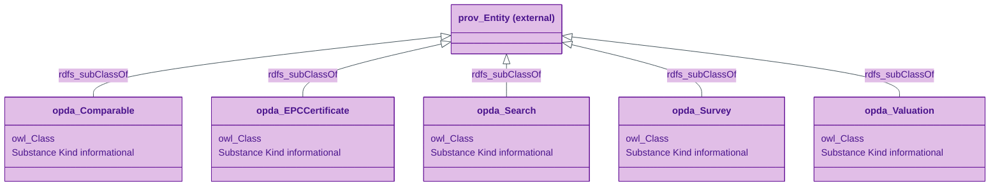
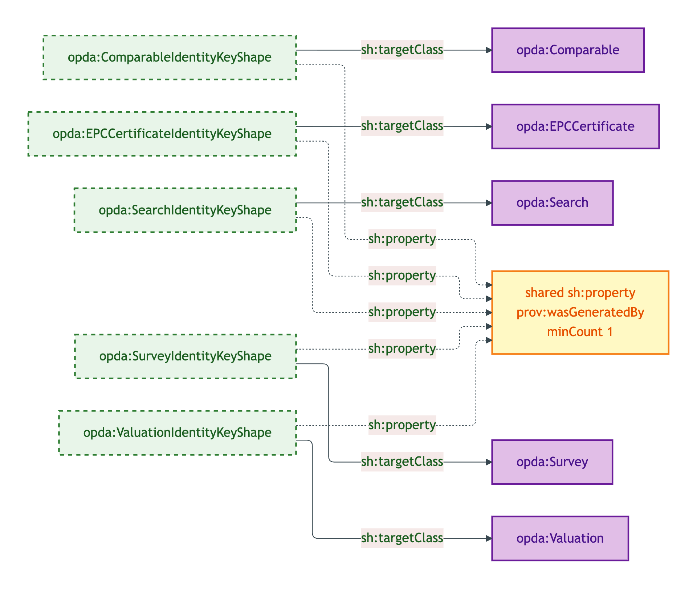
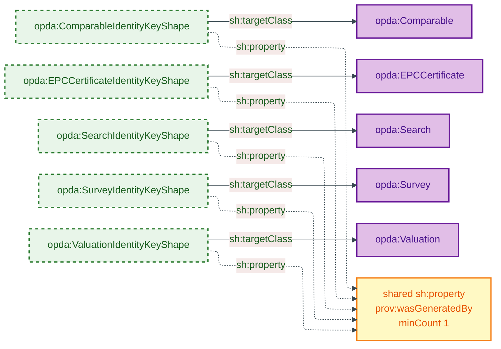
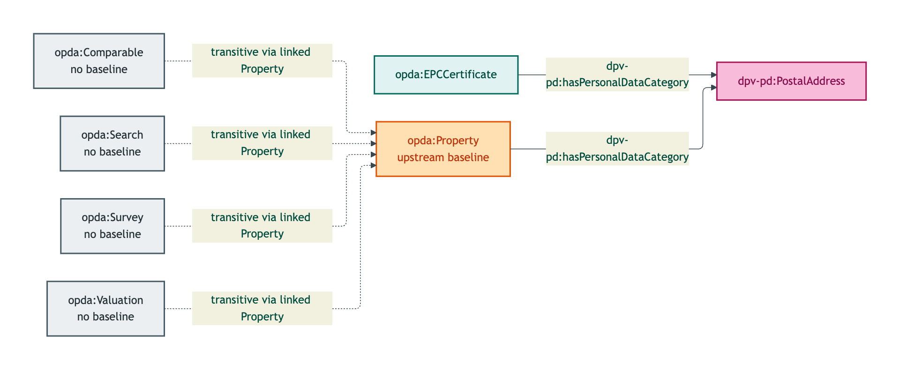
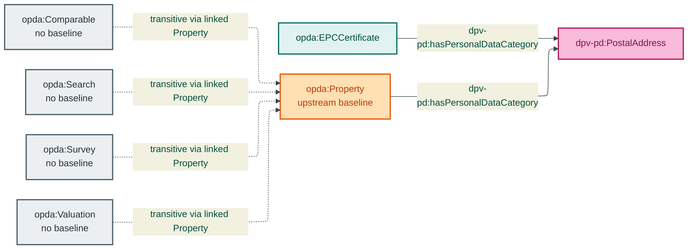

# Descriptive module

The Descriptive module emits 5 OWL classes class-promoted per ODR-0008 §Q4a three-criterion test (authority-retrieved provenance; distinct lifecycle; distinct PII regime). Each is a PROV-O Entity subtype.

## Files

| File | Role | Source |
|---|---|---|
| `opda-descriptive.ttl` | 5 OWL classes | [opda-descriptive.ttl](../../../../source/03-standards/ontology/opda-descriptive.ttl) |
| `opda-descriptive-shapes.ttl` | 5 identity-key shapes (all share the `prov:wasGeneratedBy` property shape) | [opda-descriptive-shapes.ttl](../../../../source/03-standards/ontology/opda-descriptive-shapes.ttl) |
| `opda-descriptive-annotations.ttl` | 1 DPV baseline + 4 transitive no-baselines | [opda-descriptive-annotations.ttl](../../../../source/03-standards/ontology/opda-descriptive-annotations.ttl) |

## Ontology header

```turtle
<https://w3id.org/opda/descriptive/>
    rdf:type owl:Ontology ;
    dct:title "OPDA Descriptive Module"@en ;
    owl:imports <https://w3id.org/opda/1.0.0/>, <https://w3id.org/opda/vocabularies/> ;
    owl:versionIRI <https://w3id.org/opda/descriptive/1.0.0/> .
```

## Import chain

- `<https://w3id.org/opda/1.0.0/>` — foundation
- `<https://w3id.org/opda/vocabularies/>` — SKOS substrate

External vocabularies referenced (not imported):
- `prov:Entity` — superclass of all 5 descriptive classes

## Classes (5)

| Class | Authority | Lifecycle |
|---|---|---|
| `opda:Comparable` | Land Registry / VOA | Live; supports `prov:wasInformedBy` from Valuations |
| `opda:EPCCertificate` | DESNZ register | 10-year validity; supersession on re-assessment |
| `opda:Search` | Local authority (CON29R / LLC1 / environmental) | Ordered / returned / superseded |
| `opda:Survey` | RICS-regulated professional | Issued / superseded / re-issued / withdrawn |
| `opda:Valuation` | RICS Red Book (regulated) | Instructed / delivered / superseded |

See [`classes.md`](./classes.md) for per-class blocks.

## Module class hierarchy



<details>
<summary>Mermaid Source</summary>



</details>

## Module shape-target graph



<details>
<summary>Mermaid Source</summary>



</details>

## Module DPV co-annotation graph



<details>
<summary>Mermaid Source</summary>



</details>

## SHACL shapes (5)

All five shapes share the same `_:b218dcfc815ed` property-shape blank node (the `prov:wasGeneratedBy` discipline). See [`shapes.md`](./shapes.md).

| Shape | Severity | Category |
|---|---|---|
| `opda:ComparableIdentityKeyShape` | Violation | Cat 1 |
| `opda:EPCCertificateIdentityKeyShape` | Violation | Cat 1 |
| `opda:SearchIdentityKeyShape` | Violation | Cat 1 |
| `opda:SurveyIdentityKeyShape` | Violation | Cat 1 |
| `opda:ValuationIdentityKeyShape` | Violation | Cat 1 |

## DPV annotations

EPCCertificate carries `dpv-pd:PostalAddress` baseline (the EPC includes the property address); the four others are no-baseline (PII flows transitively via the linked `opda:Property`). See [`annotations.md`](./annotations.md).

## Source ODR + ADR

- [ODR-0008 §Q4a — Descriptive attributes (three-criterion class-promotion test)](../../../ontology/odr/ODR-0008-descriptive-attributes.md)
- [ODR-0018 — DPV co-annotation pattern](../../../ontology/odr/ODR-0018-dpv-co-annotation-pattern.md)
- [ADR-0011 — Module TBox emission](../../../adr/ADR-0011-module-tbox-emission.md)
- [ADR-0012 — SHACL + DPV annotation emission](../../../adr/ADR-0012-shacl-and-dpv-annotation-emission.md)
