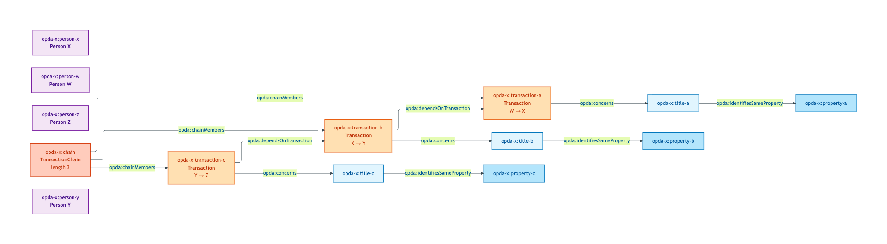

# chain-of-transactions

## Summary

Three-link chain of dependent property sales via buyer-also-seller participants. Tests S007 Q4 chain modelling — both the recursive Relator predicate (`opda:dependsOnTransaction`) and the first-class `opda:TransactionChain` resource side-by-side; the Council picked both as the canonical shape (dual-mechanism per S007 Q4).

Cross-link: [Concept tier — TransactionChain hard cases](../../concept/transaction/transaction-chain.md#hard-cases).

## Exemplar instance graph

```mermaid
---
config:
  layout: elk
  elk:
    mergeEdges: false
    nodePlacementStrategy: BRANDES_KOEPF
---
%%{init: {"theme": "base", "themeVariables": {"primaryColor": "#B3E5FC", "primaryTextColor": "#01579B", "primaryBorderColor": "#0277BD", "lineColor": "#37474F"}}}%%
flowchart LR
    accTitle: chain-of-transactions exemplar instance graph
    accDescr: Three-link chain of Transactions linked by buyer-also-seller participants. Four Persons, three Properties, three Titles, three Transactions plus one TransactionChain Aggregate. Recursive opda:dependsOnTransaction predicate plus the parent chain resource — dual-mechanism per S007 Q4.

    %% @prefix opda: <https://opda.org.uk/pdtf/>
    %% @prefix opda-x: <https://opda.org.uk/pdtf/harness/data/exemplar/chain-of-transactions/>

    classDef person fill:#F3E5F5,stroke:#7B1FA2,stroke-width:2px,color:#4A148C
    classDef prop fill:#B3E5FC,stroke:#0277BD,stroke-width:2px,color:#01579B
    classDef title fill:#E1F5FE,stroke:#0277BD,stroke-width:2px,color:#01579B
    classDef txn fill:#FFE0B2,stroke:#E65100,stroke-width:2px,color:#BF360C
    classDef chain fill:#FFCCBC,stroke:#D84315,stroke-width:2px,color:#BF360C

    W["opda-x:person-w<br/>&lt;b&gt;Person W&lt;/b&gt;"]:::person
    X["opda-x:person-x<br/>&lt;b&gt;Person X&lt;/b&gt;"]:::person
    Y["opda-x:person-y<br/>&lt;b&gt;Person Y&lt;/b&gt;"]:::person
    Z["opda-x:person-z<br/>&lt;b&gt;Person Z&lt;/b&gt;"]:::person

    PA[opda-x:property-a]:::prop
    PB[opda-x:property-b]:::prop
    PC[opda-x:property-c]:::prop

    TA[opda-x:title-a]:::title
    TB[opda-x:title-b]:::title
    TC[opda-x:title-c]:::title

    TXA["opda-x:transaction-a<br/>&lt;b&gt;Transaction&lt;/b&gt;<br/>W → X"]:::txn
    TXB["opda-x:transaction-b<br/>&lt;b&gt;Transaction&lt;/b&gt;<br/>X → Y"]:::txn
    TXC["opda-x:transaction-c<br/>&lt;b&gt;Transaction&lt;/b&gt;<br/>Y → Z"]:::txn

    Chain["opda-x:chain<br/>&lt;b&gt;TransactionChain&lt;/b&gt;<br/>length 3"]:::chain

    TA -->|opda:identifiesSameProperty| PA
    TB -->|opda:identifiesSameProperty| PB
    TC -->|opda:identifiesSameProperty| PC

    TXA -->|opda:concerns| TA
    TXB -->|opda:concerns| TB
    TXC -->|opda:concerns| TC

    TXB -->|opda:dependsOnTransaction| TXA
    TXC -->|opda:dependsOnTransaction| TXB

    Chain -->|opda:chainMembers| TXA
    Chain -->|opda:chainMembers| TXB
    Chain -->|opda:chainMembers| TXC
```



<details>
<summary>Mermaid Source</summary>



</details>

## Exemplar Turtle

```turtle
# Diagnostic exemplar — ODR-0004 §8a, IC-only — input to ODR-0007 (Transactions & Lifecycle).
# Situation: three-link chain of property sales — buyer of property A is selling property B
# (which has a buyer who is selling property C). Tests Q4 chain modelling.
# Status: ratified. Namespace: https://opda.org.uk/pdtf/ (Session 003b + ADR-0006).
# ODR-0004 status: accepted (council: session-004); ODR-0007 status: accepted (council: session-007).

@prefix opda:    <https://opda.org.uk/pdtf/> .
@prefix opda-x:  <https://opda.org.uk/pdtf/harness/data/exemplar/chain-of-transactions/> .
@prefix prov:    <http://www.w3.org/ns/prov#> .
@prefix dct:     <http://purl.org/dc/terms/> .
@prefix rdfs:    <http://www.w3.org/2000/01/rdf-schema#> .
@prefix skos:    <http://www.w3.org/2004/02/skos/core#> .
@prefix xsd:     <http://www.w3.org/2001/XMLSchema#> .

opda-x:exemplar
    a opda:DiagnosticExemplar ;
    dct:title "Chain of three property transactions linked by buyer-also-seller participants" ;
    dct:status "ratified" ;
    dct:references <ODR-0007> , <ODR-0006> , <ODR-0005> , <ODR-0004> ;
    skos:scopeNote
        "Tests Q4 chain modelling. Three transactions: T_A (sale of Property A; buyer = Person X), T_B (sale of Property B; seller = Person X, buyer = Person Y), T_C (sale of Property C; seller = Person Y). The chain is recursive on the buyer-also-seller relationship. The plan §S007 Q4 names three candidate mechanisms: (a) recursive Relator (opda:dependsOnTransaction); (b) list of Transactions on a parent ChainTransaction; (c) two separate predicates (opda:dependsOn / opda:dependedOnBy). Each transaction's status is the S011 Phase label scheme; chain status is derived (any-blocked → chain-blocked). Q3 lifecycle event: a milestone-not-met on T_C cascades up via opda:dependedOnBy to T_B and T_A — the linked transactions go on hold." .

# Three Persons (each plays Buyer in one transaction and Seller in another)
opda-x:person-w a opda:Person ; rdfs:label "Person W (seller of Property A; transaction-chain origin)" .
opda-x:person-x a opda:Person ; rdfs:label "Person X (buyer of Property A; seller of Property B)" .
opda-x:person-y a opda:Person ; rdfs:label "Person Y (buyer of Property B; seller of Property C)" .
opda-x:person-z a opda:Person ; rdfs:label "Person Z (buyer of Property C; chain terminus — cash buyer)" .

# Three Properties (each with its own LegalEstate + RegisteredTitle per S005 3-class)
opda-x:property-a a opda:Property ; rdfs:label "Property A (44 Pine Crescent)" ; opda:uprn "100070111111" .
opda-x:property-b a opda:Property ; rdfs:label "Property B (12 Elm Grove)" ; opda:uprn "100070222222" .
opda-x:property-c a opda:Property ; rdfs:label "Property C (Flat 7, Beech House)" ; opda:uprn "100070333333" .

opda-x:title-a a opda:RegisteredTitle ; opda:titleNumber "NK111000" .
opda-x:title-b a opda:RegisteredTitle ; opda:titleNumber "NK222000" .
opda-x:title-c a opda:RegisteredTitle ; opda:titleNumber "NK333000" .

opda-x:title-a opda:identifiesSameProperty opda-x:property-a .
opda-x:title-b opda:identifiesSameProperty opda-x:property-b .
opda-x:title-c opda:identifiesSameProperty opda-x:property-c .

# Three transactions, chained
opda-x:transaction-a
    a opda:Transaction ;
    rdfs:label "T_A: Person W → Person X (sale of Property A)" ;
    opda:status "active" ;
    opda:concerns opda-x:title-a .

opda-x:transaction-b
    a opda:Transaction ;
    rdfs:label "T_B: Person X → Person Y (sale of Property B; depends on T_A)" ;
    opda:status "active" ;
    opda:concerns opda-x:title-b ;
    opda:dependsOnTransaction opda-x:transaction-a .   # Q4 candidate (a) — recursive Relator predicate

opda-x:transaction-c
    a opda:Transaction ;
    rdfs:label "T_C: Person Y → Person Z (sale of Property C; depends on T_B; cash buyer terminus)" ;
    opda:status "active" ;
    opda:concerns opda-x:title-c ;
    opda:dependsOnTransaction opda-x:transaction-b .

# Chain as a first-class entity (Q4 candidate b — list-of-Transactions parent)
opda-x:chain
    a opda:TransactionChain ;
    rdfs:label "Three-link chain (T_A → T_B → T_C); 4 participants; cash buyer at T_C" ;
    opda:chainMembers opda-x:transaction-a , opda-x:transaction-b , opda-x:transaction-c ;
    opda:chainStatus "active" ;
    opda:chainLength 3 .
```

## Expected report Turtle

```turtle
# chain-of-transactions-expected-report.ttl
@prefix dct: <http://purl.org/dc/terms/> .
@prefix rdf: <http://www.w3.org/1999/02/22-rdf-syntax-ns#> .
@prefix sh: <http://www.w3.org/ns/shacl#> .
@prefix xsd: <http://www.w3.org/2001/XMLSchema#> .

<https://opda.org.uk/pdtf/data/exemplar-reports/report>
    rdf:type sh:ValidationReport ;
    dct:source <https://opda.org.uk/pdtf/harness/data/exemplar/chain-of-transactions> ;
    sh:conforms "true"^^xsd:boolean .
```

## SHACL outcome

`sh:conforms true`. All three Transactions satisfy `opda:TransactionIdentityKeyShape` (no `opda:occurredAtTime` — admissible). All four Persons satisfy `opda:PersonIdentityKeyShape`. The chain length (3) is within the `sh:maxInclusive 7` cap. No SHACL-AF rule fires.

## Source ODR + ADR

- [ODR-0004 §8a](/modelling/odr/odr-0004)
- [ODR-0007 §Q4 — Transactions and lifecycle (TransactionChain modelling)](/modelling/odr/odr-0007)
- [ADR-0014](/modelling/adr/adr-0014)
