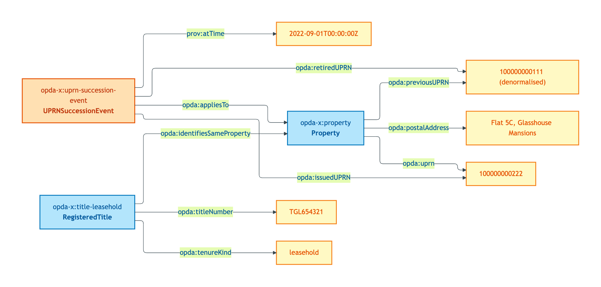
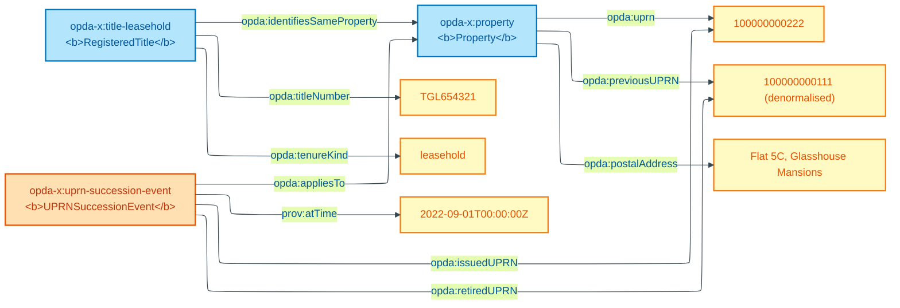

# flat-with-split-uprn

## Summary

UPRN succession via re-numbering (S005 Rule 6): the same physical Property persists across an administrative UPRN re-issue. Reified `opda:UPRNSuccessionEvent` is canonical (Gandon W3C-side recommendation, S005 Q4); literal `opda:previousUPRN` pair retained as denormalised convenience. Cagle SHACL-AF rule (ODR-0005 §6a) materialises succession chain at `sh:Info` severity.

Cross-link: [Concept tier — Property hard cases](../../concept/property/property.md#hard-cases).

## Exemplar instance graph



<details>
<summary>Mermaid Source</summary>



</details>

## Exemplar Turtle

```turtle
# Diagnostic exemplar — ODR-0004 §8a, IC-only — input to ODR-0005 (Property & Land Identity Crux).
# Situation: flat 5C Glasshouse Mansions. The building was subdivided; UPRN re-issued.
# The physical flat is the same individual before and after — UPRN succession is administrative, not identity.
# Status: ratified. Namespace: https://opda.org.uk/pdtf/ (Session 003b + ADR-0006).
# ODR-0004 status: accepted (council: session-004; wg-decision: session-003b).
# ODR-0005 status: proposed (council: session-005; namespace block carries).
# Amended 2026-05-27 post-S005 close: scope-note updated to note reified opda:UPRNSuccessionEvent
# is the canonical succession form (Gandon W3C-side recommendation, S005 Q4); literal-pair retained
# as denormalised convenience for dash:uniqueValueForClass stale-reference checks. Cagle SHACL-AF
# rule (S005 §6a) materialises the chain into the validation report at sh:Info severity.

@prefix opda:    <https://opda.org.uk/pdtf/> .
@prefix opda-x:  <https://opda.org.uk/pdtf/harness/data/exemplar/flat-with-split-uprn/> .
@prefix prov:    <http://www.w3.org/ns/prov#> .
@prefix dct:     <http://purl.org/dc/terms/> .
@prefix rdfs:    <http://www.w3.org/2000/01/rdf-schema#> .
@prefix skos:    <http://www.w3.org/2004/02/skos/core#> .
@prefix xsd:     <http://www.w3.org/2001/XMLSchema#> .

opda-x:exemplar
    a opda:DiagnosticExemplar ;
    dct:title "Flat with split UPRN — UPRN succession; physical identity persists" ;
    dct:status "ratified" ;
    dct:references <ODR-0005> , <ODR-0004> ;
    skos:scopeNote
        "Tests Rule 6: UPRN is a contingent administrative identifier; the same physical Property persists across re-numbering. The right answer is one Property individual (NOT two) whose current UPRN was derived from a predecessor. NO owl:sameAs anywhere. The reified opda:UPRNSuccessionEvent is canonical (S005 Q4 Gandon W3C-side recommendation — own URI, dereferenceable identity, audit trail); the literal opda:previousUPRN pair is retained as denormalised convenience for dash:uniqueValueForClass stale-reference checks. Both coexist; the reified event is authoritative. The Cagle SHACL-AF rule (ODR-0005 §6a) materialises the succession chain into the validation report at sh:Info severity, ensuring LLM consumers see the chain as structured data (per Hellmann et al. DBpedia 2017)." .

# Physical Property — one individual, persists across the UPRN re-numbering.
opda-x:property
    a opda:Property ;
    rdfs:label "Flat 5C Glasshouse Mansions — physical referent (unchanged across UPRN succession)" ;
    opda:uprn "100000000222" ;
    opda:previousUPRN "100000000111" ;
    opda:postalAddress "Flat 5C, Glasshouse Mansions, 102 Glasshouse Walk, London SE11 5ES" .

# Reified succession event — alternative modelling the Council may prefer over literal-pair.
opda-x:uprn-succession-event
    a opda:UPRNSuccessionEvent ;
    rdfs:label "UPRN re-numbering on building subdivision" ;
    prov:atTime "2022-09-01T00:00:00Z"^^xsd:dateTime ;
    opda:retiredUPRN "100000000111" ;
    opda:issuedUPRN "100000000222" ;
    opda:appliesTo opda-x:property .

# Leasehold title for this flat (registered post-subdivision). The freehold of the building is a
# separate title not included here — multi-title cardinality is the parallel S005 Q5 question
# (2-vs-3 class split) and is covered by deliberation, not by stacking more individuals in this exemplar.
opda-x:title-leasehold
    a opda:RegisteredTitle ;
    rdfs:label "HMLR title TGL654321 (leasehold of Flat 5C)" ;
    opda:titleNumber "TGL654321" ;
    opda:tenureKind "leasehold" ;
    opda:firstRegisteredOn "2022-10-12"^^xsd:date .

# Co-reference between title and physical flat. NEVER owl:sameAs.
opda-x:title-leasehold opda:identifiesSameProperty opda-x:property .
```

## Expected report Turtle

```turtle
# flat-with-split-uprn-expected-report.ttl — paired SHACL validation report
# Generated by opda-gen 1.0.0; DO NOT HAND-EDIT.

@prefix dct: <http://purl.org/dc/terms/> .
@prefix rdf: <http://www.w3.org/1999/02/22-rdf-syntax-ns#> .
@prefix sh: <http://www.w3.org/ns/shacl#> .
@prefix xsd: <http://www.w3.org/2001/XMLSchema#> .

<https://opda.org.uk/pdtf/data/exemplar-reports/report>
    rdf:type sh:ValidationReport ;
    dct:source <https://opda.org.uk/pdtf/harness/data/exemplar/flat-with-split-uprn> ;
    sh:conforms "true"^^xsd:boolean .
```

## SHACL outcome

`sh:conforms true` — no Violation-tier shapes fire. The exemplar satisfies all identity-key + IC-breach shapes. The SHACL-AF rule [`opda:UPRNSuccessionRule`](../property/shapes.md#opdauprnsuccessionrule) materialises `opda:hasUPRNSuccessionStatus "succession-tracked"` on `opda-x:property` because the reified `opda:UPRNSuccessionEvent` provides the predecessor chain (Info severity; non-blocking).

## Source ODR + ADR

- [ODR-0004 §8a](/modelling/odr/odr-0004)
- [ODR-0005 §6a + Rule 6 + Anti-pattern §5](/modelling/odr/odr-0005)
- [ADR-0014](/modelling/adr/adr-0014)
