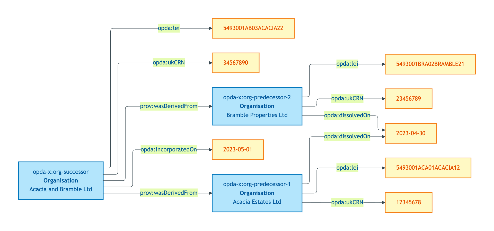
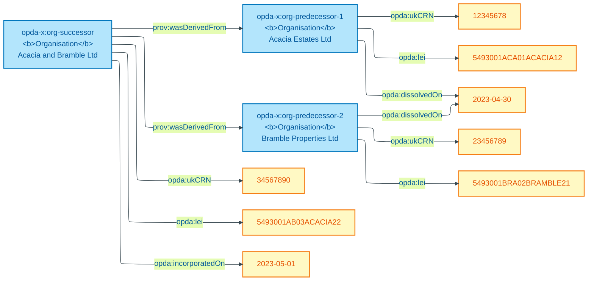

# organisation-with-merger

## Summary

Organisation IC over entity merger: two predecessor Companies House CRNs dissolve; successor (new CRN, new LEI) is a new individual with `prov:wasDerivedFrom` chains to both predecessors. Three individuals total, NOT one with mutated CRN. FIBO LegalEntity / LEI succession pattern.

Cross-link: [Concept tier — Organisation hard cases](../../concept/agent/organisation.md#hard-cases).

## Exemplar instance graph



<details>
<summary>Mermaid Source</summary>



</details>

## Exemplar Turtle

```turtle
# Diagnostic exemplar — ODR-0004 §8a, IC-only — input to ODR-0006 (Agents & Roles).
# Situation: two estate-agency Organisations merge into a new entity in 2023. The new
# Organisation has its own Companies House number, LEI, and trading name. Pre-merger
# transactions were associated with the predecessors; post-merger with the successor.
# The IC must determine when an Organisation persists through change and when it does not.
# Status: ratified. Namespace: https://w3id.org/opda/# (Session 003b + ADR-0006).
# ODR-0004 status: accepted (council: session-004); ODR-0006 status: accepted (council: session-006).

@prefix opda:    <https://w3id.org/opda/#> .
@prefix opda-x:  <https://openpropdata.org.uk/data/exemplar/organisation-with-merger/> .
@prefix prov:    <http://www.w3.org/ns/prov#> .
@prefix dct:     <http://purl.org/dc/terms/> .
@prefix rdfs:    <http://www.w3.org/2000/01/rdf-schema#> .
@prefix skos:    <http://www.w3.org/2004/02/skos/core#> .
@prefix xsd:     <http://www.w3.org/2001/XMLSchema#> .

opda-x:exemplar
    a opda:DiagnosticExemplar ;
    dct:title "Organisation merger — IC across entity-merger hard case" ;
    dct:status "ratified" ;
    dct:references <ODR-0006> , <ODR-0005> , <ODR-0004> ;
    skos:scopeNote
        "Tests Organisation IC over the merger hard case. Two estate agencies (Companies House CRNs 12345678 and 23456789) merged in 2023; predecessors dissolved on Companies House; successor company (CRN 34567890) is a new individual. Under S006 Q1 the IC for opda:Organisation must give three individuals (two predecessors + one successor), NOT one with mutated CRN. PROV-O chains: successor prov:wasDerivedFrom both predecessors. Multi-jurisdiction parallel: each predecessor had its own LEI (ISO 17442); successor has a new LEI. FIBO LegalEntity / LEI succession pattern is the precedent (Kendall S005 Q4 + Q5 framing — FIBO LEI handles multiple identifiers for one Kind; entity-merger is different: multiple Kind instances → new Kind instance)." .

# Predecessor 1 — dissolved on merger
opda-x:org-predecessor-1
    a opda:Organisation ;
    rdfs:label "Acacia Estates Ltd (CRN 12345678) — dissolved 2023-04-30" ;
    opda:ukCRN "12345678" ;
    opda:lei "5493001ACA01ACACIA12" ;
    opda:tradingName "Acacia Estates" ;
    opda:companyStatus "dissolved" ;
    opda:dissolvedOn "2023-04-30"^^xsd:date .

# Predecessor 2 — dissolved on merger
opda-x:org-predecessor-2
    a opda:Organisation ;
    rdfs:label "Bramble Properties Ltd (CRN 23456789) — dissolved 2023-04-30" ;
    opda:ukCRN "23456789" ;
    opda:lei "5493001BRA02BRAMBLE21" ;
    opda:tradingName "Bramble Properties" ;
    opda:companyStatus "dissolved" ;
    opda:dissolvedOn "2023-04-30"^^xsd:date .

# Successor — new individual; not the same Org as either predecessor
opda-x:org-successor
    a opda:Organisation ;
    rdfs:label "Acacia & Bramble Ltd (CRN 34567890) — incorporated 2023-05-01 by merger" ;
    opda:ukCRN "34567890" ;
    opda:lei "5493001AB03ACACIA22" ;
    opda:tradingName "Acacia & Bramble" ;
    opda:companyStatus "active" ;
    opda:incorporatedOn "2023-05-01"^^xsd:date ;
    prov:wasDerivedFrom opda-x:org-predecessor-1 , opda-x:org-predecessor-2 .

# NO owl:sameAs anywhere; PROV chains capture the lineage.
```

## Expected report Turtle

```turtle
# organisation-with-merger-expected-report.ttl
@prefix dct: <http://purl.org/dc/terms/> .
@prefix rdf: <http://www.w3.org/1999/02/22-rdf-syntax-ns#> .
@prefix sh: <http://www.w3.org/ns/shacl#> .
@prefix xsd: <http://www.w3.org/2001/XMLSchema#> .

<https://w3id.org/opda/data/exemplar-reports/report>
    rdf:type sh:ValidationReport ;
    dct:source <https://openpropdata.org.uk/data/exemplar/organisation-with-merger> ;
    sh:conforms "true"^^xsd:boolean .
```

## SHACL outcome

`sh:conforms true`. All three Organisation instances satisfy `opda:OrganisationIdentityKeyShape` (none carry `opda:hasAssertedCapacity`; admissible).

## Source ODR + ADR

- [ODR-0004 §8a](../../../ontology/odr/ODR-0004-pdtf-ontology-foundation.md)
- [ODR-0006 §Q1 + §Q6 — Agents and roles (Organisation IC)](../../../ontology/odr/ODR-0006-agents-and-roles.md)
- [ADR-0014](../../../adr/ADR-0014-baspi5-round-trip-mvp-harness.md)
