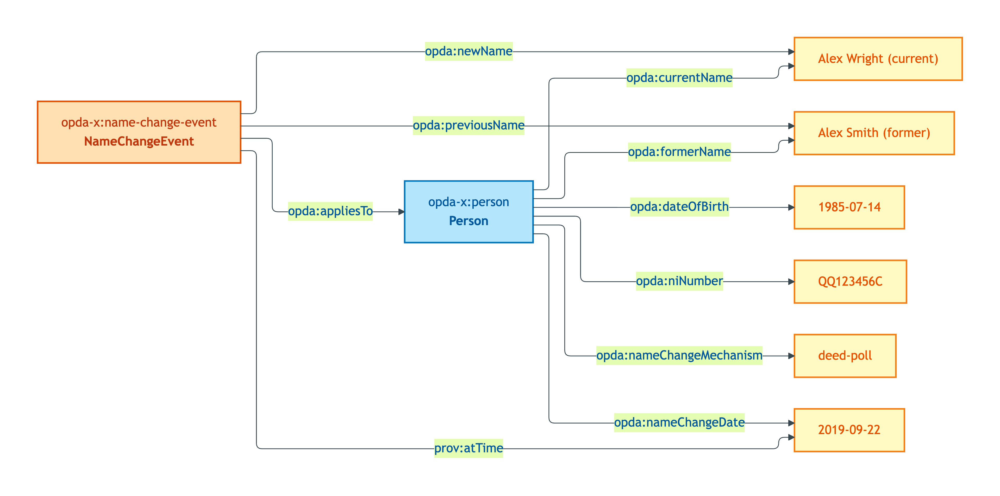
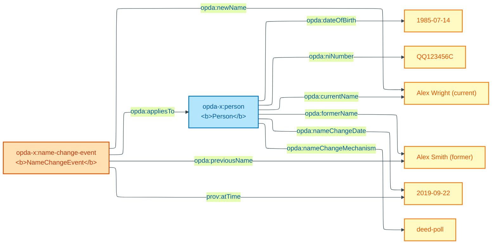

# person-with-name-change

## Summary

Person IC over deed-poll name change (2019): one Person individual with name-attribute mutation, NOT two distinct Persons. NameChangeEvent captures provenance via PROV-O. Anti-pattern: `owl:sameAs` across former/current names.

Cross-link: [Concept tier — Person hard cases](../../concept/agent/person.md#hard-cases).

## Exemplar instance graph



<details>
<summary>Mermaid Source</summary>



</details>

## Exemplar Turtle

```turtle
# Diagnostic exemplar — ODR-0004 §8a, IC-only — input to ODR-0006 (Agents & Roles).
# Situation: a Person with a name change (deed-poll, 2019); they were the seller on a 2017
# transaction under their former name, and the buyer on a 2024 transaction under their current name.
# The IC must say this is one Person individual whose name-attribute changed, not two.
# Status: ratified. Namespace: https://w3id.org/opda/# (Session 003b + ADR-0006).
# ODR-0004 status: accepted (council: session-004); ODR-0006 status: accepted (council: session-006).

@prefix opda:    <https://w3id.org/opda/#> .
@prefix opda-x:  <https://openpropdata.org.uk/data/exemplar/person-with-name-change/> .
@prefix prov:    <http://www.w3.org/ns/prov#> .
@prefix dct:     <http://purl.org/dc/terms/> .
@prefix rdfs:    <http://www.w3.org/2000/01/rdf-schema#> .
@prefix skos:    <http://www.w3.org/2004/02/skos/core#> .
@prefix xsd:     <http://www.w3.org/2001/XMLSchema#> .

opda-x:exemplar
    a opda:DiagnosticExemplar ;
    dct:title "Person with name change — IC across name-mutation hard case" ;
    dct:status "ratified" ;
    dct:references <ODR-0006> , <ODR-0005> , <ODR-0004> ;
    skos:scopeNote
        "Tests Person IC over the name-change hard case. The same Person held distinct names on two transactions five years apart (deed-poll in 2019). Under S006 Q1 the IC for opda:Person must give one individual, not two. Candidate ICs: (a) date-of-birth + state-issued ID combination; (b) any single state-issued ID; (c) PROV-O wasDerivedFrom chain over name-attribute changes. The IC the Council settles must cope with the 2017-as-FormerName + 2024-as-CurrentName case without collapsing to owl:sameAs (which would propagate every triple from one context to the other; same anti-pattern as ODR-0005 Rule 5)." .

# One Person individual; name-attribute changed over time (recorded via prov:wasRevisionOf).
opda-x:person
    a opda:Person ;
    rdfs:label "Person individual — currently named Alex Wright (formerly Alex Smith)" ;
    opda:dateOfBirth "1985-07-14"^^xsd:date ;
    opda:niNumber "QQ123456C" ;
    opda:currentName "Alex Wright" ;
    opda:formerName "Alex Smith" ;
    opda:nameChangeDate "2019-09-22"^^xsd:date ;
    opda:nameChangeMechanism "deed-poll" .

# Provenance of the name change — a registered deed-poll event.
opda-x:name-change-event
    a opda:NameChangeEvent ;
    rdfs:label "Deed-poll filed 2019-09-22" ;
    prov:atTime "2019-09-22T00:00:00Z"^^xsd:dateTime ;
    opda:previousName "Alex Smith" ;
    opda:newName "Alex Wright" ;
    opda:appliesTo opda-x:person ;
    dct:source <https://www.gov.uk/change-name-deed-poll> .
```

## Expected report Turtle

```turtle
# person-with-name-change-expected-report.ttl
@prefix dct: <http://purl.org/dc/terms/> .
@prefix rdf: <http://www.w3.org/1999/02/22-rdf-syntax-ns#> .
@prefix sh: <http://www.w3.org/ns/shacl#> .
@prefix xsd: <http://www.w3.org/2001/XMLSchema#> .

<https://w3id.org/opda/data/exemplar-reports/report>
    rdf:type sh:ValidationReport ;
    dct:source <https://openpropdata.org.uk/data/exemplar/person-with-name-change> ;
    sh:conforms "true"^^xsd:boolean .
```

## SHACL outcome

`sh:conforms true`. The exemplar satisfies:

- `opda:PersonIdentityKeyShape` (Cat 1): `opda:hasAssertedCapacity` count is 0 (admissible)
- `opda:SpecialCategoryPIIWithoutLawfulBasisShape` (Cat 4): no `opda:hasSpecialCategoryData true` → rule does not fire

The SHACL-AF rules materialise:

- `opda:IdentifierSuccessionRule` → `opda:hasIdentifierSuccessionEvent opda-x:name-change-event` (the NameChangeEvent names the Person via `opda:appliesTo`, equivalent surface for the rule's `prov:wasAssociatedWith` pattern)
- `opda:CapacityAuthorityMatchRule` → no fire (no `opda:hasAssertedCapacity`)

## Source ODR + ADR

- [ODR-0004 §8a](../../../ontology/odr/ODR-0004-pdtf-ontology-foundation.md)
- [ODR-0006 §Q1 — Person IC over name-change](../../../ontology/odr/ODR-0006-agents-and-roles.md)
- [ADR-0014](../../../adr/ADR-0014-baspi5-round-trip-mvp-harness.md)
