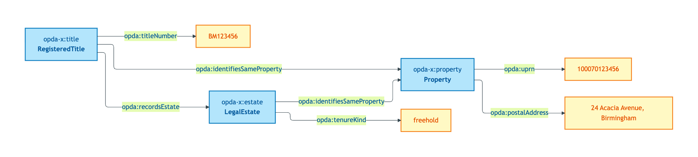
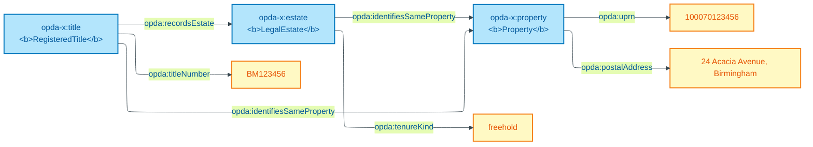

# registered-freehold-house

## Summary

Baseline easy case for S005 (Property and land identity crux): UPRN present, freehold legal estate vested, freehold title registered, single proprietor. Under the 3-class commitment (S005 Q5): one physical `opda:Property` + one `opda:LegalEstate` (freehold rights-bundle) + one `opda:RegisteredTitle` (HMLR record) all co-referring; no succession; no degradation; no first-registration ambiguity. Baseline against which harder cases are differentiated.

Cross-link: [Concept tier — Property hard cases](../../concept/property/property.md#hard-cases).

## Exemplar instance graph



<details>
<summary>Mermaid Source</summary>



</details>

## Exemplar Turtle

```turtle
# Diagnostic exemplar — ODR-0004 §8a, IC-only — input to ODR-0005 (Property & Land Identity Crux).
# Situation: 24 Acacia Avenue, Birmingham. UPRN present; freehold title registered; single proprietor.
# Status: ratified. Namespace: https://w3id.org/opda/# (Session 003b + ADR-0006).
# ODR-0004 status: accepted (council: session-004; wg-decision: session-003b).
# ODR-0005 status: accepted (council: session-005).
# Amended 2026-05-27 post-S005 close: added opda:LegalEstate individual explicitly (3-class commitment from S005 Q5).

@prefix opda:    <https://w3id.org/opda/#> .
@prefix opda-x:  <https://openpropdata.org.uk/data/exemplar/registered-freehold-house/> .
@prefix dct:     <http://purl.org/dc/terms/> .
@prefix rdfs:    <http://www.w3.org/2000/01/rdf-schema#> .
@prefix skos:    <http://www.w3.org/2004/02/skos/core#> .
@prefix xsd:     <http://www.w3.org/2001/XMLSchema#> .

opda-x:exemplar
    a opda:DiagnosticExemplar ;
    dct:title "Registered freehold house — baseline easy case" ;
    dct:status "ratified" ;
    dct:references <ODR-0005> , <ODR-0004> ;
    skos:scopeNote
        "Tests the IC under no edge condition: UPRN present, freehold legal estate vested, freehold title registered. Under the 3-class commitment (S005 Q5): one physical Property + one LegalEstate (freehold rights-bundle) + one RegisteredTitle (HMLR record) all co-referring; no succession; no degradation; no first-registration ambiguity. Baseline against which the harder cases (unregistered, UPRN-split) are differentiated." .

# Physical Property — UFO Substance Kind, DOLCE Endurant (S005 §2a).
opda-x:property
    a opda:Property ;
    rdfs:label "Physical dwelling at 24 Acacia Avenue, Birmingham" ;
    opda:uprn "100070123456" ;
    opda:inspireId "urn:opda:inspire:200012345" ;
    opda:postalAddress "24 Acacia Avenue, Birmingham, B12 9XY" .

# Legal estate — UFO Substance Kind, DOLCE NonPhysicalEndurant; IC = rights-bundle persistence (S005 §3b).
opda-x:estate
    a opda:LegalEstate ;
    rdfs:label "Freehold estate in 24 Acacia Avenue" ;
    opda:tenureKind "freehold" .

# Registered title — UFO Substance Kind, DOLCE NonPhysicalEndurant; IC = title-number lineage (S005 §3c).
opda-x:title
    a opda:RegisteredTitle ;
    rdfs:label "HMLR title BM123456 (freehold record)" ;
    opda:titleNumber "BM123456" ;
    opda:firstRegisteredOn "1998-03-14"^^xsd:date ;
    opda:lastRegistryEvent "2018-05-12"^^xsd:date .

# Co-reference: title records the estate; estate vests in the property. NEVER owl:sameAs.
opda-x:title opda:identifiesSameProperty opda-x:property .
opda-x:estate opda:identifiesSameProperty opda-x:property .
opda-x:title opda:recordsEstate opda-x:estate .
```

## Expected report Turtle

```turtle
# registered-freehold-house-expected-report.ttl — paired SHACL validation report
# Generated by opda-gen 1.0.0; DO NOT HAND-EDIT.
# Specification: https://openpropdata.org.uk/adr/ADR-0007-ontology-generator-specification
# Implementation: https://openpropdata.org.uk/adr/ADR-0014-baspi5-round-trip-mvp-harness
# Ratifying ODR: ODR-0004 §8a (diagnostic exemplar pairing).
# Comparison is semantic-equivalence (focusNode, resultPath, severity, constraint, message) per tests/baspi5_round_trip/compare_reports.py.

@prefix dct: <http://purl.org/dc/terms/> .
@prefix rdf: <http://www.w3.org/1999/02/22-rdf-syntax-ns#> .
@prefix sh: <http://www.w3.org/ns/shacl#> .
@prefix xsd: <http://www.w3.org/2001/XMLSchema#> .

<https://w3id.org/opda/data/exemplar-reports/report>
    rdf:type sh:ValidationReport ;
    dct:source <https://openpropdata.org.uk/data/exemplar/registered-freehold-house> ;
    sh:conforms "true"^^xsd:boolean .
```

## SHACL outcome

`sh:conforms true` — no shapes fire. The exemplar satisfies:

- `opda:PropertyIdentityKeyShape` (Cat 1): `opda:hasUPRN` cardinality 1 (single UPRN literal)
- `opda:LegalEstateIdentityKeyShape` (Cat 1): `opda:tenureKind` cardinality 1
- `opda:PropertyICBreachShape` (Cat 2): co-reference uses `opda:identifiesSameProperty` (IRI-valued); no `owl:sameAs`
- `opda:UPRNSuccessionRule` (SHACL-AF Info): materialises `opda:hasUPRNSuccessionStatus "primary-uprn"` (no `prov:wasDerivedFrom`)

## Source ODR + ADR

- [ODR-0004 §8a — Diagnostic exemplar policy](../../../ontology/odr/ODR-0004-pdtf-ontology-foundation.md)
- [ODR-0005 §2a + §3b + §3c — Property and land identity crux](../../../ontology/odr/ODR-0005-property-and-land-identity-crux.md)
- [ADR-0014 — BASPI5 round-trip MVP harness](../../../adr/ADR-0014-baspi5-round-trip-mvp-harness.md)
