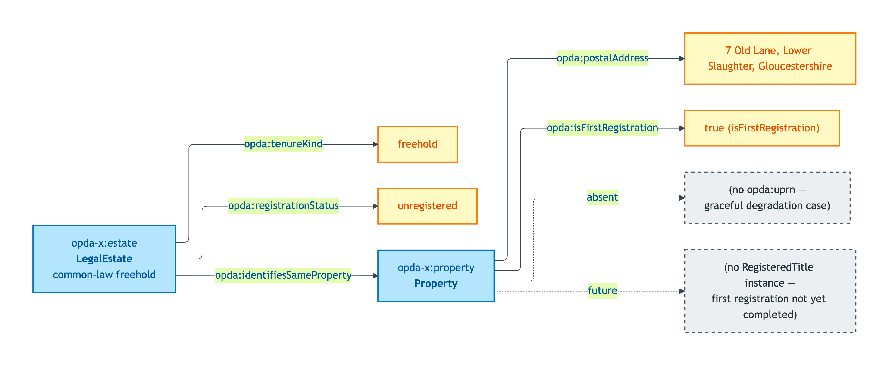
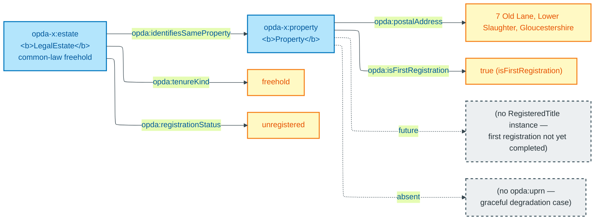

# unregistered-pre-first-registration-house

## Summary

LegalEstate-without-RegisteredTitle cardinality test (S005 Q5): a rural cottage held under common-law freehold for decades, no first registration yet. UPRN deliberately absent — Cagle's graceful-degradation challenge. This is the load-bearing exemplar for S005 Q5's 6-2-1 verdict against the 2-class collapse — the only modelling that gives this case a coherent answer.

Cross-link: [Concept tier — Property hard cases](../../concept/property/property.md#hard-cases).

## Exemplar instance graph



<details>
<summary>Mermaid Source</summary>



</details>

## Exemplar Turtle

```turtle
# Diagnostic exemplar — ODR-0004 §8a, IC-only — input to ODR-0005 (Property & Land Identity Crux).
# Situation: rural cottage, owner-occupied for decades, no first registration yet (isFirstRegistration = Yes).
# UPRN deliberately absent — Cagle's graceful-degradation challenge (ODR-0005 Rule 3 + Anti-patterns).
# Status: ratified. Namespace: https://opda.org.uk/pdtf/ (Session 003b + ADR-0006).
# ODR-0004 status: accepted (council: session-004; wg-decision: session-003b).
# ODR-0005 status: accepted (council: session-005).
# Amended 2026-05-27 post-S005 close: added common-law opda:LegalEstate individual explicitly.
# This discharges the Kendall+Davis cardinality-test requirement (S005 Q5 + Q7) — manifests the
# LegalEstate-without-RegisteredTitle case and shows the 3-class commitment gives the right answer.

@prefix opda:    <https://opda.org.uk/pdtf/> .
@prefix opda-x:  <https://opda.org.uk/pdtf/harness/data/exemplar/unregistered-pre-first-registration-house/> .
@prefix dct:     <http://purl.org/dc/terms/> .
@prefix rdfs:    <http://www.w3.org/2000/01/rdf-schema#> .
@prefix skos:    <http://www.w3.org/2004/02/skos/core#> .

opda-x:exemplar
    a opda:DiagnosticExemplar ;
    dct:title "Unregistered house pre-first-registration — LegalEstate-without-RegisteredTitle cardinality test" ;
    dct:status "ratified" ;
    dct:references <ODR-0005> , <ODR-0004> ;
    skos:scopeNote
        "Tests the IC when no RegisteredTitle exists yet AND UPRN is absent. Under the 3-class commitment (S005 Q5): one physical Property + one LegalEstate (common-law freehold the owner has held for decades — Pandit's Q3 PII-regime evidence: this estate is private personal data) + NO opda:RegisteredTitle (registration has not completed). When first registration later completes, a new RegisteredTitle is minted with prov:wasGeneratedBy; the LegalEstate persists as the same individual through the event; the Property persists. The 2-class collapse (Allemang DA) would force omitting the LegalEstate (false — common-law freehold exists) or fabricating a RegisteredTitle (also false). The 3-class commitment is the only modelling that gives this case a coherent answer — this is the load-bearing exemplar for S005 Q5's 6-2-1 verdict against Davis + Cagle's 2-class dissents." .

# Physical Property — UFO Substance Kind, DOLCE Endurant (S005 §2a).
# UPRN deliberately omitted — Cagle's graceful-degradation case.
opda-x:property
    a opda:Property ;
    rdfs:label "Unregistered cottage at 7 Old Lane (no UPRN in AddressBase as of dataset cut)" ;
    opda:postalAddress "7 Old Lane, Lower Slaughter, Gloucestershire, GL54 2HP" ;
    opda:isFirstRegistration true .

# Common-law LegalEstate — exists at common law without registration.
# Pandit Q3 PII regime: private (NOT HMLR-published; transitions to public at first registration).
opda-x:estate
    a opda:LegalEstate ;
    rdfs:label "Common-law freehold of 7 Old Lane — held since pre-1990 (outside compulsory-registration triggers until sale)" ;
    opda:tenureKind "freehold" ;
    opda:registrationStatus "unregistered" .

# Deliberately NO opda:RegisteredTitle individual — registration not yet completed.
# When first registration completes, an opda:RegisteredTitle will be minted with prov:wasGeneratedBy
# the registration activity; opda:identifiesSameProperty linkage created; PII regime transitions.

# Co-reference: the estate vests in the property. NEVER owl:sameAs.
opda-x:estate opda:identifiesSameProperty opda-x:property .
```

## Expected report Turtle

```turtle
# unregistered-pre-first-registration-house-expected-report.ttl — paired SHACL validation report
# Generated by opda-gen 1.0.0; DO NOT HAND-EDIT.

@prefix dct: <http://purl.org/dc/terms/> .
@prefix rdf: <http://www.w3.org/1999/02/22-rdf-syntax-ns#> .
@prefix sh: <http://www.w3.org/ns/shacl#> .
@prefix xsd: <http://www.w3.org/2001/XMLSchema#> .

<https://opda.org.uk/pdtf/data/exemplar-reports/report>
    rdf:type sh:ValidationReport ;
    dct:source <https://opda.org.uk/pdtf/harness/data/exemplar/unregistered-pre-first-registration-house> ;
    sh:conforms "true"^^xsd:boolean .
```

## SHACL outcome

`sh:conforms true` — no shapes fire. UPRN absence is admissible per ODR-0005 §6a (UPRN is contingent). The exemplar satisfies:

- `opda:PropertyIdentityKeyShape` (Cat 1): `opda:hasUPRN` count is 0 (absence admissible)
- `opda:LegalEstateIdentityKeyShape` (Cat 1): `opda:tenureKind` cardinality 1
- `opda:PropertyICBreachShape` (Cat 2): co-reference uses `opda:identifiesSameProperty`
- `opda:UPRNSuccessionRule` (SHACL-AF Info): no `opda:hasUPRN` value → rule does not fire

## Source ODR + ADR

- [ODR-0004 §8a](../../../ontology/odr/ODR-0004-pdtf-ontology-foundation.md)
- [ODR-0005 §3a (Rule 3, Rule 6) + §3b + Anti-patterns](../../../ontology/odr/ODR-0005-property-and-land-identity-crux.md)
- [ADR-0014](../../../adr/ADR-0014-baspi5-round-trip-mvp-harness.md)
