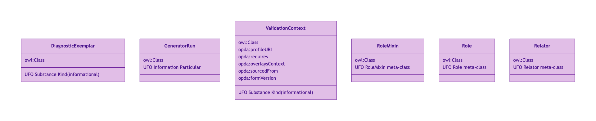
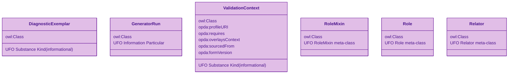
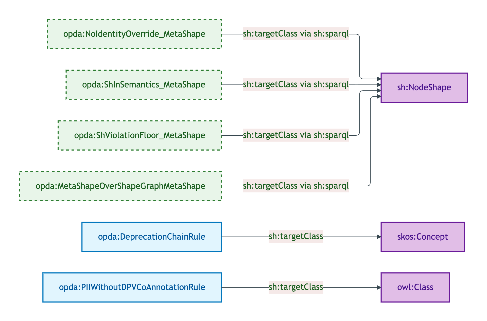
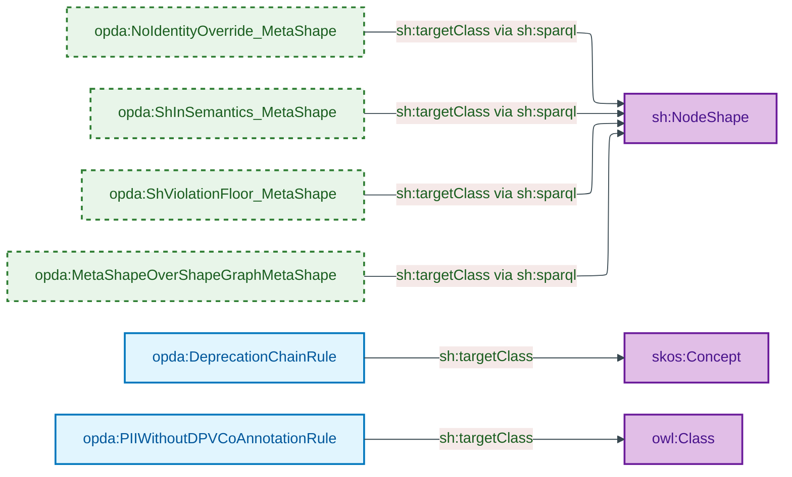

# Foundation module

The foundation graph carries the **6 cross-cutting classes** that the per-module graphs depend on, plus the **foundation meta-shapes** (cross-cutting SHACL discipline) and the **header-only annotations graph**.

## Files

| File | Role | Source |
|---|---|---|
| `foundation.ttl` | Ontology header (`<https://w3id.org/opda/>` + `owl:versionIRI`) | [foundation.ttl](../../../../source/03-standards/ontology/foundation.ttl) |
| `opda-classes.ttl` | 6 foundation classes + `opda:hasSpecialCategoryData` datatype property | [opda-classes.ttl](../../../../source/03-standards/ontology/opda-classes.ttl) |
| `opda-shapes.ttl` | 5 meta-shapes + 2 cross-cutting SHACL-AF rules | [opda-shapes.ttl](../../../../source/03-standards/ontology/opda-shapes.ttl) |
| `opda-annotations.ttl` | Header-only (no class-level DPV baseline) | [opda-annotations.ttl](../../../../source/03-standards/ontology/opda-annotations.ttl) |

## Ontology header

```turtle
<https://w3id.org/opda/>
    rdf:type owl:Ontology ;
    dct:creator "OPDA Linked Data Council" ;
    dct:description "Linked-data ontology for UK residential property transaction data; the Trust Framework's machine-readable vocabulary."@en ;
    dct:issued "2026-05-27"^^xsd:date ;
    dct:license <https://creativecommons.org/publicdomain/zero/1.0/> ;
    dct:modified "2026-05-28"^^xsd:date ;
    dct:title "OPDA — Open Property Data Association Ontology"@en ;
    vann:preferredNamespacePrefix "opda" ;
    vann:preferredNamespaceUri "https://w3id.org/opda/#"^^xsd:anyURI ;
    owl:versionIRI <https://w3id.org/opda/1.0.0/> ;
    owl:versionInfo "1.0.0 — foundation + SKOS vocabularies + UFO meta-classes + module shapes + DPV annotations + overlay profiles + ValidationContext + hasSpecialCategoryData (ADR-0009 + ADR-0010 + ADR-0011 + ADR-0012 + ADR-0013 + ADR-0014)" ;
    sh:declare _:b0bdbfe4f895a ;
    opda:generatorVersion "opda-gen-1.0.0" .

_:b0bdbfe4f895a
    sh:namespace "https://w3id.org/opda/#"^^xsd:anyURI ;
    sh:prefix "opda" .
```

## Module class hierarchy



<details>
<summary>Mermaid Source</summary>



</details>

## Module shape-target graph



<details>
<summary>Mermaid Source</summary>



</details>

## Six foundation classes

| Class | UFO category | Role |
|---|---|---|
| `opda:DiagnosticExemplar` | Substance Kind (informational) | Named hard case used as IC pressure-test |
| `opda:GeneratorRun` | Information Particular | Provenance record for each `opda-gen` emission |
| `opda:Relator` | UFO meta-class | Relational endurant supertype |
| `opda:Role` | UFO meta-class | Anti-rigid sortal role supertype |
| `opda:RoleMixin` | UFO meta-class | Anti-rigid cross-sortal role pattern supertype |
| `opda:ValidationContext` | Substance Kind (informational) | Reification of overlay-profile context per ODR-0010 §Q1 |

Plus one DatatypeProperty added by ADR-0014 G14:

- `opda:hasSpecialCategoryData` (xsd:boolean) — Cat 4 SHACL shape target.

See [`classes.md`](./classes.md) for per-class blocks.

## Five foundation meta-shapes

| Shape | Category | Role |
|---|---|---|
| `opda:NoIdentityOverride_MetaShape` | Cat 3 (Violation) | Profile cannot suppress Kind's identity-key |
| `opda:ShInSemantics_MetaShape` | Cat 5 (Violation) | Overlay `sh:in` must union into base SKOS scheme members (Rule 1) |
| `opda:ShViolationFloor_MetaShape` | Cat 5 (Violation) | Overlay cannot downgrade base `sh:Violation` severity (Rule 2) |
| `opda:MetaShapeOverShapeGraphMetaShape` | Cat 5 (Violation) | Meta-shape using Violation severity needs `opda:metaShapeJustification` |
| `opda:DeprecationChainRule` | SHACL-AF | Materialises deprecation status on `skos:Concept` |
| `opda:PIIWithoutDPVCoAnnotationRule` | SHACL-AF | Flags `opda:isPIIBearing true` classes lacking DPV co-annotation |

See [`meta-shapes.md`](./meta-shapes.md) for per-shape blocks.

## Import chain

The foundation graph has no `owl:imports` (it is the base). Per-module graphs import it via:

```turtle
owl:imports <https://w3id.org/opda/1.0.0/>, <https://w3id.org/opda/vocabularies/>
```

(both `opda:` foundation + SKOS substrate)

## Source ADR + ODR

- [ADR-0009 — Foundation TBox emission](../../../adr/ADR-0009-foundation-tbox-emission.md)
- [ADR-0011 — Module TBox emission](../../../adr/ADR-0011-module-tbox-emission.md)
- [ADR-0014 — BASPI5 round-trip MVP harness](../../../adr/ADR-0014-baspi5-round-trip-mvp-harness.md) (G14)
- [ODR-0004 — PDTF ontology foundation](../../../ontology/odr/ODR-0004-pdtf-ontology-foundation.md)
- [ODR-0010 — Overlay profile mechanism](../../../ontology/odr/ODR-0010-overlay-profile-mechanism.md) (ValidationContext)
- [ODR-0011 — Enumeration vocabularies](../../../ontology/odr/ODR-0011-enumeration-vocabularies.md) (UFO meta-classes)
- [ODR-0012 §Q5 — Special-category PII](../../../ontology/odr/ODR-0012-shacl-and-dpv-annotation-emission.md)
- [ODR-0017 §2a — Meta-shape justification](../../../ontology/odr/ODR-0017-shacl-af-quality-rules-pattern.md)
