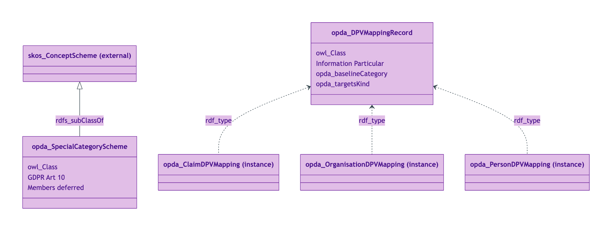
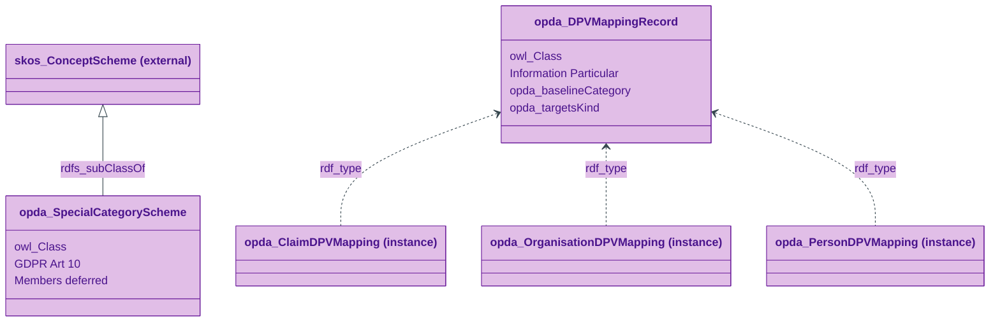
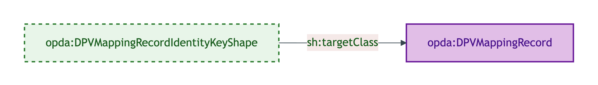
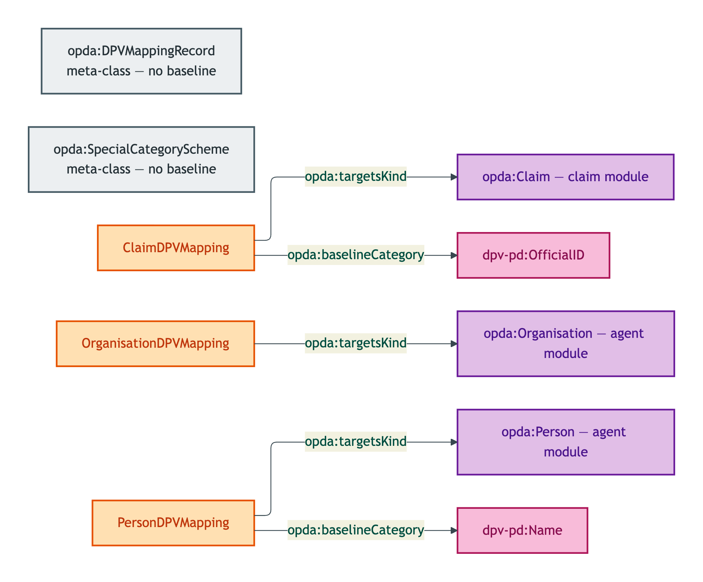
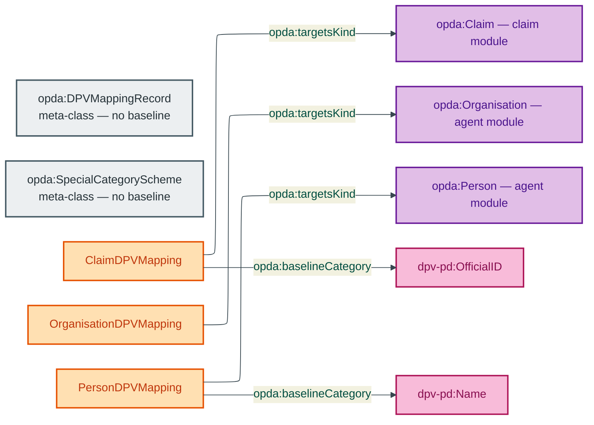

# Governance module

The Governance module emits 2 OWL classes (DPVMappingRecord meta-record class + SpecialCategoryScheme placeholder) and 3 `opda:DPVMappingRecord` instances (Claim / Organisation / Person mappings).

## Files

| File | Role | Source |
|---|---|---|
| `opda-governance.ttl` | 2 OWL classes + 2 ObjectProperties + 3 DPVMappingRecord instances | [opda-governance.ttl](../../../../source/03-standards/ontology/opda-governance.ttl) |
| `opda-governance-shapes.ttl` | 1 identity-key shape | [opda-governance-shapes.ttl](../../../../source/03-standards/ontology/opda-governance-shapes.ttl) |
| `opda-governance-annotations.ttl` | Header-only (meta-records carry no DPV baseline) | [opda-governance-annotations.ttl](../../../../source/03-standards/ontology/opda-governance-annotations.ttl) |

## Ontology header

```turtle
<https://opda.org.uk/pdtf/graph/governance>
    rdf:type owl:Ontology ;
    dct:references <https://w3id.org/dpv/pd> ;
    dct:title "OPDA Governance Module"@en ;
    owl:imports <https://opda.org.uk/pdtf/harness/release/1.0.0/>, <https://opda.org.uk/pdtf/scheme/> ;
    owl:versionIRI <https://opda.org.uk/pdtf/harness/release/governance/1.0.0/> .
```

## Import chain

- `<https://opda.org.uk/pdtf/harness/release/1.0.0/>` — foundation
- `<https://opda.org.uk/pdtf/scheme/>` — SKOS substrate

External vocabularies referenced (not imported):
- `dpv-pd:` — cited via `dct:references` on the module header + per-instance `opda:baselineCategory` triples
- `skos:ConceptScheme` — `opda:SpecialCategoryScheme rdfs:subClassOf skos:ConceptScheme`

## Classes (2)

| Class | Role |
|---|---|
| `opda:DPVMappingRecord` | Meta-record class declaring DPV baseline + variant refinements for a Kind |
| `opda:SpecialCategoryScheme` | Class declaration for GDPR Art 10 special-category scheme (members deferred per ODR-0011) |

See [`classes.md`](./classes.md) for per-class blocks.

## Module class hierarchy



<details>
<summary>Mermaid Source</summary>



</details>

## Module shape-target graph



<details>
<summary>Mermaid Source</summary>


</details>

## Module DPV co-annotation graph



<details>
<summary>Mermaid Source</summary>



</details>

## SHACL shapes (1)

| Shape | Severity | Category |
|---|---|---|
| `opda:DPVMappingRecordIdentityKeyShape` | Violation | Cat 1 |

See [`shapes.md`](./shapes.md) for per-shape blocks.

## DPV annotations

Header-only. Governance classes (`DPVMappingRecord`, `SpecialCategoryScheme`) are meta-records declaring the DPV regime; they themselves carry no DPV class-level baseline. See [`annotations.md`](./annotations.md).

## Source ODR + ADR

- [ODR-0012 — SHACL + DPV annotation emission](/modelling/odr/odr-0012)
- [ODR-0018 — DPV co-annotation pattern](/modelling/odr/odr-0018)
- [ODR-0011 — Enumeration vocabularies (SpecialCategoryScheme deferral)](/modelling/odr/odr-0011)
- [ADR-0011 — Module TBox emission](/modelling/adr/adr-0011)
- [ADR-0012 — SHACL + DPV annotation emission](/modelling/adr/adr-0012)
