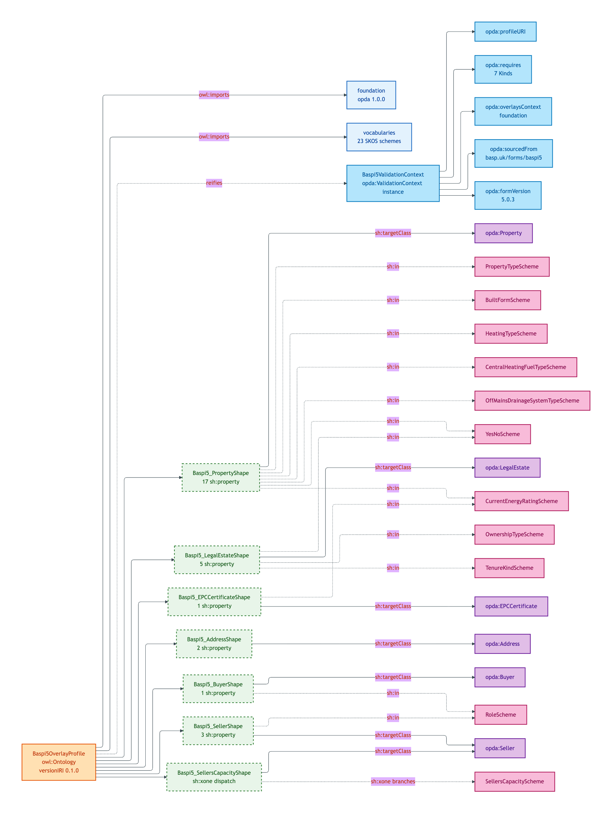
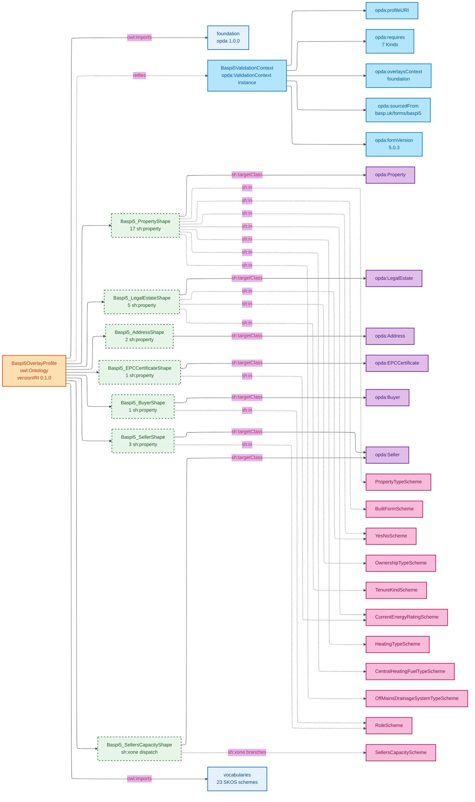

# opda:Baspi5OverlayProfile

## Summary

SHACL profile graph for the BASPI5 (British Association of Surveyors Property Information) version 5 form. Per-form cardinality, enum subsets, DASH UI rendering. Composes over the foundation + module TBox + base shapes per ODR-0010.

| Field | Value |
|---|---|
| Authority | BASPI |
| Form version | 5.0.3 |
| Profile URI | `<https://w3id.org/opda/profiles/baspi5>` |
| Version IRI | `<https://w3id.org/opda/profiles/baspi5/0.1.0/>` |
| Production status | MVP gate (ODR-0010 §Q7) |
| Source | [`profiles/baspi5.ttl`](../../../../source/03-standards/ontology/profiles/baspi5.ttl) |

## Profile dependency graph



<details>
<summary>Mermaid Source</summary>



</details>

## Ontology header

```turtle
<https://w3id.org/opda/profiles/baspi5>
    rdf:type owl:Ontology ;
    dct:source <https://openpropdata.org.uk/adr/ADR-0013-overlay-profile-emission> ;
    dct:description "SHACL profile graph for the BASPI5 (British Association of Surveyors Property Information) version 5 form. Per-form cardinality, enum subsets, DASH UI rendering. Composes over the foundation + module TBox + base shapes per ODR-0010."@en ;
    dct:title "BASPI5 overlay profile"@en ;
    owl:imports <https://w3id.org/opda/1.0.0/>, <https://w3id.org/opda/vocabularies/> ;
    owl:versionIRI <https://w3id.org/opda/profiles/baspi5/0.1.0/> .
```

## opda:ValidationContext (per ODR-0010 §Q1)

```turtle
opda:Baspi5ValidationContext
    rdf:type opda:ValidationContext ;
    dct:source <https://w3id.org/opda/odr/ODR-0010#section-Q1> ;
    opda:formVersion "5.0.3" ;
    opda:overlaysContext <https://w3id.org/opda/profiles/foundation> ;
    opda:profileURI <https://w3id.org/opda/profiles/baspi5> ;
    opda:requires opda:Address, opda:Buyer, opda:EPCCertificate, opda:LegalEstate, opda:Property, opda:Seller, opda:Survey ;
    opda:sourcedFrom <https://www.basp.uk/forms/baspi5> .
```

### Five-property explanation

| Property | Value | Purpose |
|---|---|---|
| `opda:profileURI` | `<https://w3id.org/opda/profiles/baspi5>` | Self-reference — names the profile |
| `opda:requires` | 7 Kinds (Address, Buyer, EPCCertificate, LegalEstate, Property, Seller, Survey) | Which Kinds this profile constrains |
| `opda:overlaysContext` | `<https://w3id.org/opda/profiles/foundation>` | The base context being overlayed |
| `opda:sourcedFrom` | `<https://www.basp.uk/forms/baspi5>` | External authoring source URL |
| `opda:formVersion` | `"5.0.3"` | The form version this profile binds against |

This reification converts conditionality from "required (depending)" to "required relative to a named, dereferenceable context" — discharging Guarino's withdrawal condition at S010.

## Per-Kind profile shapes

### opda:Baspi5_PropertyShape

```turtle
opda:Baspi5_PropertyShape
    rdf:type sh:NodeShape ;
    dct:source <https://www.basp.uk/forms/baspi5#A1.1> ;
    sh:property _:b09d940f4830d, _:b1ca4257457df, _:b3b6f8aad6108, _:b3d84f4079cd7, _:b6cdfcb85b159, _:b789e8fa013f5, _:b9c7667cdd323, _:ba0edada6d73c, _:ba4d62e82b074, _:bbdcc7a62bf9b, _:bd0edc3f293ca, _:bd793d8bc592e, _:bd798d7258a49, _:bdbff4bb1ff2b, _:bdd8f0ca42248, _:be6ec25e20193, _:bfbe3637dfbe6 ;
    sh:targetClass opda:Property .
```

17 property shapes covering BASPI5 questions:
- A1.1.5 — `opda:hasUPRN` (required identity-key + cardinality 1)
- A1.8 — `opda:propertyType` (required; full PropertyTypeScheme `sh:in`)
- A1.8.1 — `opda:builtForm` (required; full BuiltFormScheme `sh:in`)
- A1.8.3.1.1 — `opda:currentEnergyRating` (required A-G via `sh:in`)
- A1.8.4.1, A1.8.6.1, A1.2.1, A4.1.1, A9.1, A10.1.1, A11.1.1, B4.6.2, A8.1.1 — various Yes/No discriminators (full `opda:YesNoScheme` `sh:in`)
- A6.2.1 — `opda:offMainsDrainageSystemType` (subset `sh:in`)
- A7.1 — `opda:heatingType` (full HeatingTypeScheme `sh:in`)
- A7.4.0.2 — `opda:centralHeatingFuelType` (full CentralHeatingFuelTypeScheme `sh:in`)

### opda:Baspi5_LegalEstateShape

```turtle
opda:Baspi5_LegalEstateShape
    rdf:type sh:NodeShape ;
    dct:source <https://www.basp.uk/forms/baspi5#A1.3> ;
    sh:property _:b2d557e6c90c7, _:b76a31b3e9782, _:b7b8ba7829bd6, _:bda5177528e12, _:bfc1b2fab09d1 ;
    sh:targetClass opda:LegalEstate .
```

5 property shapes covering BASPI5 A1.3 questions:
- A1.3 — `opda:ownershipType` (required; OwnershipTypeScheme `sh:in`)
- A1.3 — `opda:tenureKind` (required; TenureKindScheme `sh:in`)
- A1.3.1 — `opda:isSharedOwnership` (Yes/No)
- A1.4.2 — `opda:isGroundRentPayable` (Yes/No)
- A1.5.1 — `opda:sellerContributesToServiceCharge` (Yes/No)

### opda:Baspi5_AddressShape

```turtle
opda:Baspi5_AddressShape
    rdf:type sh:NodeShape ;
    dct:source <https://www.basp.uk/forms/baspi5#A1.1> ;
    sh:property _:b50cc78b55dd8, _:b73cf8ca21c31 ;
    sh:targetClass opda:Address .
```

2 property shapes:
- A1.1.1 — `vcard:street-address` (required)
- A1.1.5 — `vcard:postal-code` (required)

### opda:Baspi5_EPCCertificateShape

```turtle
opda:Baspi5_EPCCertificateShape
    rdf:type sh:NodeShape ;
    dct:source <https://www.basp.uk/forms/baspi5#A1.8.3.1> ;
    sh:property _:b1eb770128af6 ;
    sh:targetClass opda:EPCCertificate .
```

1 property shape:
- A1.8.3.1.1 — `opda:currentEnergyRating` (required A-G via `sh:in`)

### opda:Baspi5_BuyerShape

```turtle
opda:Baspi5_BuyerShape
    rdf:type sh:NodeShape ;
    dct:source <https://www.basp.uk/forms/baspi5#B1> ;
    sh:property _:b78bd3625e376 ;
    sh:targetClass opda:Buyer .
```

1 property shape:
- B1.1 — `opda:role` (required cardinality 1; RoleScheme `sh:in` subset: Buyer, Seller's Conveyancer, Prospective Buyer, Buyer's Conveyancer, Estate Agent, Buyer's Agent, Surveyor, Mortgage Broker, Lender, Landlord, Tenant)

### opda:Baspi5_SellerShape

```turtle
opda:Baspi5_SellerShape
    rdf:type sh:NodeShape ;
    dct:source <https://www.basp.uk/forms/baspi5#B1> ;
    sh:property _:b3ef8485aa649, _:ba81ef3c751b7, _:bd693afd83922 ;
    sh:targetClass opda:Seller .
```

3 property shapes:
- B1.1 — `vcard:fn` (required full-name)
- B1.3 — `vcard:email` (required)
- B1.1 — `opda:role` (required cardinality 1; subset: Seller)

### opda:Baspi5_SellersCapacityShape

```turtle
opda:Baspi5_SellersCapacityShape
    rdf:type sh:NodeShape ;
    dct:source <https://www.basp.uk/forms/baspi5#B1.3> ;
    sh:severity sh:Violation ;
    sh:targetClass opda:Seller ;
    sh:xone _:b9a107f47f5d7 .
```

Uses `sh:xone` to dispatch on capacity (`opda:oneOf`-as-`sh:xone` per ODR-0010 §Q5):

- **Branch 1** (simple cases): `opda:hasAssertedCapacity` ∈ {"Legal Owner", "Mortgagee in Possession"} — no further evidence required
- **Branch 2** (escalated cases): `opda:hasAssertedCapacity` ∈ {"Personal Representative for a Deceased Owner", "Under Power of Attorney", "Assistant", "Other"} — requires `opda:hasEvidencedAuthority` (BASPI5 question B1.3.2-3)

## Property groups (9)

```turtle
opda:Baspi5_Participants_Group  sh:order "1" .  # rdfs:label "Participants"@en
opda:Baspi5_Address_Group       sh:order "2" .  # rdfs:label "Address"@en
opda:Baspi5_BuiltForm_Group     sh:order "3" .  # rdfs:label "Built form"@en
opda:Baspi5_Energy_Group        sh:order "4" .  # rdfs:label "Energy & EPC"@en
opda:Baspi5_Heating_Group       sh:order "5" .  # rdfs:label "Heating & utilities"@en
opda:Baspi5_Ownership_Group     sh:order "6" .  # rdfs:label "Ownership & tenure"@en
opda:Baspi5_Drainage_Group      sh:order "7" .  # rdfs:label "Water & drainage"@en
opda:Baspi5_Environmental_Group sh:order "8" .  # rdfs:label "Environmental issues"@en
opda:Baspi5_Completion_Group    sh:order "9" .  # rdfs:label "Completion"@en
```

Each property shape declares `sh:group <group>` and `sh:order N` to drive DASH form rendering.

## Three-rule interface contract — CI status

Per ODR-0010 §Q6 three-rule interface contract, BASPI5 must pass all three meta-shape constraints. CI test status (`opda-gen ci-profile-contract`):

| Rule | Meta-shape | CI status |
|---|---|---|
| 1 — `sh:in` semantics | `opda:ShInSemantics_MetaShape` | **PASS** (every BASPI5 `sh:in` value is a SKOS scheme member) |
| 2 — Violation floor | `opda:ShViolationFloor_MetaShape` | **PASS** (every overlay shape carries `sh:severity sh:Violation`) |
| 3 — No-identity-override | `opda:NoIdentityOverride_MetaShape` | **PASS** (BASPI5 surfaces `opda:hasUPRN` as required with cardinality 1, NOT suppressed) |

CI command: `opda-gen ci-profile-contract --profile baspi5`.

## DASH UI predicates

Every BASPI5 property shape carries DASH editor + viewer predicates:

- `dash:editor dash:EnumSelectEditor` — for `sh:in` enum properties (e.g. `propertyType`, `builtForm`, `currentEnergyRating`)
- `dash:editor dash:TextFieldEditor` — for literal properties (e.g. `vcard:postal-code`, `opda:hasUPRN`)
- `dash:editor dash:DetailsEditor` — for nested object properties (e.g. `opda:hasAddress`)
- `dash:viewer dash:LabelViewer` — enum value rendering
- `dash:viewer dash:LiteralViewer` — literal rendering
- `dash:viewer dash:URIViewer` — object reference rendering

## Source ADR

- [ADR-0013 — Overlay profile emission](../../../adr/ADR-0013-overlay-profile-emission.md)
- [ODR-0010 — Overlay profile mechanism (§Q1 ValidationContext; §Q3 dct:source IRIs; §Q4 DASH UI; §Q5 oneOf-as-xone; §Q6 no-identity-override; §Q7 BASPI5 MVP gate)](../../../ontology/odr/ODR-0010-overlay-profile-mechanism.md)
- [ADR-0014 — BASPI5 round-trip MVP harness](../../../adr/ADR-0014-baspi5-round-trip-mvp-harness.md)
