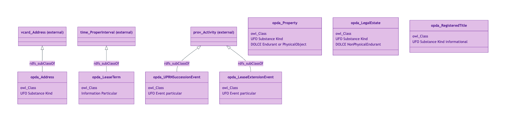
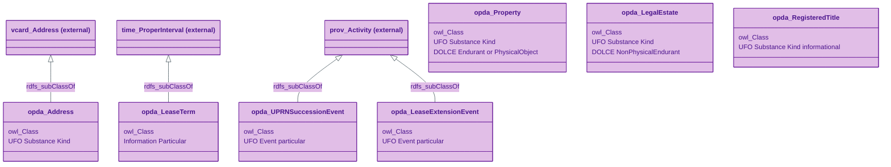
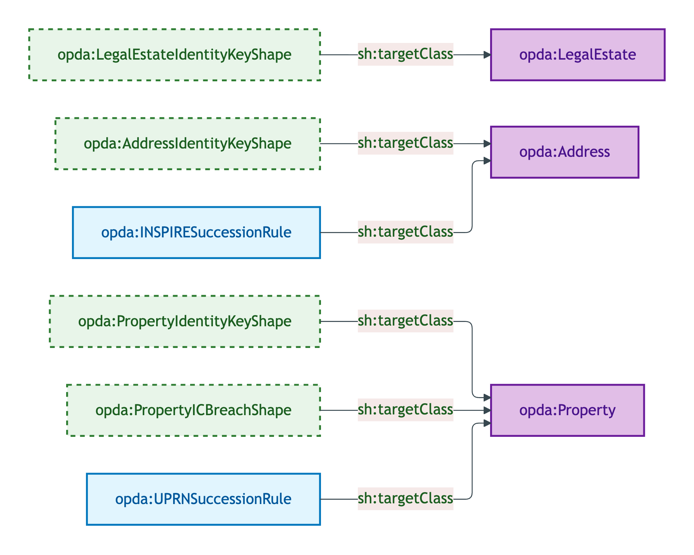
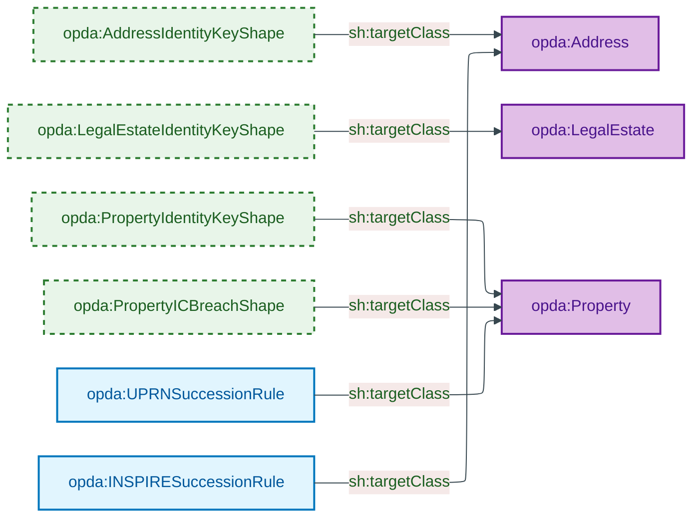
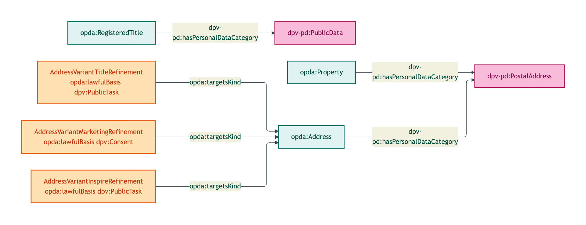
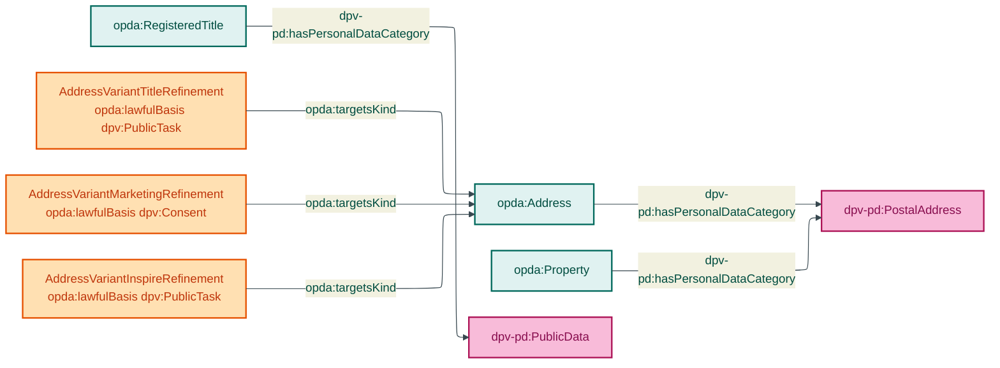

# Property module

The Property module emits 7 OWL classes covering the physical-property identity crux (Property, LegalEstate, RegisteredTitle, Address), the two reified PROV-O succession activities (UPRNSuccessionEvent, LeaseExtensionEvent), and the OWL-Time LeaseTerm interval.

## Files

| File | Role | Source |
|---|---|---|
| `opda-property.ttl` | 7 OWL classes + 24 DatatypeProperties + 3 ObjectProperties | [opda-property.ttl](../../../../source/03-standards/ontology/opda-property.ttl) |
| `opda-property-shapes.ttl` | 4 identity-key shapes + 1 IC-breach shape + 2 SHACL-AF rules | [opda-property-shapes.ttl](../../../../source/03-standards/ontology/opda-property-shapes.ttl) |
| `opda-property-annotations.ttl` | 3 DPV class-level co-annotations + 3 variant refinements | [opda-property-annotations.ttl](../../../../source/03-standards/ontology/opda-property-annotations.ttl) |

## Ontology header

```turtle
<https://opda.org.uk/pdtf/graph/property>
    rdf:type owl:Ontology ;
    dct:title "OPDA Property Module"@en ;
    owl:imports <https://opda.org.uk/pdtf/harness/release/1.0.0/>, <https://opda.org.uk/pdtf/scheme/> ;
    owl:versionIRI <https://opda.org.uk/pdtf/harness/release/property/1.0.0/> .
```

## Import chain

- `<https://opda.org.uk/pdtf/harness/release/1.0.0/>` — foundation TBox (Relator / Role / RoleMixin / ValidationContext / DiagnosticExemplar / GeneratorRun)
- `<https://opda.org.uk/pdtf/scheme/>` — 23 SKOS schemes (BuiltForm, OwnershipType, TenureKind, AddressVariant, etc.)

External vocabularies referenced (not imported):
- `vcard:Address` — `opda:Address rdfs:subClassOf vcard:Address`
- `time:ProperInterval` — `opda:LeaseTerm rdfs:subClassOf time:ProperInterval`
- `prov:Activity` — superclass of `opda:LeaseExtensionEvent` + `opda:UPRNSuccessionEvent`

## Module class hierarchy



<details>
<summary>Mermaid Source</summary>



</details>

## Module shape-target graph



<details>
<summary>Mermaid Source</summary>



</details>

## Module DPV co-annotation graph



<details>
<summary>Mermaid Source</summary>



</details>

## Classes (7)

- `opda:Address` — Substance Kind (Royal Mail / OS AddressBase / HMLR / INSPIRE locator); subclass of `vcard:Address`
- `opda:LeaseExtensionEvent` — Event particular (reified PROV-O Activity for statutory lease extension)
- `opda:LeaseTerm` — Information particular (OWL-Time ProperInterval)
- `opda:LegalEstate` — Substance Kind (legal rights-bundle vested in a Property)
- `opda:Property` — Substance Kind (physical property; spatial-material continuity IC)
- `opda:RegisteredTitle` — Substance Kind, informational (HMLR title-register record)
- `opda:UPRNSuccessionEvent` — Event particular (reified PROV-O Activity for UPRN re-numbering)

See [`classes.md`](./classes.md) for per-class blocks.

## SHACL shapes (6 + 2 rules)

| Shape | Severity | Category |
|---|---|---|
| `opda:AddressIdentityKeyShape` | Violation | Cat 1 |
| `opda:LegalEstateIdentityKeyShape` | Violation | Cat 1 |
| `opda:PropertyIdentityKeyShape` | Violation | Cat 1 |
| `opda:PropertyICBreachShape` | Violation | Cat 2 |
| `opda:UPRNSuccessionRule` | Info | SHACL-AF |
| `opda:INSPIRESuccessionRule` | Info | SHACL-AF |

See [`shapes.md`](./shapes.md) for per-shape blocks.

## DPV annotations

3 class-level annotations + 3 variant refinements. See [`annotations.md`](./annotations.md).

## Source ODR + ADR

- [ODR-0005 — Property and land identity crux](/modelling/odr/odr-0005)
- [ODR-0015 — Address and geography](/modelling/odr/odr-0015)
- [ODR-0007 §Q5 — Lease term as interval](/modelling/odr/odr-0007)
- [ODR-0008 §Q5a — BASPI5 attribute discipline](/modelling/odr/odr-0008)
- [ADR-0011 — Module TBox emission](/modelling/adr/adr-0011)
- [ADR-0012 — SHACL + DPV annotation emission](/modelling/adr/adr-0012)
